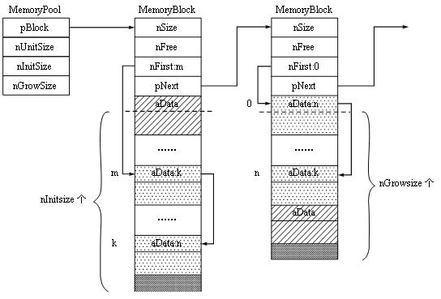

# 八股


# C++基础


## 拷贝构造函数的参数可以不加引用吗

如果拷贝构造函数中的参数不是一个引用，即形如CClass(const CClass c_class)，那么就相当于采用了传值的方式(pass-by-value)，而传值的方式会调用该类的拷贝构造函数，从而造成无穷递归地调用拷贝构造函数。因此拷贝构造函数的参数必须是一个引用。


## 含有指针类型成员变量的类的拷贝构造函数和移动构造函数

```c++
class MemoryBlock  
{  
public:  
    // 构造器（初始化资源）  
    explicit MemoryBlock(size_t length)  
        : _length(length)  
        , _data(new int[length])   { }  
  
    // 析构器（释放资源）  
    ~MemoryBlock()  
    {  
        if (_data != nullptr)  
        {  
            delete[] _data;  
        }  
    }  
  
    // 必须使用深拷贝，不能用浅拷贝
    // 拷贝构造器（实现拷贝语义：拷贝that）  
    MemoryBlock(const MemoryBlock& that)  
        // 拷贝that对象所拥有的资源  
        : _length(that._length)  
        , _data(new int[that._length])  
    {  
        std::copy(that._data, that._data + _length, _data);  
    }  
  
    // 拷贝赋值运算符（实现拷贝语义：释放this ＋ 拷贝that）  
    MemoryBlock& operator=(const MemoryBlock& that)  
    {  
        if (this != &that)  
        {  
            // 释放自身的资源  
            delete[] _data;  
  
            // 拷贝that对象所拥有的资源  
            _length = that._length;  
            _data = new int[_length];  
            std::copy(that._data, that._data + _length, _data);  
        }  
        return *this;  
    }  
  
    // 移动构造器（实现移动语义：移动that）  
    MemoryBlock(MemoryBlock&& that)  
        // 将自身的资源指针指向that对象所拥有的资源  
        : _length(that._length)  
        , _data(that._data)  
    {  
        // 将that对象原本指向该资源的指针设为空值  
        that._data = nullptr;  
        that._length = 0;  
    }  
  
    // 移动赋值运算符（实现移动语义：释放this ＋ 移动that）  
    MemoryBlock& operator=(MemoryBlock&& that)  
    {  
        if (this != &that)  
        {  
            // 释放自身的资源  
            delete[] _data;  
  
            // 将自身的资源指针指向that对象所拥有的资源  
            _data = that._data;  
            _length = that._length;  
  
            // 将that对象原本指向该资源的指针设为空值  
            that._data = nullptr;  
            that._length = 0;  
        }  
        return *this;  
    }  
private:  
    size_t _length; // 资源的长度  
    int* _data; // 指向资源的指针，代表资源本身  
};  
```


## struct class union 的区别

在C++中，结构体和类没有什么区别，唯一的区别就是：默认的访问权限和继承访问权限不同：

- 默认访问权限：结构体是public，类是private
- 默认继承访问权限：结构体是public，类是private


union是一种特殊的节省空间的类。一个union可以有多个数据成员，但是在任意时刻只能有一个数据成员有值。也就是说，当我们给某一个数据成员赋值之后，该union的其他数据成员就变成未定义的状态了。分配给一个union的存储空间至少要容纳它的最大的数据成员。

union与class类的区别：

- 与结构体一样，union的成员的默认访问权限是public。
- union可以定义包括构造函数和析构函数在内的成员函数。
- 既不能作为基类被继承也不能继承他人，union是独立的，所以也不能实现虚函数。

注意的点：

1. **union的数据成员可以是类类型， 但不能含有引用类型的成员，因为union的所有数据成员是要共享内存的。**
2. 因为一旦给union的一个成员赋值的时候，其他的值处于未定义状态，所以在使用union的时候必须知道当前union中存的是什么类型值。


## explicit关键字的作用

**explicit关键字的作用就是防止类构造函数的隐式自动转换.**

explicit关键字只对有一个参数的类构造函数有效, 如果类构造函数参数大于或等于两个时, 是不会产生隐式转换的,所以explicit关键字也就无效了。


## static 的作用

- 在修饰变量的时候，static 修饰的静态局部变量只执行初始化一次，而且延长了局部变量的生命周期，直到程序运行结束以后才释放。
- **static 修饰全局变量的时候，这个全局变量只能在本文件中访问，不能在其它文件中访问，即便是 extern 外部声明也不可以。**
- static 修饰一个函数，则这个函数的只能在本文件中调用，不能被其他文件调用。static 修饰的变量存放在全局数据区的静态变量区，包括全局静态变量和局部静态变量，都在全局数据区分配内存。初始化的时候自动初始化为 0。
- 不想被释放的时候，可以使用static修饰。比如修饰函数中存放在栈空间的数组。如果不想让这个数组在函数调用结束释放可以使用 static 修饰。
- 考虑到数据安全性（当程序想要使用全局变量的时候应该先考虑使用 static）。


**静态数据的存储**

**全局（静态）存储区**：分为 DATA 段和 BSS 段。DATA 段（全局初始化区）存放初始化的全局变量和静态变量；BSS 段（全局未初始化区）存放未初始化的全局变量和静态变量。程序运行结束时自动释放。其中BBS段在程序执行之前会被系统自动清0，所以未初始化的全局变量和静态变量在程序执行之前已经为0。存储在静态数据区的变量会在程序刚开始运行时就完成初始化，也是唯一的一次初始化。

在 C++ 中 static 的内部实现机制：静态数据成员要在程序一开始运行时就必须存在。因为函数在程序运行中被调用，所以静态数据成员不能在任何函数内分配空间和初始化。


**全局变量和全局静态变量的区别**

- 全局变量是不显式用 static 修饰的全局变量，全局变量默认是有外部链接性的，作用域是整个工程，在一个文件内定义的全局变量，在另一个文件中，通过 extern 全局变量名的声明，就可以使用全局变量。
- 全局静态变量是显式用 static 修饰的全局变量，作用域是声明此变量所在的文件，其他的文件即使用 extern 声明也不能使用。


**静态全局变量与静态局部变量**

- 所有静态变量都在全局数据区分配内存

- 未经初始化的所有全局变量会被程序自动初始化为0。静态局部变量在程序执行到该对象的声明处时被首次初始化，即以后的函数调用不再进行初始化

- 静态全局变量在声明它的整个文件都是可见的，而在文件之外是不可见的。静态局部变量为局部作用域，当定义它的函数或语句块结束时，其作用域随之结束

  

```c++
#include <stdio.h>  
#include <stdlib.h>  
int k1 = 1;
int k2;
static int k3 = 2;
static int k4;
int main()
{
    static int m1 = 2, m2;
    int i = 1;
    char*p;
    char str[10] = "hello";
    char*q = "hello";
    p = (char *)malloc(100);
    free(p);
    printf("栈区-变量地址   i：%p\n", &i);
    printf("栈区-变量地址   p：%p\n", &p);
    printf("栈区-变量地址 str：%p\n", str);
    printf("栈区-变量地址   q：%p\n", &q);
    printf("堆区地址-动态申请：%p\n", p);
    printf("全局外部有初值 k1：%p\n", &k1);
    printf("   外部无初值  k2：%p\n", &k2);
    printf("静态外部有初值 k3：%p\n", &k3);
    printf("   外静无初值  k4：%p\n", &k4);
    printf("  内静态有初值 m1：%p\n", &m1);
    printf("  内静态无初值 m2：%p\n", &m2);
    printf("     文字常量地址：%p, %s\n", q, q);
    printf("       程序区地址：%p\n", &main);
    return 0;
}
```

输出：

```
栈区-变量地址   i：0x7ffd0fe38474
栈区-变量地址   p：0x7ffd0fe38478
栈区-变量地址 str：0x7ffd0fe3848e
栈区-变量地址   q：0x7ffd0fe38480
堆区地址-动态申请：0x55e3f9cbe2a0
全局外部有初值 k1：0x55e3f8113010
   外部无初值  k2：0x55e3f8113020
静态外部有初值 k3：0x55e3f8113014
   外静无初值  k4：0x55e3f8113024
  内静态有初值 m1：0x55e3f8113018
  内静态无初值 m2：0x55e3f8113028
     文字常量地址：0x55e3f8111008, hello
       程序区地址：0x55e3f81101a9
```


## 引用和指针的区别

**指针和引用主要有以下区别：**

1. 引用必须被初始化，但是不分配存储空间。指针在声明时初始化，在初始化的时候需要分配存储空间。
2. 引用初始化后不能被改变，指针可以改变所指的对象。
3. **不存在指向空值的引用，但是存在指向空值的指针**。


**引用实际上就是基于指针加了一些语法糖，比如必须初始化、不能改变引用的指向等等。但是引用是别名这是c++语法规定的语义，那么到底引用在汇编层面和指针有什么区别呢？ 没区别。 对，引用会被c++编译器当做const指针来进行操作。**


## N 种 const 写法

不管const写成如何，读懂别人写的const和\*满天飞的类型的规律是**const默认作用于其左边的东西，否则作用于其右边的东西：**

> const applies to the thing left of it. If there is nothing on the left then it applies to the thing right of it.

例如，

```c++
const int*
```

const只有右边有东西，所以const修饰int成为[常量整型](https://www.zhihu.com/search?q=常量整型&search_source=Entity&hybrid_search_source=Entity&hybrid_search_extra={"sourceType"%3A"answer"%2C"sourceId"%3A1723886545})，然后*再作用于常量整型。所以这是a pointer to a constant integer（指向一个整型，不可通过该指针改变其指向的内容，但可改变指针本身所指向的地址）

```c++
int const *
```

再看这个，const左边有东西，所以const作用于int，*再作用于int const所以这还是 a pointer to a constant integer（同上）

```c++
const int* const
```

这里有两个const。左边的const 的左边没东西，右边有int, 那么此const修饰int。右边的const作用于*使得指针本身变成const（不可改变指向地址），那么这个是a constant pointer to a constant integer，不可改变指针本身所指向的地址也不可通过指针改变其指向的内容。

```c++
int const * const
```

这里也出现了两个const，左边都有东西，那么左边的const作用于int，右边的const作用于*，于是这个还是是a constant pointer to a constant integer

```c++
int const * const *
```

a pointer to a constant pointer to a constant integer，其实就是指向上边那个的东西的指针。


从代码可读性易维护性出发，强烈推荐把const写在右边，可以跟指针的作用范围很好地统一起来不至于混乱。


**成员函数后面加const的含义**

C++中，成员函数后面加`const`表示这个成员函数是一个常量成员函数，即在这个函数里面不能修改对象的状态。具体来说，如果一个成员函数被声明为const，则该函数内部不能修改任何类成员（除了被声明为mutable的成员），也不能调用非const的成员函数。


## static_cast 和 dynamic_cast

**static_cast（编译时类型检查）**

static_cast \<type-id\> ( expression )，该运算符把expression转换为type-id类型，但没有运行时类型检查来保证转换的安全性，它主要有如下几种用法：

(1) 用于基本数据类型之间的转换，如把int转换为char，把int转换成enum，但这种转换的安全性需要开发者自己保证。如在把int转换为char时，如果char没有足够的比特位来存放int的值（int>127或int<-127时），那么static_cast所做的只是简单的截断，及简单地把int的低8位复制到char的8位中，并直接抛弃高位。

(2) 把空指针转换成目标类型的空指针

(3) 把任何类型的表达式类型转换成void类型

(4) 用于类层次结构中父类和子类之间指针和引用的转换。

对于以上第(4)点，存在两种形式的转换，即上行转换（子类到父类）和下行转换（父类到子类）。对于static_cast，上行转换是安全的，而下行转换是不安全的，为什么呢？因为static_cast的转换是粗暴的，它仅根据类型转换语句中提供的信息（尖括号中的类型）来进行转换，这种转换方式对于上行转换，由于子类总是包含父类的所有数据成员和函数成员，因此从子类转换到父类的指针对象可以没有任何顾虑的访问其（指父类）的成员。而对于下行转换为什么不安全，是因为static_cast只是在编译时进行类型坚持，没有运行时的类型检查。


**dynamic_cast（运行时类型检查）**

dynamic_cast依赖于RTTI信息，在转换时，dynamic_cast会检查转换的source对象是否真的可以转换成target类型，这种检查不是语法上的，而是真实情况的检查。

许多编译器都是通过vtable找到对象的RTTI信息，这也就意味着，如果基类没有虚方法，就无法判断一个基类指针变量所指对象的真实类型, 此时，dynamic_cast只能用来做安全的转换，例如从派生类指针转换成基类指针。而这种转换其实并不需要dynamic_cast参与。

dynamic_cast主要用于类层次结构中父类和子类之间指针和引用的转换，由于具有运行时类型检查，因此可以保证下行转换的安全性，何为安全性？即转换成功就返回转换后的正确类型指针，如果转换失败，则返回NULL，之所以说static_cast在下行转换时不安全，是因为即使转换失败，它也不返回NULL。


[c++ - When should static_cast, dynamic_cast, const_cast, and reinterpret_cast be used? - Stack Overflow](https://stackoverflow.com/questions/332030/when-should-static-cast-dynamic-cast-const-cast-and-reinterpret-cast-be-used)

- Use `dynamic_cast` for converting pointers/references within an inheritance hierarchy.
- Use `static_cast` for ordinary type conversions.
- Use `reinterpret_cast` for low-level reinterpreting of bit patterns. Use with extreme caution.
- Use `const_cast` for casting away `const/volatile`. Avoid this unless you are stuck using a const-incorrect API.


## constexpr 和 const

The primary difference between const and constexpr variables is that **the initialization of a const variable can be deferred until run time**. A constexpr variable must be initialized at compile time.

```c++
struct S {
    // A constexpr constructor allows the compiler to initialize the 
    // object at compile-time, provided that the constructor's arguments 
    // are all constant expressions. 
    constexpr S(int);
};

const S s0(0);
constexpr S s1(1);
```

`s0` is a constant, but it does not promise to be initialized at compile-time. `s1` is marked `constexpr`, so it is a constant and, because `S`'s constructor is also marked `constexpr`, it will be initialized at compile-time.


## new 和 malloc 的区别

### 1. 申请的内存所在位置

new操作符从自由存储区（free store）上为对象动态分配内存空间，而malloc函数从堆上动态分配内存。自由存储区是C++基于new操作符的一个抽象概念，凡是通过new操作符进行内存申请，该内存即为自由存储区。而堆是操作系统中的术语，是操作系统所维护的一块特殊内存，用于程序的内存动态分配，C语言使用malloc从堆上分配内存，使用free释放已分配的对应内存。

那么自由存储区是否能够是堆（问题等价于new是否能在堆上动态分配内存），这取决于operator new 的实现细节。自由存储区不仅可以是堆，还可以是静态存储区，这都看operator new在哪里为对象分配内存。

特别的，new甚至可以不为对象分配内存！

```c++
new (place_address) type
```

place_address为一个指针，代表一块内存的地址。当使用上面这种仅以一个地址调用new操作符时，new操作符调用特殊的operator new，也就是下面这个版本：

```c++
void * operator new (size_t, void *) //不允许重定义这个版本的operator new
```

这个operator new不分配任何的内存，它只是简单地返回指针实参，然后由new表达式负责在place_address指定的地址进行对象的初始化工作。


### 2. 返回类型安全性

new操作符内存分配成功时，返回的是对象类型的指针，类型严格与对象匹配，无须进行类型转换，故new是符合类型安全性的操作符。而malloc内存分配成功则是返回void * ，需要通过强制类型转换将void*指针转换成我们需要的类型。
类型安全很大程度上可以等价于内存安全，类型安全的代码不会试图访问自己没被授权的内存区域。


### 3. 内存分配失败时的返回值

new内存分配失败时，会抛出bac_alloc异常，它不会返回NULL；malloc分配内存失败时返回NULL。
在使用C语言时，我们习惯在malloc分配内存后判断分配是否成功；而在C++中应该使用异常机制。


### 4. 是否需要指定内存大小

使用new操作符申请内存分配时无须指定内存块的大小，编译器会根据类型信息自行计算，而malloc则需要显式地指出所需内存的尺寸。

```c++
class A{...}
A * ptr = new A;
A * ptr = (A *)malloc(sizeof(A)); //需要显式指定所需内存大小sizeof(A); 
```


### 5. 是否调用构造/析构函数

使用new操作符来分配对象内存时会经历三个步骤：

第一步：调用operator new 函数（对于数组是operator new[]）分配一块足够大的，原始的，未命名的内存空间以便存储特定类型的对象。
第二步：编译器运行相应的构造函数以构造对象，并为其传入初值。
第三部：对象构造完成后，返回一个指向该对象的指针。

使用delete操作符来释放对象内存时会经历两个步骤：
第一步：调用对象的析构函数。
第二步：编译器调用operator delete(或operator delete[])函数释放内存空间。

总之，new/delete会调用对象的构造函数/析构函数以完成对象的构造/析构。而malloc则不会。


### 6. 对数组的处理

C++提供了new[]与delete[]来专门处理数组类型:

```c++
A * ptr = new A[10];//分配10个A对象
```

使用new[]分配的内存必须使用delete[]进行释放：

```c++
delete[] ptr;
```

**new对数组的支持体现在它会分别调用构造函数函数初始化每一个数组元素，释放对象时为每个对象调用析构函数。注意delete[]要与new[]配套使用，不然会造成数组对象部分释放的现象，造成内存泄漏。**


### 7. new与malloc是否可以相互调用

operator new /operator delete的实现可以基于malloc，而malloc的实现不可以去调用new。下面是编写operator new /operator delete 的一种简单方式，其他版本也与之类似：

```c++
void * operator new (sieze_t size)
{
    if(void * mem = malloc(size))
        return mem;
    else
        throw bad_alloc();
}
void operator delete(void *mem) noexcept
{
    free(mem);
}
```


### 8. 是否可以被重载

opeartor new /operator delete可以被重载。标准库是定义了operator new函数和operator delete函数的8个重载版本：

```c++
//这些版本可能抛出异常
void * operator new(size_t);
void * operator new[](size_t);
void * operator delete (void * )noexcept;
void * operator delete[](void *0）noexcept;
//这些版本承诺不抛出异常
void * operator new(size_t, nothrow_t&) noexcept;
void * operator new[](size_t, nothrow_t& );
void * operator delete (void *, nothrow_t& )noexcept;
void * operator delete[](void *0, nothrow_t& ）noexcept;
```


### 9. 能够直观地重新分配内存

使用malloc分配的内存后，如果在使用过程中发现内存不足，可以使用realloc函数进行内存重新分配实现内存的扩充。realloc先判断当前的指针所指内存是否有足够的连续空间，如果有，原地扩大可分配的内存地址，并且返回原来的地址指针；如果空间不够，先按照新指定的大小分配空间，将原有数据从头到尾拷贝到新分配的内存区域，而后释放原来的内存区域。

new没有这样直观的配套设施来扩充内存。


### 10. 客户处理内存分配不足

在operator new抛出异常以反映一个未获得满足的需求之前，它会先调用一个用户指定的错误处理函数，这就是new-handler。new_handler是一个指针类型：

```c++
namespace std
{
    typedef void (*new_handler)();
}
```

指向了一个没有参数没有返回值的函数，即为错误处理函数。为了指定错误处理函数，客户需要调用set_new_handler，这是一个声明于的一个标准库函数:

```c++
namespace std
{
    new_handler set_new_handler(new_handler p ) throw();
}
```

set_new_handler的参数为new_handler指针，指向了operator new 无法分配足够内存时该调用的函数。其返回值也是个指针，指向set_new_handler被调用前正在执行（但马上就要发生替换）的那个new_handler函数。

对于malloc，客户并不能够去编程决定内存不足以分配时要干什么事。


## new的时候内存不够了，操作系统会做什么操作

在C++中，如果new关键字无法分配所需的内存，它将抛出一个std::bad_alloc异常。

在C/C++，不管是用malloc还是new，申请的都是虚拟内存上的堆内存（malloc有一个阈值128k，当大于他的时候，从文件映射区分配，也就是调用mmap），也就是申请的是虚拟内存，64位机器虚拟内存的大小是128T，申请的虚拟内存只有在真正使用的时候才会发生缺页中断，映射到物理内存。当内存不够的时候，liunx操作系统为例（windows不太熟），操作系统会开始进行内存回收，分为后台回收，直接回收，如果开启了swap机制（一般是默认开启），操作系统，会把不常访问的一部分内存换到磁盘中，空出一部分内存来供我们的程序使用，（这时候我们即使申请很大，100T的内存，按理说也能正常使用），当回收的速度跟不上我们使用的速度，操作系统就会开启OOM机制，强制杀内存（最糟糕的情况）。


## 不借助swap函数，实现一个函数来交换两个string类型的对象的值

一个可能的实现：

```c++
void swap(string& a, string& b)
{
    string tmp(move(a));
    a = move(b);
    b = move(temp);
}
```


## C++11为什么引入nullptr


在C++中，考虑如下重载示例：

```cpp
void overloaded(int value) {
    std::cout << "int value" << std::endl;
}
void overloaded(int *ptr) {
    std::cout << "int *ptr" << std::endl;
}
int main() {
    overloaded(NULL);   // 歧义，因为NULL既可以是常量0，也可以是void*指针。
    return 0;
}
```

由于C++支持函数重载，此时NULL的定义就会带来歧义，当我们调用`overloaded(NULL)`的时候，编译器无法确认，到底是把NULL作为常量0还是作为 (void \*)0，因此编译无法通过。

为了解决这个问题，C++11引入了nullptr常量，该常量是std::nullptr_t类型。std::nullptr_t类型可以转换为任意指针类型（类似于void \*，也可以转换为任意指针类型），同时也可以转换为bool类型（用以支持条件判断 !ptr），但是不能转换成整型类型。这样便消除了上面的重载歧义。

当然，nullptr只是解决了整型和指针类型的重载问题，对于两个不同指针类型的重载函数，nullptr无法区分出来：

```cpp
void overloaded(int *ptr) {
    std::cout << "int *ptr" << std::endl;
}

void overloaded(char *ptr) {
    std::cout << "char *ptr" << std::endl;
}

int main() {
    overloaded(nullptr);    // 歧义，依然无法区分 int *和 char *
    return 0;
}
```

这时候，可以使用std::nullptr_t类型，如下：

```cpp
void overloaded(int *ptr) {
    std::cout << "int *ptr" << std::endl;
}

void overloaded(char *ptr) {
    std::cout << "char *ptr" << std::endl;
}

void overloaded(std::nullptr_t ptr) {
    std::cout << "std::nullptr_t ptr" << std::endl;
}

int main() {
    overloaded(nullptr);    // ok，输出 std::nullptr_t ptr
    return 0;
}
```

 

## C++11为什么引入enum class？

**C语言规定，枚举类型（enum）的成员的可见范围被提升至该枚举类型所在的作用域内。这被认为有可能污染了外部的作用域。**为此，C++11引入了枚举类(enum class)解决此问题。 

比如，我们定义一个枚举类型： 

```c++
enum Sex
{
  Girl,        
  Boy    
};
```

这时，就不可以再使用另一个枚举去定义Girl 和 Boy了，如： 

```c++
// 错误，编译器提示 Girl，Boy重定义
enum Student
{
  Girl,        
  Boy  
};
```

编译错误的原因在于Sex与Student都处在同一作用域下，成员变量重定义。 如果改用enum class就没有这个问题。


## 多态


### C++虚函数表如何生成的

C++的虚函数是通过虚函数表来实现的。在C++编译器编译一个类时，如果它包含虚函数，编译器会为该类生成一个虚函数表（Virtual Table）。

虚函数表是一个指向函数地址的指针数组，每个虚函数都在虚函数表中占用一个指针位置。这个指针指向了实际的虚函数的地址，因此当调用虚函数时，程序可以通过虚函数表找到正确的函数地址，并执行该函数。

虚函数表通常被放置在对象的内存空间的开头或结尾，或者在类的元数据中作为一个单独的数据成员。

当一个对象被创建时，编译器会将虚函数表的地址存储在对象的内存空间中，以便在调用虚函数时可以通过该地址找到正确的虚函数表，并从中获取正确的函数地址。

同时，对于每个派生类，编译器也会生成一个新的虚函数表，并在其中添加新增的虚函数，覆盖或继承基类的虚函数表中的虚函数。


### inline函数可以是虚函数吗?

不能，因为inline函数没有地址，无法把地址放到虚函数表中。


### 静态成员可以是虚函数吗?

不能，因为静态成员函数没有this指针，使用类型::成员函数的调用方式无法访问虚函数表，所以静态成员函数无法放进虚函数表。


### 构造函数可以是虚函数吗?

虚函数的调用需要虚函数表指针，而该指针存放在对象的内存空间中；若构造函数声明为虚函数，那么由于对象还未创建，还没有内存空间，更没有虚函数表地址用来调用虚函数。 **因此，构造函数不应该被定义为虚函数。**


### 析构函数可以是虚函数吗?什么场景下析构函数是虚函数?

可以，并且最好把基类的析构函数定义成虚函数。

**虚析构函数是为了解决这样的一个问题：基类的指针指向派生类对象，并用基类的指针删除派生类对象。**

- 基类指针可以指向派生类的对象（多态性），如果删除该指针delete []p；就会调用该指针指向的派生类析构函数，而派生类的析构函数又自动调用基类的析构函数，这样整个派生类的对象完全被释放。
- **如果析构函数不被声明成虚函数，则编译器实施静态绑定，在删除基类指针时，只会调用基类的析构函数而不调用派生类析构函数，这样就会造成派生类对象析构不完全。**


### 对象访问普通函数快还是虚函数更快?

**普通函数快，因为地址在编译期间指定，单纯的寻址调用。
虚函数调用时，首先找虚函数表，然后找偏移地址进行调用。**


### 虚函数表是在什么阶段生成的，存在哪的?

虚函数是在编译阶段就生成的；一般情况下存在代码段(常量区)的：因为虚表中的内容是不允许被修改的。


### 虚函数和普通类成员函数在内存中是怎样存放的？

虚函数表位于只读数据段（.rodata），即C++内存模型中的常量区；
虚函数代码则位于代码段（.text），也就是C++内存模型中的代码区；


### 虚函数可以内联吗

虚函数可以被内联，但是只有在特定情况下才能内联。如果在调用虚函数的地方已经确定了需要调用的函数版本，那么编译器可以内联虚函数。这种情况下，虚函数的表现和非虚函数一样。

然而，当虚函数被声明为内联时，这并不意味着该函数一定会被内联。具体来说，如果虚函数被任何函数调用，这个函数带有动态绑定的行为，此时虚函数是不能被内联的，因为编译器无法确定需要调用哪个版本的函数。此时，虚函数必须按照常规的调用机制被调用。

因此，内联虚函数的效果可以被视为一个优化技术，只有当编译器确定要调用的函数版本时，才能被内联。


### 虚继承是怎么实现的

虚继承的实现是通过在类的内部维护虚基类表(virtual base table)和虚基类指针(virtual base pointer)来完成的。

在继承链的顶端虚基类被标记为虚基类，它的虚基类表中保存了虚基类与子类的偏移量，以及虚基类指针在子类对象中的偏移量。

当派生类被创建时，会在对象中分配虚基类指针，并根据虚基类表的信息计算出虚基类对象的地址，将虚基类指针指向该地址。

如果存在多个虚基类，虚基类指针会被存储在对象中，如果某个派生类同时继承了多个虚基类，那么在该类中会有多个虚基类指针，每个指针指向一个虚基类对象。

在派生类的构造函数中，需要调用虚基类的构造函数，而这个构造函数只能由最终的派生类去调用，因此在构造函数中需要进行虚基类指针的调整，使其指向正确的虚基类对象。

虚继承的实现比较复杂，但它可以避免数据的多次复制，节省了空间，同时也保持了虚函数的正确性。


## 栈溢出几种情况

一、局部数组过大。当函数内部的数组过大时，有可能导致堆栈溢出。

二、递归调用层次太多。递归函数在运行时会执行压栈操作，当压栈次数太多时，也会导致堆栈溢出。

三、指针或数组越界。这种情况最常见，例如进行字符串拷贝，或处理用户输入等等。


解决这类问题的办法有两个：一是增大栈空间；二是改用动态分配，使用堆而不是栈。 


## core dump的原因有哪些

内存越界，内存耗尽。非法指针访问，栈内存溢出。 可以用gdb复现，如果栈破坏了，那么只能排查近期的提交。


## 静态链接和动态链接的区别，系统如何找到对应的外部引用

静态链接将程序中所有编译后的目标文件和库文件都链接到一个单独的可执行文件中。因此，运行程序时不需要依赖任何外部库。动态链接则将程序和使用的库文件分开，只有当程序在运行时需要使用库文件时，才会载入相应的库文件。相比静态链接，动态链接节省了内存和磁盘空间，同时也使得程序在维护和更新库文件时更加方便。

系统在查找外部引用时会首先在程序中指定的路径中查找相关的库文件，如果未找到，则会在系统库路径中查找。在动态链接中，系统还可以使用动态链接器（ld.so）来查找并载入所需的库文件。

相关的信息存储在程序头表（Program Header Table）和动态链接表（DynamicLinking Table）中。程序头表存储了程序中各个段的信息，而动态链接表则存储了程序中涉及到的动态链接相关信息，如需要载入的共享库的名字、位置等。


## 模板


### 模板类A中有一个static变量x，那么该程序中变量x的实例有几份？ 

取决于一个类模板最终被编译成多少个具体类型的类。不同类型的类模板对应的static成员是不同的（不同的类），但相同类型的类模板的static成员是共享的（同一个类）。


## 内联函数的原理，和宏定义的区别

内联函数是一种宏替换和函数调用的折中，它是将函数的定义嵌入到每一个调用点处，从而避免了函数调用时的开销。内联函数的机制是在编译时将函数调用直接展开，因此运行时不需要再进行函数调用，从而提高了程序的执行效率。对于简短的函数以及频繁调用的函数，使用内联函数可以带来明显的性能提升。

由于内联函数的代码被直接复制到调用点处，如果内联函数中包含递归调用，会导致代码复制无限循环，因此**内联函数不能是递归函数**。在编写内联函数时，还需要注意代码的复杂性和内存占用，过于复杂的代码和过大的内联函数会导致代码冗长、内存占用过多，甚至使得程序的执行效率变差。因此在使用内联函数时，需要根据实际情况进行选择和优化。


内联函数和宏定义都是代码优化的方法，可用于提高程序的执行效率。但是它们之间的主要区别为：

1. 内联函数是真正的函数调用，而宏定义是一个简单的文本替换，不会进行函数调用。
2. 内联函数在编译时展开，代码被直接插入到调用函数体中，而宏定义仅仅是简单的代码替换，不会生成函数调用的相关代码，因此在展开后可能会大大增加代码量。
3. 内联函数可以进行类型检查，而宏定义不能进行类型检查，会导致一些难以察觉的错误。
4. 内联函数可以使用各种语言特性（如const保护、函数重载、namespace等），而宏定义不能。
5. 内联函数不能递归调用，而宏定义允许递归调用。

因此，在编写代码时，应当优先使用内联函数，因为内联函数可以保证代码的安全和可读性，同时也能够充分利用代码优化的优势，提高程序的执行效率。使用宏定义时，应当谨慎考虑，充分考虑其可能产生的副作用，并用注释来说明其详细作用。


## 智能指针


### 分类

两种智能指针：shared_ptr和unique_ptr。与常规指针行为类型，最重要的区别就是它负责自动释放所指向的对象。这两种智能指针的区别在于管理底层指针的方式：shared_ptr允许多个指针指向同一个对象；unique_ptr则独占所指向的对象。

还有一种weak_ptr，它是一种弱引用，指向shared_ptr所管理的对象。

weak_ptr最初的引入，是为了解决shared_ptr互相引用导致的内存无法释放的问题。weak_ptr不会增加引用计数，不能直接操作对象的内存（需要先调用lock接口），需要和shared_ptr配套使用。

同时，通过weak_ptr获得的shared_ptr可以安全使用，因为其lock接口是原子性的，那么lock返回的是一个新的shared_ptr，不存在同一个shared_ptr的读写操作，除非后续这个新的shared_ptr又被其他线程同时读写。


### 实现原理

C++ 智能指针底层是采用引用计数的方式实现的。智能指针在申请堆内存空间的同时，会为其配备一个整形值（初始值为 1），每当有新对象使用此堆内存时，该整形值 +1；反之，每当使用此堆内存的对象被释放时，该整形值减 1。当堆空间对应的整形值为 0 时，即表明不再有对象使用它，该堆空间就会被释放掉


### 智能指针是线程安全的吗

shared_ptr 智能指针的引用计数在实现上使用了 atomic 原子操作，所以引用计数是线程安全的。 但是指向对象的指针不是线程安全的，使用 shared_ptr 智能指针访问资源不是线程安全的，需要手动加锁解锁。

shared_ptr中除了有一个指针，指向所管理数据的地址。还有一个指针指向一个控制块的地址，里面存放了所管理数据的数量（常说的引用计数）、weak_ptr的数量、删除器、分配器等。 

也就是说对于引用计数这一变量的存储，是在堆上的，多个shared_ptr的对象都指向同一个堆地址。在多线程环境下，管理同一个数据的shared_ptr在进行计数的增加或减少的时候是线程安全的吗？答案是肯定的，这一操作是原子操作。

> To satisfy thread safety requirements, the reference counters are typically incremented using an equivalent of std::atomic::fetch_add with std::memory_order_relaxed (decrementing requires stronger ordering to safely destroy the control block)


**情况一：多线程代码操作的是同一个shared_ptr的对象**

比如std::thread的回调函数，是一个lambda表达式，其中引用捕获了一个shared_ptr对象

```c++
std::thread td([&sp1] () {....});
```

又或者通过回调函数的参数传入的shared_ptr对象，参数类型是指针或引用:

指针类型：

```c++
void fn(shared_ptr<A>* sp) {
    ...
}
std::thread td(fn, &sp1);
```

引用类型：
```c++
void fn(shared_ptr<A>& sp) {
    ...
}
std::thread td(fn, sp1);
```

这时候确实是不是线程安全的。

当你在多线程回调中修改shared_ptr指向的时候。
```c++
fn(shared_ptr<A>& sp) {
    ...
    if (...) {
        sp = other_sp; 
    } else if (...) {
        sp = other_sp2; 
    }
}
```

shared_ptr内数据指针要修改指向，sp原先指向的引用计数的值要减去1，other_sp指向的引用计数值要加1。然而这几步操作加起来并不是一个原子操作，如果多个线程都在修改sp的指向，那么有可能会出问题。比如在导致计数操作减一的时候，其内部的指向，已经被其他线程修改过了。引用计数的异常会导致某个管理的对象被提前析构，后续在使用到该数据的时候触发core dump。当然如果你没有修改指向的时候，是没有问题的。


**情况二：多线程代码操作的不是同一个shared_ptr的对象**

这里指的是管理的数据是同一份，而shared_ptr不是同一个对象。比如多线程回调的lambda的是按值捕获的对象。

```cpp
std::thread td([sp1] () {....});
```

或者参数传递的shared_ptr是值传递，而非引用：

```cpp
void fn(shared_ptr<A> sp) {
    ...
}
...
std::thread td(fn, sp1);
```

这时候每个线程内看到的sp，它们所管理的是同一份数据，用的是同一个引用计数。但是各自是不同的对象，当发生多线程中修改sp指向的操作的时候，是不会出现非预期的异常行为的。

也就是说，如下操作是安全的：

```cpp
void fn(shared_ptr<A> sp) {
    ...
    if (...) {
        sp = other_sp;
    } else if (...) {
        sp = other_sp2;
    }
}
```


**所管理数据的线程安全性**
尽管前面提到了如果是按值捕获（或传参）的shared_ptr对象，那么是该对象是线程安全的。然而话虽如此，但却可能让人误入歧途。因为我们使用shared_ptr更多的是操作其中的数据，对其管理的数据进行读写。尽管在按值捕获的时候shared_ptr是线程安全的，不需要对此施加额外的同步操作（比如加解锁），但是这并不意味着shared_ptr所管理的对象是线程安全的！请注意这是两码事。

如果shared_ptr管理的数据是STL容器，那么多线程如果存在同时修改的情况，是极有可能触发core dump的。比如多线程中对同一个vector进行push_back，或者对同一个map进行了insert。甚至是对STL容器中并发的做clear操作，都有可能触发core dump，当然这里的线程不安全性，其实是其所指向数据的类型的线程不安全导致的，并非是shared_ptr本身的线程安全性导致的。尽管如此，由于shared_ptr使用上的特殊性，所以我们有时也要将其纳入到shared_ptr相关的线程安全问题的讨论范围内。


### shared_ptr\<T\>怎么实现一个普通指针的const T\*效果？

应该用 shared_ptr\<const T\> ， const shared_ptr\<T\>\& 这种方式并没有把const限制在T上，还是限制在外部。


### shared_ptr修改指向的时候，分析一下过程，性能开销如何？

修改内部裸指针的指向，对原来指向的对象的引用计数做减法，对新指向对象的引用计数做加法。

在旧计数减成0的时候，要对原先指向的对象做析构。 而这个析构可能会成为主要的开销来源。当然仅仅是可能，和具体存储的对象的析构成本相关。


## STL


### C++中STL的常用容器的底层数据结构

1.vector:底层数据结构为数组 ，支持快速随机访问。
2.list:底层数据结构为双向链表，支持快速增删。
3.deque:底层数据结构为一个中央控制器和多个缓冲区，支持首尾（中间不能）快速增删，也支持随机访问。
4.stack:底层一般用2或3实现，封闭头部即可，不用vector的原因应该是容量大小有限制，扩容耗时
5.queue:底层一般用2或3实现，封闭头部即可，不用vector的原因应该是容量大小有限制，扩容耗时（stack和queue其实是适配器，而不叫容器，因为是对容器的再封装）
6.priority_queue:底层数据结构一般为vector，堆heap为处理规则来管理底层容器实现
7.set:底层数据结构为红黑树，有序，不重复。
8.multiset:底层数据结构为红黑树，有序，可重复。
9.map:底层数据结构为红黑树，有序，不重复。
10.multimap:底层数据结构为红黑树，有序，可重复。
11.hash_set:底层数据结构为hash表，无序，不重复。
12.hash_multiset:底层数据结构为hash表，无序，可重复 。
13.hash_map :底层数据结构为hash表，无序，不重复。
14.hash_multimap:底层数据结构为hash表，无序，可重复。


### vecotr\<int\> a； a在堆上还是栈上？数据是在堆上还是栈上？

栈上，数据在堆上。


### vector的clear()的时间复杂度是多少？

如果是POD类型，O(1) ； 如果是复杂类型，需要一个一个析构，O(n)


### 怎么在vector变量的有效期内，释放其中元素所占的内存？

使用swap()方法：

```cpp
vector<Data>().swap(v);
```

**如下写法是否也能达到目的？为什么？**

```cpp
v.swap(vector<Data>());
```

不能。因为swap的参数是T&，不能传递匿名对象。


## 多线程


### std::thread使用lambda做回调时的注意事项


# Linux 操作系统


## 进程的加载过程

在进程加载过程中，操作系统会分配一段内存空间给进程，并将进程所需的代码和数据加载到该内存空间中。具体的加载过程包括以下几个步骤：

1. 空间分配：操作系统会为进程分配一段连续的内存空间，这个空间包括进程的代码段、数据段、堆栈等。
2. 装入：将程序的可执行文件从硬盘中读取到内存中，通常包括代码段、数据段、符号表、重定位信息等。
3. 初始化：对进程的代码段、数据段进行初始化，包括全局变量的初始化、静态变量的初始化、堆栈指针的初始化等。
4. 动态链接：对于需要链接的库文件，操作系统会在运行时进行动态链接，将库文件中的函数和变量链接到进程的地址空间中。
5. 启动进程：最后，操作系统会将程序的入口地址作为程序计数器的值，开始执行进程的代码。


## 进程上下文切换会保存哪些数据

在操作系统中，当CPU从一个进程切换到另一个进程时，需要保存当前进程的上下文信息，以便在下次切换回该进程时能够继续执行。上下文切换会保存以下一些数据：

1. 寄存器值：包括通用寄存器、程序计数器、状态寄存器、堆栈指针等。这些值保存了当前进程的执行状态，以便在下次切换回来时能够继续执行。
2. 进程控制块（PCB）：进程控制块是操作系统中用于管理进程的数据结构，其中保存了该进程的所有状态信息，包括进程标识符、进程状态、进程优先级、进程的资源使用情况等。上下文切换时需要保存当前进程的 PCB，以便在下次切换回该进程时能够继续管理该进程。
3. 内存映像信息：包括代码、数据、堆栈等内存区域的信息。这些信息保存了当前进程所使用的内存区域的状态，以便在下次切换回来时能够继续使用这些内存区域。
4. 浮点寄存器值（可选）：对于需要使用浮点运算的进程，操作系统需要保存其浮点寄存器的状态，以便在下次切换回来时能够继续执行浮点运算。

总之，上下文切换需要保存当前进程的执行状态以及与进程相关的一些数据，以便在下次切换回来时能够继续执行。这是操作系统中非常重要的一个机制，也是实现多任务处理和进程间切换的关键。


## Linux系统如何管理内存，即malloc底层如何实现？

1) 当开辟的空间小于 128K 时，调用 brk()函数，malloc 的底层实现是系统调用函数 brk()，其主要移动指针 _enddata(此时的 _enddata 指的是 Linux 地址空间中堆段的末尾地址，不是数据段的末尾地址)
2) 当开辟的空间大于 128K 时，mmap()系统调用函数来在虚拟地址空间中（堆和栈中间，称为“文件映射区域”的地方）找一块空间来开辟。
   

3个用于存储空间动态分配的函数。

1. malloc 分配指定字节数的存储区。此存储区中的初始值不确定。
2. calloc 为指定数量指定长度的对象分配存储空间。该空间中的每一位都初始化为0。
3. realloc 增加或减少以前分配区的长度。当增加长度时，可能需将以前分配区的内容移到另一个足够大的区域，以便在尾端提供增加的存储区，而新增区域内的初始值则不确定。

三个函数的定义如下。若调用成功，返回非空指针；若出错，返回NULL。三个函数所返回的指针一定是适当对齐的，使其可用于任何数据对象。

```c++
#include <stdlib.h>
void *malloc(size_t size);
void *calloc(size_t nobj, size_t size);
void *realloc(void *ptr, size_t newsize);
```


## Linux 内存池

应用程序可以通过系统的内存分配调用预先一次性申请适当大小的内存作为一个内存池，之后应用程序自己对内存的分配和释放则可以通过这个内存池来完成。只有当内存池大小需要动态扩展时，才需要再调用系统的内存分配函数，其他时间对内存的一切操作都在应用程序的掌控之中。

从内存池可分配内存单元大小来分，可以分为固定内存池和可变内存池。所谓固定内存池是指应用程序每次从内存池中分配出来的内存单元大小事先已经确定，是固定不变的；而可变内存池则每次分配的内存单元大小可以按需变化，应用范围更广，而性能比固定内存池要低。


## 固定内存池

固定内存池由一系列固定大小的内存块组成，每一个内存块又包含了固定数量和大小的内存单元。

如下图所示，该内存池一共包含4个内存块。在内存池初次生成时，只向系统申请了一个内存块，返回的指针作为整个内存池的头指针。之后随着应用程序对内存的不断需求，内存池判断需要动态扩大时，才再次向系统申请新的内存块，并把所有这些内存块通过指针链接起来。对于操作系统来说，它已经为该应用程序分配了4个等大小的内存块。由于是大小固定的，所以分配的速度比较快；而对于应用程序来说，其内存池开辟了一定大小，内存池内部却还有剩余的空间。

例如放大来看第4个内存块，其中包含一部分内存池块头信息和3个大小相等的内存池单元。单元1和单元3是空闲的，单元2已经分配。当应用程序需要通过该内存池分配一个单元大小的内存时，只需要简单遍历所有的内存池块头信息，快速定位到还有空闲单元的那个内存池块。然后根据该块的块头信息直接定位到第1个空闲的单元地址，把这个地址返回，并且标记下一个空闲单元即可；当应用程序释放某一个内存池单元时，直接在对应的内存池块头信息中标记该内存单元为空闲单元即可。

可见与系统管理内存相比，内存池的操作非常迅速，它在性能优化方面的优点主要如下。

（1）针对特殊情况，例如需要频繁分配释放固定大小的内存对象时，不需要复杂的分配算法和多线程保护。也不需要维护内存空闲表的额外开销，从而获得较高的性能。

（2）由于开辟一定数量的连续内存空间作为内存池块，因而一定程度上提高了程序局部性，提升了程序性能。


## 一个内存池的实现实例

下面介绍一个应用于单线程环境且分配单元大小固定的内存池，一般用来为执行时会动态频繁地创建且可能会被多次创建的类对象或者结构体分配内存。


### 内部构造

内存池类MemoryPool的声明如下：

```c++
class MemoryPool
{
private:
    MemoryBlock *pBlock;
    USHORT nUnitSize;
    USHORT nInitSize;
    USHORT nGrowSize;

public:
    MemoryPool(USHORT nUnitSize,
               USHORT nInitSize = 1024,
               USHORT nGrowSize = 256);
    ~MemoryPool();

    void *Alloc();
    void Free(void *p);
};
```

MemoryBlock为内存池中附着在真正用来为内存请求分配内存的内存块头部的结构体，它描述了与之联系的内存块的使用信息：

```c++
struct MemoryBlock
{
    USHORT          nSize;
    USHORT          nFree;
    USHORT          nFirst;
    USHORT          nDummyAlign1;
    MemoryBlock*    pNext;
    char            aData[1];

	static void* operator new(size_t, USHORT nTypes, USHORT nUnitSize)
	{
		return ::operator new(sizeof(MemoryBlock) + nTypes * nUnitSize);
	}
	static void  operator delete(void *p, size_t)
	{
		::operator delete (p);
	}

	MemoryBlock (USHORT nTypes = 1, USHORT nUnitSize = 0);
	~MemoryBlock() {}
};
```

此内存池的数据结构如图所示。




### 总体机制

此内存池的总体机制如下：

（1）在运行过程中，MemoryPool内存池可能会有多个用来满足内存申请请求的内存块，这些内存块是从进程堆中开辟的一个较大的连续内存区域，它由一个MemoryBlock结构体和多个可供分配的内存单元组成，所有内存块组成了一个内存块链表，MemoryPool的pBlock是这个链表的头。对每个内存块，都可以通过其头部的MemoryBlock结构体的pNext成员访问紧跟在其后面的那个内存块。

（2）每个内存块由两部分组成，即一个MemoryBlock结构体和多个内存分配单元。这些内存分配单元大小固定（由MemoryPool的nUnitSize表示），MemoryBlock结构体并不维护那些已经分配的单元的信息；相反，它只维护没有分配的自由分配单元的信息。它有两个成员比较重要：nFree和nFirst。nFree记录这个内存块中还有多少个自由分配单元，而nFirst则记录下一个可供分配的单元的编号。**每一个自由分配单元的头两个字节（即一个USHORT型值）记录了紧跟它之后的下一个自由分配单元的编号，这样，通过利用每个自由分配单元的头两个字节，一个MemoryBlock中的所有自由分配单元被链接起来。**

（3）当有新的内存请求到来时，MemoryPool会通过pBlock遍历MemoryBlock链表，直到找到某个MemoryBlock所在的内存块，其中还有自由分配单元（通过检测MemoryBlock结构体的nFree成员是否大于0）。如果找到这样的内存块，取得其MemoryBlock的nFirst值（此为该内存块中第1个可供分配的自由单元的编号）。然后根据这个编号定位到该自由分配单元的起始位置（因为所有分配单元大小固定，因此每个分配单元的起始位置都可以通过编号分配单元大小来偏移定位），这个位置就是用来满足此次内存申请请求的内存的起始地址。但在返回这个地址前，需要首先将该位置开始的头两个字节的值（这两个字节值记录其之后的下一个自由分配单元的编号）赋给本内存块的MemoryBlock的nFirst成员。这样下一次的请求就会用这个编号对应的内存单元来满足，同时将此内存块的MemoryBlock的nFree递减1，然后才将刚才定位到的内存单元的起始位置作为此次内存请求的返回地址返回给调用者。

（4）如果从现有的内存块中找不到一个自由的内存分配单元（当第1次请求内存，以及现有的所有内存块中的所有内存分配单元都已经被分配时会发生这种情形），MemoryPool就会从进程堆中申请一个内存块（这个内存块包括一个MemoryBlock结构体，及紧邻其后的多个内存分配单元，假设内存分配单元的个数为n，n可以取值MemoryPool中的nInitSize或者nGrowSize），申请完后，并不会立刻将其中的一个分配单元分配出去，而是需要首先初始化这个内存块。初始化的操作包括设置MemoryBlock的nSize为所有内存分配单元的大小（注意，并不包括MemoryBlock结构体的大小）、nFree为n-1（注意，这里是n-1而不是n，因为此次新内存块就是为了满足一次新的内存请求而申请的，马上就会分配一块自由存储单元出去，如果设为n-1，分配一个自由存储单元后无须再将n递减1），nFirst为1（已经知道nFirst为下一个可以分配的自由存储单元的编号。为1的原因与nFree为n-1相同，即立即会将编号为0的自由分配单元分配出去。现在设为1，其后不用修改nFirst的值），MemoryBlock的构造需要做更重要的事情，即将编号为0的分配单元之后的所有自由分配单元链接起来。如前所述，每个自由分配单元的头两个字节用来存储下一个自由分配单元的编号。另外，**因为每个分配单元大小固定，所以可以通过其编号和单元大小（MemoryPool的nUnitSize成员）的乘积作为偏移值进行定位**。现在唯一的问题是定位从哪个地址开始？答案是MemoryBlock的aData[1]成员开始。因为aData[1]实际上是属于MemoryBlock结构体的（MemoryBlock结构体的最后一个字节），所以实质上，MemoryBlock结构体的最后一个字节也用做被分配出去的分配单元的一部分。因为整个内存块由MemoryBlock结构体和整数个分配单元组成，这意味着内存块的最后一个字节会被浪费，这个字节在图中用位于两个内存的最后部分的浓黑背景的小块标识。确定了分配单元的起始位置后，将自由分配单元链接起来的工作就很容易了。即从aData位置开始，每隔nUnitSize大小取其头两个字节，记录其之后的自由分配单元的编号。因为刚开始所有分配单元都是自由的，所以这个编号就是自身编号加1，即位置上紧跟其后的单元的编号。初始化后，将此内存块的第1个分配单元的起始地址返回，已经知道这个地址就是aData。

（5）当某个被分配的单元因为delete需要回收时，该单元并不会返回给进程堆，而是返回给MemoryPool。**返回时，MemoryPool能够知道该单元的起始地址。这时，MemoryPool开始遍历其所维护的内存块链表，判断该单元的起始地址是否落在某个内存块的地址范围内。如果不在所有内存地址范围内，则这个被回收的单元不属于这个MemoryPool；如果在某个内存块的地址范围内，那么它会将这个刚刚回收的分配单元加到这个内存块的MemoryBlock所维护的自由分配单元链表的头部，同时将其nFree值递增1。**回收后，考虑到资源的有效利用及后续操作的性能，内存池的操作会继续判断：如果此内存块的所有分配单元都是自由的，那么这个内存块就会从MemoryPool中被移出并作为一个整体返回给进程堆；如果该内存块中还有非自由分配单元，这时不能将此内存块返回给进程堆。但是因为刚刚有一个分配单元返回给了这个内存块，即这个内存块有自由分配单元可供下次分配，因此它会被移到MemoryPool维护的内存块的头部。这样下次的内存请求到来，MemoryPool遍历其内存块链表以寻找自由分配单元时，第1次寻找就会找到这个内存块。因为这个内存块确实有自由分配单元，这样可以减少MemoryPool的遍历次数。

综上所述，每个内存池（MemoryPool）维护一个内存块链表（单链表），每个内存块由一个维护该内存块信息的块头结构（MemoryBlock）和多个分配单元组成，块头结构MemoryBlock则进一步维护一个该内存块的所有自由分配单元组成的"链表"。这个链表不是通过"指向下一个自由分配单元的指针"链接起来的，而是通过"下一个自由分配单元的编号"链接起来，这个编号值存储在该自由分配单元的头两个字节中。另外，第1个自由分配单元的起始位置并不是MemoryBlock结构体"后面的"第1个地址位置，而是MemoryBlock结构体"内部"的最后一个字节aData（也可能不是最后一个，因为考虑到字节对齐的问题），即分配单元实际上往前面错了一位。又因为MemoryBlock结构体后面的空间刚好是分配单元的整数倍，这样依次错位下去，内存块的最后一个字节实际没有被利用。这么做的一个原因也是考虑到不同平台的移植问题，因为不同平台的对齐方式可能不尽相同。即当申请MemoryBlock大小内存时，可能会返回比其所有成员大小总和还要大一些的内存。最后的几个字节是为了"补齐"，而使得aData成为第1个分配单元的起始位置，这样在对齐方式不同的各种平台上都可以工作。


### 细节剖析

**(1) MemoryPool的构造**

```c++
MemoryPool::MemoryPool(USHORT _nUnitSize,
                       USHORT _nInitSize, USHORT _nGrowSize )
{
    pBlock      = NULL;	            ①
    nInitSize   = _nInitSize;       ②
    nGrowSize   = _nGrowSize;       ③

    if ( _nUnitSize > 4 )
        nUnitSize = (_nUnitSize + (MEMPOOL_ALIGNMENT-1)) & ~(MEMPOOL_ALIGNMENT-1); ④
    else if ( _nUnitSize <= 2 )
        nUnitSize = 2;              ⑤
    else
        nUnitSize = 4;
}
```

从①处可以看出，MemoryPool创建时，并没有立刻创建真正用来满足内存申请的内存块，即内存块链表刚开始时为空。

②处和③处分别设置"第1次创建的内存块所包含的分配单元的个数"，及"随后创建的内存块所包含的分配单元的个数"，这两个值在MemoryPool创建时通过参数指定，其后在该MemoryPool对象生命周期中一直不变。

后面的代码用来设置nUnitSize，这个值参考传入的\_nUnitSize参数。但是还需要考虑两个因素。如前所述，每个分配单元在自由状态时，其头两个字节用来存放"其下一个自由分配单元的编号"。即每个分配单元"最少"有"两个字节"，这就是⑤处赋值的原因。④处是将大于4个字节的大小\_nUnitSize往上"取整到"大于\_nUnitSize的最小的MEMPOOL_ ALIGNMENT的倍数（前提是MEMPOOL_ALIGNMENT为2的倍数）。如\_nUnitSize为11时，MEMPOOL_ALIGNMENT为8，nUnitSize为16；MEMPOOL_ALIGNMENT为4，nUnitSize为12；MEMPOOL_ALIGNMENT为2，nUnitSize为12，以此类推。


**(2) 当向MemoryPool提出内存请求时**

```c++
void* MemoryPool::Alloc()
{
    if ( !pBlock )           ①
    {
		……							
    }

    MemoryBlock* pMyBlock = pBlock;
    while (pMyBlock && !pMyBlock->nFree )  ②
        pMyBlock = pMyBlock->pNext;

    if ( pMyBlock )	         ③
    {
        char* pFree = pMyBlock->aData+(pMyBlock->nFirst*nUnitSize);			
        pMyBlock->nFirst = *((USHORT*)pFree);
							
        pMyBlock->nFree--;	
        return (void*)pFree;
    }
    else                    ④
    {
        if ( !nGrowSize )
            return NULL;

		pMyBlock = new(nGrowSize, nUnitSize) FixedMemBlock(nGrowSize, nUnitSize);
        if ( !pMyBlock )
            return NULL;

        pMyBlock->pNext = pBlock;
        pBlock = pMyBlock;

        return (void*)(pMyBlock->aData);
    }
}
```

MemoryPool满足内存请求的步骤主要由四步组成。

①处首先判断内存池当前内存块链表是否为空，如果为空，则意味着这是第1次内存申请请求。这时，从进程堆中申请一个分配单元个数为nInitSize的内存块，并初始化该内存块（主要初始化MemoryBlock结构体成员，以及创建初始的自由分配单元链表，下面会详细分析其代码）。如果该内存块申请成功，并初始化完毕，返回第1个分配单元给调用函数。第1个分配单元以MemoryBlock结构体内的最后一个字节为起始地址。

②处的作用是当内存池中已有内存块（即内存块链表不为空）时遍历该内存块链表，寻找还有"自由分配单元"的内存块。

③处检查如果找到还有自由分配单元的内存块，则"定位"到该内存块现在可以用的自由分配单元处。"定位"以MemoryBlock结构体内的最后一个字节位置aData为起始位置，以MemoryPool的nUnitSize为步长来进行。找到后，需要修改MemoryBlock的nFree信息（剩下来的自由分配单元比原来减少了一个），以及修改此内存块的自由存储单元链表的信息。在找到的内存块中，pMyBlock->nFirst为该内存块中自由存储单元链表的表头，其下一个自由存储单元的编号存放在pMyBlock->nFirst指示的自由存储单元（亦即刚才定位到的自由存储单元）的头两个字节。通过刚才定位到的位置，取其头两个字节的值，赋给pMyBlock->nFirst，这就是此内存块的自由存储单元链表的新的表头，即下一次分配出去的自由分配单元的编号（如果nFree大于零的话）。修改维护信息后，就可以将刚才定位到的自由分配单元的地址返回给此次申请的调用函数。**注意，因为这个分配单元已经被分配，而内存块无须维护已分配的分配单元，因此该分配单元的头两个字节的信息已经没有用处。换个角度看，这个自由分配单元返回给调用函数后，调用函数如何处置这块内存，内存池无从知晓，也无须知晓。**此分配单元在返回给调用函数时，其内容对于调用函数来说是无意义的。因此几乎可以肯定调用函数在用这个单元的内存时会覆盖其原来的内容，即头两个字节的内容也会被抹去。因此每个存储单元并没有因为需要链接而引入多余的维护信息，而是直接利用单元内的头两个字节，当其分配后，头两个字节也可以被调用函数利用。而在自由状态时，则用来存放维护信息，即下一个自由分配单元的编号，这是一个有效利用内存的好例子。

④处表示在②处遍历时，没有找到还有自由分配单元的内存块，这时，需要重新向进程堆申请一个内存块。因为不是第一次申请内存块，所以申请的内存块包含的分配单元个数为nGrowSize，而不再是nInitSize。与①处相同，先做这个新申请内存块的初始化工作，然后将此内存块插入MemoryPool的内存块链表的头部，再将此内存块的第1个分配单元返回给调用函数。将此新内存块插入内存块链表的头部的原因是该内存块还有很多可供分配的自由分配单元（除非nGrowSize等于1，这应该不太可能。因为内存池的含义就是一次性地从进程堆中申请一大块内存，以供后续的多次申请），放在头部可以使得在下次收到内存申请时，减少②处对内存块的遍历时间。


**(3) MemoryPool回收内存时**

```c++
void MemoryPool::Free( void* pFree )
{
    ……

    MemoryBlock* pMyBlock = pBlock;

    while ( ((ULONG)pMyBlock->aData > (ULONG)pFree) ||
         ((ULONG)pFree >= ((ULONG)pMyBlock->aData + pMyBlock->nSize)) ) ①
    {
         ……
    }

    pMyBlock->nFree++;                     ②
    *((USHORT*)pFree) = pMyBlock->nFirst;  ③
    pMyBlock->nFirst = (USHORT)(((ULONG)pFree-(ULONG)(pBlock->aData)) / nUnitSize); ④

    if (pMyBlock->nFree*nUnitSize == pMyBlock->nSize ) ⑤
    {
        ……
    }
    else
    {
        ……
    }
}
```

回收分配单元时，可能会将整个内存块返回给进程堆，也可能将被回收分配单元所属的内存块移至内存池的内存块链表的头部。这两个操作都需要修改链表结构。这时需要知道该内存块在链表中前一个位置的内存块。

①处遍历内存池的内存块链表，确定该待回收分配单元（pFree）落在哪一个内存块的指针范围内，通过比较指针值来确定。

运行到②处，pMyBlock即找到的包含pFree所指向的待回收分配单元的内存块（当然，这时应该还需要检查pMyBlock为NULL时的情形，即pFree不属于此内存池的范围，因此不能返回给此内存池，读者可以自行加上）。这时将pMyBlock的nFree递增1，表示此内存块的自由分配单元多了一个。

③处用来修改该内存块的自由分配单元链表的信息，它将这个待回收分配单元的头两个字节的值指向该内存块原来的第一个可分配的自由分配单元的编号。

④处将pMyBlock的nFirst值改变为指向这个待回收分配单元的编号，其编号通过计算此单元的起始位置相对pMyBlock的aData位置的差值，然后除以步长（nUnitSize）得到。

实质上，③和④两步的作用就是将此待回收分配单元"真正回收"。值得注意的是，这两步实际上是使得此回收单元成为此内存块的下一个可分配的自由分配单元，即将它放在了自由分配单元链表的头部。注意，其内存地址并没有发生改变。实际上，一个分配单元的内存地址无论是在分配后，还是处于自由状态时，一直都不会变化。变化的只是其状态（已分配/自由），以及当其处于自由状态时在自由分配单元链表中的位置。

⑤处检查当回收完毕后，包含此回收单元的内存块的所有单元是否都处于自由状态，且此内存是否处于内存块链表的头部。如果是，将此内存块整个的返回给进程堆，同时修改内存块链表结构。

注意，这里在判断一个内存块的所有单元是否都处于自由状态时，并没有遍历其所有单元，而是判断nFree乘以nUnitSize是否等于nSize。nSize是内存块中所有分配单元的大小，而不包括头部MemoryBlock结构体的大小。这里可以看到其用意，即用来快速检查某个内存块中所有分配单元是否全部处于自由状态。因为只需结合nFree和nUnitSize来计算得出结论，而无须遍历和计算所有自由状态的分配单元的个数。

另外还需注意的是，这里并不能比较nFree与nInitSize或nGrowSize的大小来判断某个内存块中所有分配单元都为自由状态，这是因为第1次分配的内存块（分配单元个数为nInitSize）可能被移到链表的后面，甚至可能在移到链表后面后，因为某个时间其所有单元都处于自由状态而被整个返回给进程堆。即在回收分配单元时，无法判定某个内存块中的分配单元个数到底是nInitSize还是nGrowSize，也就无法通过比较nFree与nInitSize或nGrowSize的大小来判断一个内存块的所有分配单元是否都为自由状态。


一个内存块在申请后会初始化，主要是为了建立最初的自由分配单元链表，下面是其详细代码：

```c++
MemoryBlock::MemoryBlock (USHORT nTypes, USHORT nUnitSize)
	: nSize  (nTypes * nUnitSize),
	  nFree  (nTypes - 1),                     ④
	  nFirst (1),                              ⑤
	  pNext  (0)
{
		char * pData = aData;                  ①
		for (USHORT i = 1; i < nTypes; i++)    ②
		{
			*reinterpret_cast<USHORT*>(pData) = i; ③
			pData += nUnitSize;
		}
}
```

这里可以看到，①处pData的初值是aData，即0编号单元。但是②处的循环中i却是从1开始，然后在循环内部的③处将pData的头两个字节值置为i。即0号单元的头两个字节值为1，1号单元的头两个字节值为2，一直到（nTypes-2）号单元的头两个字节值为（nTypes-1）。这意味着内存块初始时，其自由分配单元链表是从0号开始。依次串联，一直到倒数第2个单元指向最后一个单元。

还需要注意的是，在其初始化列表中，nFree初始化为nTypes-1（而不是nTypes），nFirst初始化为1（而不是0）。这是因为第1个单元，即0编号单元构造完毕后，立刻会被分配。另外注意到最后一个单元初始并没有设置头两个字节的值，因为该单元初始在本内存块中并没有下一个自由分配单元。但是从上面例子中可以看到，当最后一个单元被分配并回收后，其头两个字节会被设置。

下图所示为一个内存块初始化后的状态。


当内存池析构时，需要将内存池的所有内存块返回给进程堆：

```c++
MemoryPool::~MemoryPool()
{
    MemoryBlock* pMyBlock = pBlock;
    while ( pMyBlock )
    {
        ……
    }
}
```

