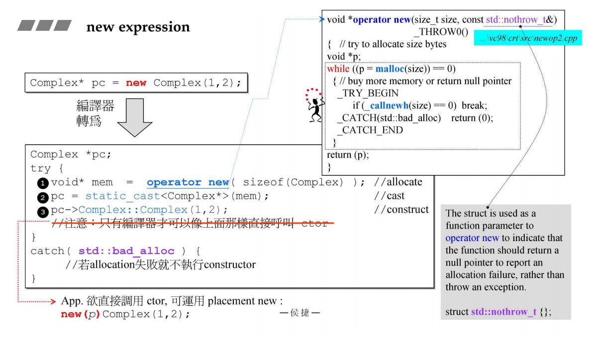
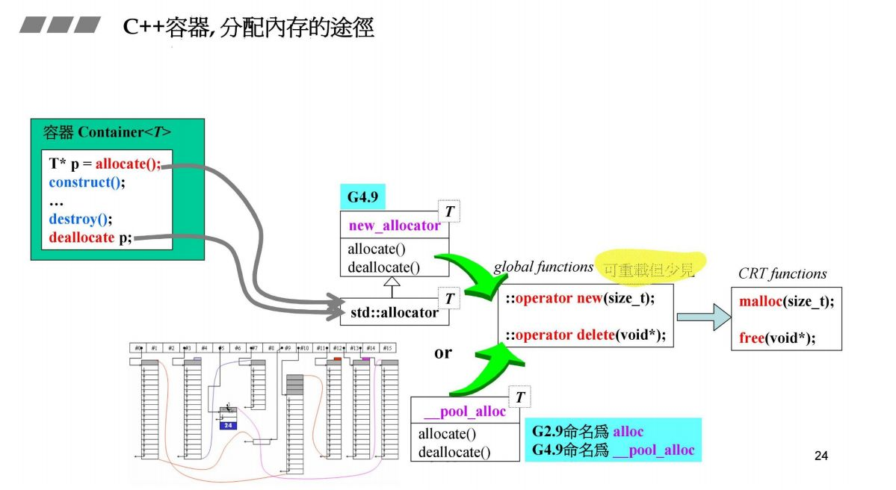
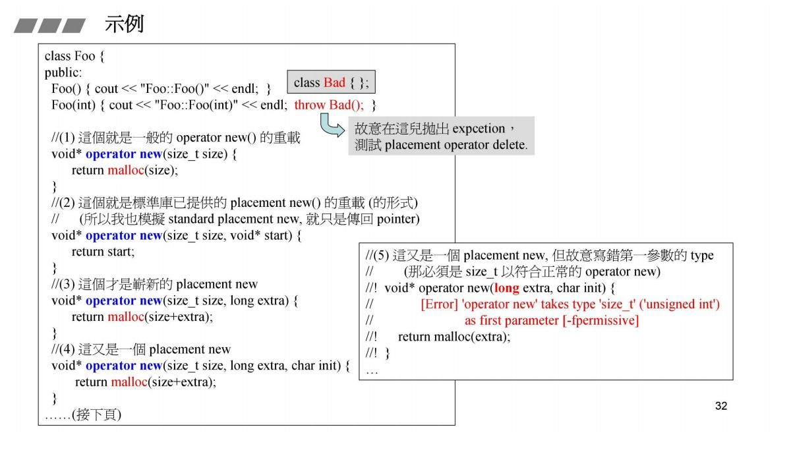
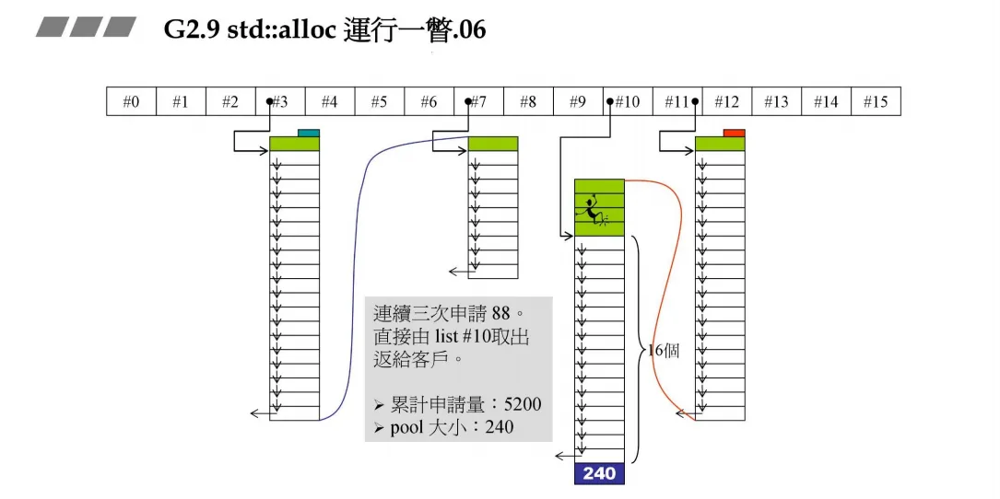
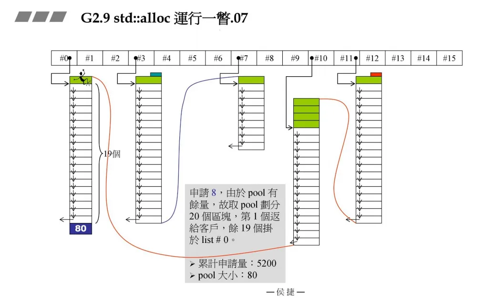
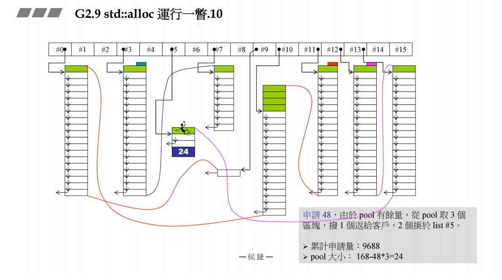

# 侯捷C++内存管理讲义

[侯捷C++ 内存管理 第一讲 笔记](https://zhuanlan.zhihu.com/p/476637169)

[侯捷 C++内存管理机制_侯捷](https://blog.csdn.net/u011386173/article/details/121872751)


## 内存管理基础


### 四种内存分配和释放方法


在编程时可以通过上图的几种方法直接或间接地操作内存。下面将介绍四种C++内存操作方法：


通常可以使用malloc和new来分配内存，当然也可以使用::operator new()和分配器allocator来操作内存，下面将具体介绍这些函数的使用方法。对于不同的编译器，其allocate函数的接口也有所不同：


对于GNU C，不同版本又有所不同：


这张图中的**gnu_cxx::**pool_alloc< T >().allocate()对应于上张图中的allocator< T >().allocate()。

通过malloc和new分配内存、通过free和delete释放内存是十分常用的，通过::operator new操作内存比较少见，allocator分配器操作内存在STL源码中使用较多，对于不同的编译环境使用也有所不同。


### 基本构件之 new/delete expression

#### 1、内存申请



上面这张图揭示了new操作背后编译器做的事：

1. 第一步通过operator new()操作分配一个目标类型的内存大小，这里是Complex的大小；
2. 第二步通过static_cast将得到的内存块强制转换为目标类型指针，这里是Complex*
3. 第三步调用目标类型的构造方法，但是需要注意的是，直接通过pc->Complex::Complex(1, 2)这样的方法调用构造函数只有编译器可以做，用户这样做将产生错误。

值得注意的是，operator new()操作的内部是调用了malloc()函数。


#### 2、内存释放


同样地，delete操作第一步也是调用了对象的析构函数，然后再通过operator delete()函数释放内存，本质上也是调用了free函数。


### Array new


上图主要展示的是关于new array内存分配的大致情况。当new一个数组对象时（例如 new Complex[3]），编译器将分配一块内存，这块内存首部是关于对象内存分配的一些标记，然后下面会分配三个连续的对象内存，在使用delete释放内存时需要使用delete[]。**如果不使用delete[]，只是使用delete只会将分配的三块内存空间释放，但不会调用对象的析构函数，如果对象内部还使用了new指向其他空间，如果指向的该空间里的对象的析构函数没有意义，那么不会造成问题，如果有意义，那么由于该部分对象析构函数不会调用，那么将会导致内存泄漏。**图中new string[3]便是一个例子，虽然str[0]、str[1]、str[2]被析构了，但只是调用了str[0]的析构函数，其他对象的析构函数不被调用，这里就会出问题。

下图将演示数组对象创建与析构过程：


构造函数调用顺序是按照构建对象顺序来执行的，但是析构函数执行却相反。值得注意的是，在调用了delete的大括号代码段中，数组有三个元素，但最后只调用了第一个对象的析构函数。


接下来将更具体地展示new array对象的内存分配情况：


如果使用new分配十个内存的int，内存空间如上图所示，首先内存块会有一个头和尾，黄色部分为debug信息，灰色部分才是真正使用到的内存，蓝色部分的12 bytes是为了让该内存块以16字节对齐。在这个例子中delete pi和delete[] pi效果是一样的，因为int没有析构函数。但是下面的例子就不一样了：


上图通过new申请三个Demo空间大小，内存块使用了96 byte，这里是这样计算得到的:黄色部分调试信息32 + 4 = 36 byte；黄色部分下面的“3”用于标记实际分配给对象内存个数，这里是三个所以里面内容为3，消耗4 byte；Demo内有三个int类型成员变量，一个Demo消耗内存3 * 4 = 12 byte，由于有三个Demo，所以消耗了12 * 3 = 36 byte空间；到目前为止消耗36 + 4 + 36 = 76 byte，加上头尾cookie一共8 byte一共消耗84 byte，由于需要16位对齐，所以填充蓝色部分为12 byte，一共消耗了84 + 12 = 96 byte。这里释放内存时需要加上delete[]，上面分配内存中有个标记“3”，所以编译器将释放三个Demo对象空间，如果不加就会报错。


### placement new


### 重载 

#### 1、C++内存分配的途径


如果是正常情况下，调用new之后走的是第二条路线，如果在类中重载了operator new()，那么走的是第一条路线，但最后还是要调用到系统的::operator new()函数，这在后续的例子中会体现。




对于GNU C，背后使用的allocate()函数最后也是调用了系统的::operator new()函数。


#### 2、重载new 和 delete


上面这张图演示了如何重载系统的::operator new()函数，该方法最后也是模拟了系统的做法，效果和系统的方法一样，但一般不推荐重载::operator new()函数，因为它对全局有影响，如果使用不当将造成很大的问题。

如果是在类中重载operator new()方法，那么该方法有N多种形式，但必须保证函数参数列表第一个参数是size_t类型变量；对于operator delete()，第一个参数必须是void* 类型，第二个size_t是可选项，可以去掉。


对于operator new[]和operator delete[]函数的重载，和前面类似。





### pre-class allocator


每个对象以8 byte对齐。内存池本质上是分配了一大块内存，然后将该内存分割为多个小块通过链表拼接起来，所以物理上不一定连续但是逻辑上是连续的。


### static allocator


之前的几个版本都是在类的内部重载了operator new()和operator delete()函数，这些版本都将分配内存的工作放在这些函数中，但现在的这个版本将这些分配内存的操作放在了allocator类中，这就渐渐接近了标准库的方法。从上面的代码中可以看到，两个类Foo和Goo中operator new()和operator delete()函数等很多部分代码类似，于是可以使用宏来将这些高度相似的代码提取出来，简化类的内部结构，但最后达到的结果是一样的：


### global allocator


 

### new handler


如果用户调用new申请一块内存，如果由于系统原因或者申请内存过大导致申请失败，这时将抛出异常，在一些老的编译器中可能会直接返回0，可以参考上图右边代码，当无法分配内存时，operator new()函数内部将调用_calnewh()函数，这个函数通过左边的typedef传入，看程序员是否能自己写一个handler处理函数来处理该问题。一般有两个选择，让更多的Memory可用或者直接abort()或exit()。


### =default和=delete


## std::allocator

[侯捷C++ 内存管理第二讲笔记（一） - 知乎 (zhihu.com)](https://zhuanlan.zhihu.com/p/478900210)


### malloc()内部原理


#### 1、VC6.0 malloc


从上图可见，VC6中的malloc()函数分配的内存里面除了我们需要申请的内存空间外还有cookie、debug信息和pad，其中cookie是我们不需要的，如果大量调用malloc的话cookie总和会增多，这会造成较大的浪费。


从上面可以看出，VC6.0的allocate()函数只是对malloc的二次封装，并没有做什么很特殊的操作，它是以类型字节长度为单位分配内存的，上图就分配了512个int类型空间。


#### 2、BC5 malloc


BC5的allocate( )函数和VC6.0本质一样。


#### 3、G2.9 malloc


GCC 2.9版本的allocator如上图所示，但是在实际中该部分却没有被包含使用，从下图容器使用的Alloc可以看到，实际的分配器是使用了一个叫alloc的类，该类分配内存是以字节为单位的，而不是以对象为单位。下图右边灰色部分分配的是512字节，而不是512个对象。


#### 4、__pool_alloc


从上面两张图可以对比看出，2.9版本的allocate和4.9版本的__pool_alloc做的事是一样的，只是修改了变量名和一些细小操作而已。


### std::alloc


#### 1、std:alloc运作模式


std::alloc使用==一个16个元素为指针的数组==来管理内存链表，而我们上一章只是用了一条链表。数组不同的元素管理不同的区块管理，例如#3号元素负责管理32bytes为一小块的链表。

假设现在用户需要32字节的内存，std::allloc先申请一块区间，为==32* 20 * 2==大小，用一条链表管理，然后让数组的#3元素管理这条链表。接着将该链表的一个单元（32字节）分给用户。

为什么是==32 * 20 * 2==？ 前面32 * 20空间是分配给用户的，但是后面的32 * 20空间是预留的，如果这时用户需要一个64字节的空间，那么剩下的32 * 20空间将变成64 * 10，然后将其中64字节分配给用户，而不用再一次地构建链表和申请空间。

但是也有上限。如果该链表组维护的链表最大的一个小块为128byte，但是用户申请内存块超过了128byte，那么std::alloc将调用malloc给用户分配空间，然后该块将带上cookie头和尾。


#### 2、std::alloc运行一瞥


**申请32bytes**


32字节对应#3指针所指向的链表，此时由于战备池为空，故向战备池中充值==32 * 20 * 2 + RoundUp(0>>4)=1280==，从中切出一块返回给客户，剩余19块，累计申请1280字节，战备池有640字节。

==RoundUp==实现8字节对齐。例如传入13，传出的就是16。0>>4表示右移4位。


**申请64bytes**


上次的战备池有640字节，下次的分配就会从战备池中取，这次申请64字节，对应到#7链表指针，此时使用战备池中的字节做区块，可以得到10，从中切出一块返回给用户，剩余9个，此时累计申请量1280，战备池大小此时为0.


**申请96bytes**

由于战备池中没有余量，此时向战备池中注入==96 * 20 * 2+RoundUp(1280>>4)==，其余原理同上。【这里的1280就是到目前为止已经申请的内存大小】


后面的申请流程不再赘述。







**碎片处理**

申请104bytes， 但是战备池的余量一个也供应不了，此时先把战备池的余额分给list #9（==碎片处理==），然后系统给战备池充值 ==104 * 20 * 2 + RoundUp(5200 >> 4)== ， 切出一块给用户，19块给list #12, 剩余 2408bytes 作为战备池调用。




**系统可分配内存不足，如何处理**

申请 72 bytes, list #8无可用区域，战备池余量又不足以供应一个，此时进行碎片处理。先把战备池的余额发给list #2，然后要重新往#8中充值，但此时假设系统的heap大小为10000，此时分配的72 * 20 * 2 + RoundUp(9688 >> 4）再加上之前的累计申请量，更新后就超过了10000，资源不够了。此时就需要从后面最近的链表元素借，在上一个图中我们发现#9满足，此时80-72=8，也就是战备池为8。切除了72返回给用户。


再次申请72 bytes, 战备池无余额， 进行碎片处理，然后向系统索取 72 * 20 * 2 + RoundUp(9688 >> 4) 但系统无可分配内存， 于是==alloc==从手中资源取最接近的88（list# 10）回填战备池， 再从中切出72 bytes 分配给客户， 余 16 bytes。


**山穷水尽**

申请 120 btyes ，此时已经无法找到合适的借用。


##  malloc/free

[内存管理第三讲笔记 malloc/free(一)](https://zhuanlan.zhihu.com/p/517472169)


malloc和 free 作为 c 语言中的内存申请函数（new是运算符），malloc 实际上依据申请的空间大小，大空间调用操作系统的 API（HeapAlloc()），小空间使用SBH(小于等于1K)。

SBH 是 Small Block Heap 的缩写，进行**操作系统之上的小区块内存的管理**。在 VC6 中可找到源码实现，升级版本 VC10 中统一使用系统API进行内存申请, SBH 被整合到了操作系统内部。

malloc与free带来的内存管理是应付小区块的，即SBH(small block heap)，这点也可以从源代码中看出：

```cpp
if(size <= __sbh_threshold) {
    pvReturn = __sbh_alloc_block(size);
    return pvReturn;
}
...
return HeapAlloc(_crtheap,0,size)
```

VC10下不会做门槛检测，它总是会调用系统提供的HeapAlloc。这是因为操作系统提供的函数也有类似的功能了。


### VC6和VC10的malloc比较


vc6的SBH，在vc10中被放到了heapalloc()中


### vc6内存分配

我们分析的步骤是按照函数调用的次序来的：（从下往上的函数调用次序如下）：


#### 1、heap初始化（ heap_init函数）

CRT 会先为自己创建一个 _crtheap "独特"内存（HeapCreate）, 然后从中配置 SBH 所需的 headers, regions(__sbh_heap_init). 应用程序内存申请时如果 size > threshold 就以 HeapAlloc() 从 _crtheap 取。若size <= thread 就从 SBH 取（实际区块来自 VirtualAlloc()）。


HeapCreate 要求操作系统分配一块内存，_crtheap 全局指针变量，指向分配的内存空间，专为 CRT（C Run Time） 使用
CRT是C run-time library的简称，称为C运行时库。

__sbh_heap_init()，到 _ctrheap 指向的内存获取 16 * sizeof(Header) 空间 

每个 SBH 中都有 16 个HEADER (当16 个HEADER用光后，会再进行分配)


`pHeadData`指向内存

`pRegion`指向管理中心


#### 2、计算真正区块大小


**_ioinit()**


进入该代码段，提出要求分配大小为256的空间即32 * 8【ioinfo的大小为6，对齐调整为8】，完成了应用程序启动后的“第一次”内存申请。


**_heap_alloc_dbg(nSize)**

首先了解 SBH 对所分配的内存块的结构设计，可分为三部分： _ CrtMemBlockHeader、data[nDataSize]、anotherGap[nNoMansLandSize]。 由此可以知道当应用程序申请 data[nSize] 实际消耗的内存空间大小为 blockSize = sizeof(_CrtMemBlickHeader) + nSize + nNoMansLandSize;

由此又可知 _heap_alloc_dbg(nSize)的主要任务，调整申请的内存大小，增加DebugHeader，并进行值填充和初始化。


这里的nSize为传入参数即为前面要求分配的空间大小256byte【16进制下则为100h】，nNoMansLandSize宏定义大小为4。

而结构体_CrtMemBlockHeader (**附加上去给debuger时用**) 的大小如右上图所示：

1.pBlockHeaderNext, 指向链表后内存块
2.pBlockHeaderPre, 指向链表前内存块
3.szFileName, 记录申请使用该内存空间所在的文件
4.nLine, 记录申请使用该内存空间所在文件的行号
5.nDataSize, 实际数据区的空间大小(应用程序实际使用到的内存块)
6.nBlockUse, 表示当前内存块的类型, 如 \_CRT_BLOCK、\_NORMAL_BLOCK 等...
7.IRequest, 操作流水号
8.gap[nNoMansLandSize]，上下两处“栏杆”，保护应用程序实际使用到的内存，若发生内存越界的情况，调试器可检查到


通过调用_heap_alloc_base来获取每个blockSize内存的头指针。 然后通过头尾指针将所有分配出来的block串接起来，变为一个链表。

1.上图主要对分配的空间进行数据填充和值初始化，以后续对内存块管理
2.在调试模式下，malloc 分配的内存都被管理在链表中（即使已被客户使用），因此调试器可以实现复杂的功能
3.\_pFirstBlock、\_pLastBlock 全局指针


**_heap_alloc_base(size)**

之前在通过heap_alloc_dbg中调用_heap_alloc_base来获取每个blockSize内存的头指针。现在来看看它具体步骤：

在知道所需要附加上的debuger的总的需求大小后【注意此时仍没有进行内存空间的分配，只是在发出需求】，进入\_heap_alloc_base()进行判断。


1. 当应用程序进行内存申请时，内存相关底层实现会根据申请空间的大小选择不同的接口 

   当申请量小于等于 1016Bytes 时调用 **sbh_alloc_block **

   当申请量大于 1016Bytes 时调用操作系统提供的API HeapAlloc() 从crtheap(全局变量) 中取内存

2. __sbh_threshold = 1016 = 1024 - (2 * 4). 其中 2 * 4Bytes 对应两个 cookies 的开销


**_sbh_alloc_block(...)**


intSize 就是之前得到的内存块大小；
2 * sizeof(int) 就是加 2 个cookie；
最后的部分是在做RoundUp，调整到 16 的倍数；
也就是说通过malloc分配的内存的实际大小，也是真正消耗掉的内存大小，是：要分配的大小经过调整补充（32bytes，给调试器使用的）再加上cookie，最后调整为16的倍数；
图中cookie记录的值是实际内存大小（图中一整块的大小），**本来是0x130，但是记录的却是0x131，结尾的 1 表示这块内存已经被占用了，一旦被sbh回收，就会变成 0x130；**
从`ioinit`->`_malloc_dbg`->`_nh_malloc_dbg`->`_heap_alloc_dbg`->`_heap_alloc_base`->`__sbh_alloc_block`都是在计算内存的大小，还没真正进行内存分配，图中的那些值都还没设置；


#### 3、分配和管理内存

**__sbh_alloc_new_region()**


此处真正进行内存分配；1个HEADER负责管理1MB，通过管理中心进行管理；通过LISTHEAD知道，每个GROUP一共有64条双向链表。
总结：1个HEADER将会申请真正的内存1MB，将来要分割出去的时候就从这块内存中进行分割；为了对这块内存切割后的内存块进行管理，又建立了REGION；REGION的大小是16k；


struct tagRegion：

- indGroupUse表示了当前会提供内存的group编号，从0开始
- cntRegionSize[64]用64个字节去对应当前group所将会展开链表，当对应链表挂载有内存时，将会变成1，即最上面的深灰阴影的那一行
- bitvGroupHi和bitvGroupLo共同构成了一个byteMap，共64个byte(分为32组)，将来用于对应每个group中所挂载的64条双向链表，当对应的位置挂载有可用内存时，会变成1.


struct tagGroup：

- cntEntries表示当前链表中进行了分配或释放空间的次数【**正数则代表分配操作，负数则代表释放回收操作，0则表示系统已经将分配的空间全部回收或没有任何空间被分配使用**】.
- listHead对应64对指针，也就是形成了64条链表，用于挂载不同大小的内存块，间隔为16byte，最后一条链表将挂载所有大于等于1K的内存块.


**__sbh_alloc_new_group**


从HEADER指向的内存从中分割内存块：32个Group逻辑上对应HEADER指向的内存（虚拟空间），将该内存切分为32个单元，每个单元就是32k；每个单元又细分为8个page，每个page的大小为4k（计算机中通常将4k称为1个page）；sbh设置一些指针，将这些page串起来。


这8个page在内存中是连续的；64条链表，管理的最大的区块是1k，那么每条链表负责的任务是什么呢？ 类比于GNU编译器，每条链表负责的是8的倍数的内存大小，这里的最后一条链表负责 1kB，通过计算可得第一条链表负责 16B，第二条链表负责 32B，…；当切割的内存块的大小大于1k的时候，就归最后一条链表管理，小于1k的时候就计算应该归哪条链表管理。


> 上图黄色标注 0xffffffff (-1) 可理解为“阻隔器”，在内存回收合并时使用，保证相邻的page总是被分离的（不会交融合并）；红色标注三个区块是 ENTRY 结构，4080 对应 sizeFront （表示空闲字节数）, 是阻隔器之间空间大小。
> 已知 1个page 是 4096 字节, 减去两个”阻隔器“ 4096 - （2 * 4） = 4088，预留（浪费）8字节以进行 16 对齐 4088 - 8 = 4080
> 在上图 Group 结构中，只有 64 对指针，并没有看到 sizeFront 。这是因为 Group 只是自由链表的辅助节点，并未对应实际的page空间，因此为了节省内存 sizeFront 借用了上一个 Entry 的pEntryPrev


上图是从page中切割内存块的操作；图中 0x130 的就是切割出去的，红色的地址007d0ff8是传出去的地址，但是这是在debug模式下，所以这个地址还会继续调整，扣除debug header，只将真正需要的内存地址传出去，这才是使用者真正拿到的地址，这个长度(100h)就是当初使用者申请的大小，这里的使用者就是当初的ioinit；这个page还剩 ec0 = fff0 - 130，其中 fff0  就是4080。

切割只是cookie的调整；展开的切割好的内存块中，前两个数据有错误，此处不是0了，而是对应的两个指针；第三个数据(0042ee08)指向发出内存申请的文件名ioinit.c；第4个数据(00000081)是文件的哪一行发出的内存申请；第5个数据(0000100) 表示使用者真正需要的数据大小；第6个数据(00000002)表示`_CRT_BLOCK`，表示这一块是给 CRT 用的。

main执行结束后，可能还有区块，这并不一定是内存泄漏，因为这可能是CRT在使用，查看`nBlockUse`变量是否为`_CRT_BLOCK`，那么这就是合理的；在main结束之前的一刻，发现有`_NORMAL_BLOCK`的内存块，才说明存在内存泄漏；像130h 这一个区块应该由第 304 / 16 - 1 = 18号链表供应。


#### 4、SBH行为分析-分配


**首次分配**


1. 需求：`ioinit.c`的 line#81 申请 100h，经过调整区块大小为130h；

2. `sbh`面对这样的内存申请，在初始化的时候已经有16个HEADER，现在第0个HEADER，先通过`VirtualAlloc(0, 1Mb, MEM_RESERVE, ...)`分配1Mb的空间（从操作系统海量的内存中获得的空间）；
   - 0：表示don’t care，不在意从什么地方分配的空间；
   - 1Mb：表示需要的大小；
   - MEM_RESERVE: 保留，保留这个地址空间，不需要真的有内存在这个地址；

3. 另一个指针通过`HeapAlloc` 函数从`_crtheap`中获取到一块大小为`sizeof(REGION)`的内存空间；`REGION`中包含的东西在之前已经看过其结构体了，其中还包含了32个Group，每个Group包含64对指针；

4. 从1Mb中通过`VirtualAlloc(addr, 32Kb, MEM_COMMIT)`真正地划分出32K的内存（此处的`MEM_COMMIT`表示真的分配出去，可以想象1Mb的空间里除了32K有内存，其它的都是空的，没有内存，只有号码），1Mb空间中划分出了32个32K，对应于32个Group；将32K切成更小的单元即8个page，这8个page各有两个指针，通过指针将这些page串起来，最后串回到64个链表的最后一个（之所以串回到最后一个链表，是因为每个page的大小为4080，大于1k；64条链表分别管理的区块大小为16B、32B、48B、…，而最后一个链表管理所有1k以上的区块，而目前这些page都是1k以上的，所以全部都归第64条链表管理）；

5. 以上就是为了第一次分配准备的内存；

6. 接下来开始切割，为了应付第一次的内存申请，8个page，从第一个page开始切，图中第二个大图就是page放大后的图，第一个图就是切割后给出去的130h大小的内存的具体内容，其中包含debug header以及无人区，而客户实际得到的地址是指向实际需要的大小100h的地址；在实际需要的内存大小100h的前后都有fd，当用户获得指向100h的地址后，会往下写，可能会写到后面的fd中，而在回收的时候，调试器会检测fd是否被修改，如果被修改了，就会发出警告⚠️，这就是无人区，有隐患存在，是绝对不可以被改的内容；

7. 申请100h，调整后为130h，理应由Group0的#18 list供应，但是现在只有 #63 list链接着内存块，其他链表都是自己链接到自己（为空），当用户发出申请的时候，供应端会将自己的状况告诉用户端 ，REGION中的64bits变量，对应于64条链表，哪条链表有链接着区块，对应的bit就会被设置为1，否则为0；当前的情况只有最后一条链表挂着区块，所以只有最后一个bit是1，其他都是0；每一行bits变量表示一个Group，所以有32行bits变量。


**第2次分配**


1. 某个申请x字节的内存，经过添加Debug header、cookie，以及调整为16的倍数后需要的内存大小为240h；通过计算得到应该由#35 list供应，接着就去检查Group0的64bit变量中的第35号对应的bit是0还是1，目前只有最后一个bit对应的值为1，其他都是0，也就是说应该供应的#35 list为空，只能退而求其次，找比较大的，目前只有最后一条链表，从之前的page1中剩余的内存中切割；
2. Group结构体中的cntEntries变量，当需要分配的时候+1，回收的时候-1；当值为0的时候，表示8个page可以全部收回来，还给操作系统；
3. 图中Region区域的红色的0表示正在使用Group0；如果Group0的8个page都使用完后，就继续往下使用Group1，…


**第3次分配**

1. 申请的70h，在sbh先检查应该由第几号链表供应刚刚好，结果发现其对应的链表的bit是0，于是只好找最靠近的有区块链接的链表，找到了最后一个链表；
2. 从最后一个链表中找到page1，从剩下的内存中划分70h。


**第15次分配，释放**


1. 并不是每个应用程序都是在第15次，这里只是作为观察选取的一次；
2. 14->13，释放，要先减一；
3. 这次还的是第2次分配的 240h，调用free进行释放，归还到#35 list，挂到35号链表上；回收的方式就是将这块内存的cookie里的241修改成240，就表示进行了回收，相关的数字进行修改（可能会做）；
4. 修改64bit变量中对应的第 36 个bit（表示35号链表）的数字为 1；（00000000 10000001，其中每一位表示4bit）；


1. 需要分配b0h，应该由#10 list供应，但是检查bit位发现第11个bit值为0，就要往比较大的区块进行查找，#35 list有区块，所以应该由 #35 list供应，#35 list刚刚回收了240h的内存，所以从这块内存里切；
2. 240h切出去b0h，还剩 190h，这个内存块变小了，就要进行移动，通过计算 $190h/10h−1=24$，应该挂在 #24 list上，所以第 25 个bit应该从 0 修改为 1；
3. 这个过程就是第15次的时候刚刚回收了 240h 的内存，第16次分配的时候就要从刚刚回收的内存中进行切割，剩下的内存块（190h） 比较小，就进行移动，对应的bit也要进行调整。


1. 第 n 次分配设计的是Group1的区块不足够，相对应的要划分一块32k的内存，将它划分为8个page，这是一个新的Group，之前的Group1中的32k的使用状态是 02000014 00000000，里面有3个链表挂了区块，有几块不知道；
2. 第 n 次分配需要 230h 的内存大小，之前 Group1上的链表挂的区块不能满足这个要求，于是新启动一个Group2（图中的数字变成了1），其他的操作都是一样的。


#### 5、SBH行为分析-区块合并


如果回收的内存是相邻的，是不是应该合并呢？好的设计应该是要合并的。

图中空白的区块表示已经回收了的，阴影部分表示可以进行回收的区块。

目前图一中的待回收的内存块前后都是已经回收的300h大小的内存块，这两个内存块都落在#(300h/10h - 1) 这条链表上，要归还目前这个阴影内存块，就要去判断上面和下面是不是都是已经是回收的内存块，这就谈到为什么要有上下cookie。直观地想，cookie是记录整个内存块的大小，应该只需要一个就好了，为什么上下都有一个一模一样的cookie呢？

回收的步骤：

1. 先将待回收的内存块的cookie中的 1 修改为 0；
2. 图中弓箭所在的地方的指针往上4个字节，知道了长度为300h，从这个地址开始加上300h到达了下一块内存的起点，即cookie，能够去检查最后一个bit，发现是0，所以这两块内存可以合并，得到了如图二所示的样子；
3. 因为上下都有cookie，所以从图一的弓箭处的位置往上4个字节，再往上4个字节，就到达了上一个内存块的cookie，知道了上一个内存块的大小，且知道了最后一个bit是0，于是可以继续往上调 300h到达了上一个内存块的上cookie位置，将它们进行合并，就得到了图三的样子；
4. sbh 系统计算 900h 应该链到哪条链表上；

所以，如果没有下cookie的设计，就无法管理上方区块的合并。


#### 6、free


首先要知道落在哪一个1Mb之中（一个Header对应一个1Mb的内存），在这1Mb中又要知道落在32段的哪一段之中，知道是哪一段就知道了对应于哪一个Group，然后才能去除以16再减一，确定链在哪个链表上。

指针p如何知道是哪个Header？最开始有 16 个Header，__sbh_pHeaderList指向这16个Header，每个Header的大小是固定的。回收的时候知道内存块的大小，通过p+内存块的大小，计算属于哪个Header，如果找不到，则说明当初不是从这里分配出去的，找到属于哪个Header后，将该指针减去这个1Mb的头指针再除以32k，计算得到位于1Mb的哪个段（如果从0算起，还要减1）；

p 花落谁家？

Q：落在哪个 Header 内？

A：每个Header都有指针指向1Mb的内存块，且这个内存块的大小也知道了，于是通过计算头+内存块大小，可以知道 p 是落在哪个Header内了。

Q：落在哪个 Group 内？

A：p 减去 1Mb的头指针，除以32k，就知道落在第几段，也就落在哪个Group内。

Q：落在哪个 free-list 内？（被哪个 free-list 链住？）

A：指针往上看就是cookie，通过cookie知道了内存块的大小，然后除以10h再减去1，就知道落在哪个链表；


#### 7、分段管理之妙

1. 如何判断全回收？
   如果链表全部变成0就表示全部给出去了，那么如何判断全回收呢？Group中有cntEntries变量，只要这个值变成0，就表示全回收。

2. 不要躁进！
   全回收的时候回到了初始的状态（首次分配），8个page不能再进行合并，因为并不急着还给os，方便下一次的分配，等到下一次全回收才会归还给os。只有手上有两个全回收的时候才会归还给系统。


### VC6 Heap State Reporting Functions


调试模式下才有Debug Header，才可以去追踪，图中的函数就是可以利用的。


### VC malloc + GCC allocator


GCC的allocator的原理和VC 的 malloc 是相似的，allocator中有16条链表，管理的区块最高到128B，每次需要的时候向malloc要内存，allocator中的16条链表的设计不是为了速度快，因为malloc已经很快了，目的是为了去除cookie。


# C++内存管理变革


## GC Allocator

C/C++语言的内存管理经历了几次变革，但至今仍未能趋于成熟。这几次变革主要包括：

1. 从malloc/free到new/delete。这场变革是OOP技术兴起的产物。C++是强类型语言，new/delete的主要成果也就是加强了类型观念，减少了强制类型转换的需求。但是从内存管理角度看，这个变革并没有多少的突破性。
2. 从new/delete 到内存配置器（allocator）。自从STL被纳入C++标准库后，C++世界产生了巨大的变化。而从内存管理角度来看，allocator的引入也是C++内存管理一个突破。留意一下你就可以发现，整个STL所有组件的内存均从allocator分配。也就是说，STL并不推荐使用 new/delete 进行内存管理，而是推荐使用allocator。

然而，STL的allocator并没有导致C++语言在内存管理上发生巨大的变化。除了STL本身外，并没有多少人使用allocator，甚至是意识到allocator的重要性。所以C++程序员在使用STL的同时，依旧在使用new/delete进行烦琐的内存分配/释放过程。


### 垃圾回收器（GC）

想为C++提供一个全自动的垃圾回收器是相当困难的，但是一个半自动的垃圾回收器或许是一个好的选择。


### 初识Allocator

Allacator中文称为“内存配置器”，通常它是一个类，负责提供内存管理（可能包含内存分配、释放、自动回收等能力）相关的服务。例如，我们通过C提供的malloc/free即刻提供一个allocator实作出来：

```c++
class SimpleAlloc
{
public:
    //注意这里提供的参数fnDestroy，它是为那些具备垃圾回收能力的allocator需要提供。
    void* Alloc(size_t cb, FnDestructor fnDestroy = NULL)
    {
        return malloc(cb);
    }
 
    //注意这里有看似多余的参数cb，这完全是为了和后续提供的allocator规格一致的需要。
    void Free(void* data, size_t cb)
    {
        free(data);
    }
};
```

有了allocator，我们可以申请内存了，但是我们还不能用它创建一个C++对象。为了方便创建C++对象，我们提供了辅助的New操作，原型大体如下：

```c++
template <class Type, class AllocType>
Type* New(AllocType& alloc);                    // 类似于new Type
 
template <class Type, class ArgType1, class AllocType>
Type* New(ArgType1 arg1, AllocType& alloc);    // 类似于new Type(arg1)
 
template <class Type, class AllocType>
Type* NewArray(size_t count, AllocType& alloc);// 类似于new Type[count]
```

有了这些辅助函数，我们就可以创建对象了。使用样例：

```c++
SimpleAlloc alloc;

int* intArray = NewArray<int>(count, alloc);

MyClass* obj = New<MyClass>(alloc);
MyClass* objWithArg = New<MyClass>(arg1, alloc);

MyClass* objArray = NewArray<MyClass>(count, alloc);
```


### 辅助的New过程

下面实现New函数

```c++
#include <new>
 
template <class Type, class AllocType>
inline Type* New(AllocType& alloc)
{
    void* obj = alloc.Alloc(sizeof(Type), DestructorTraits<Type>::Destruct);
    return new(obj) Type;
}
```

其中DestructorTraits是一个根据类型Type萃取析构函数的萃取器。它看起来是这样的：

```c++
template <class Type>
struct DestructorTraits
{
    static void Destruct(void* pThis)
    {
        ((Type*)pThis)->~Type();
    }
};
```


# 内存池


## 经典内存池技术

[内存池(MemPool)技术详解 - StdExt - C++ STL Extensions (wikidot.com)](http://cplusplus.wikidot.com/cn:dive-into-memory-pool)


经典的内存池（MemPool）技术，是一种用于分配大量大小相同的小对象的技术。通过该技术可以极大加快内存分配/释放过程。

经典的内存池只涉及两个常量：MemBlockSize、ItemSize（小对象的大小，但不能小于指针的大小，在32位平台也就是不能小于4字节），以及两个指针变量MemBlockHeader、FreeNodeHeader。

```c++
class MemPool
{
private:
    const int m_nMemBlockSize;
    const int m_nItemSize;
 
    struct _FreeNode {
        _FreeNode* pPrev;
        BYTE data[m_nItemSize - sizeof(_FreeNode*)];
    };
 
    struct _MemBlock {
        _MemBlock* pPrev;
        _FreeNode data[m_nMemBlockSize/m_nItemSize];
    };
 
    _MemBlock* m_pMemBlockHeader;
    _FreeNode* m_pFreeNodeHeader;
 
public:
   MemPool(int nItemSize, int nMemBlockSize = 2048)
       : m_nItemSize(nItemSize), m_nMemBlockSize(nMemBlockSize),
         m_pMemBlockHeader(NULL), m_pFreeNodeHeader(NULL)
   {
   }
};
```

其中指针变量MemBlockHeader是把所有申请的内存块（MemBlock）串成一个链表，以便通过它可以释放所有申请的内存。FreeNodeHeader变量则是把所有自由内存结点（FreeNode）串成一个链。

这段话涉及两个关键概念：**内存块（MemBlock）**和**自由内存结点（FreeNode）**。内存块大小一般固定为MemBlockSize字节（除去用以建立链表的指针外）。内存块在申请之初就被划分为多个**内存结点（Node）**，每个Node大小为ItemSize（小对象的大小），计MemBlockSize/ItemSize个。这MemBlockSize/ItemSize个内存结点刚开始全部是自由的，它们被串成链表。


### 申请内存过程

```c++
void* MemPool::malloc()    // 没有参数
{
    if (m_pFreeNodeHeader == NULL)
    {
       const int nCount = m_nMemBlockSize/m_nItemSize;
        _MemBlock* pNewBlock = new _MemBlock;
        pNewBlock->data[0].pPrev = NULL;
        for (int i = 1; i < nCount; ++i)
            pNewBlock->data[i].pPrev = &pNewBlock->data[i-1];
        m_pFreeNodeHeader = &pNewBlock->data[nCount-1];
        pNewBlock->pPrev = m_pMemBlock;
        m_pMemBlock = pNewBlock;
    }
    void* pFreeNode = m_pFreeNodeHeader;
    m_pFreeNodeHeader = m_pFreeNodeHeader->pPrev;
    return pFreeNode;
}
```

内存申请过程分为两种情况：

1. 在自由内存结点链表（FreeNodeList）非空。在此情况下，Alloc过程只是从链表中摘下一个结点的过程。
2. 否则，意味着需要一个新的内存块(MemBlock)。这个过程需要将新申请的MemBlock切割成多个Node，并把它们串起来，MemPool技术的开销主要在这。


### 释放内存过程

```c++
void MemPool::free(void* p)
{
    _FreeNode* pNode = (_FreeNode*)p;
    pNode->pPrev = m_pFreeNodeHeader;
    m_pFreeNodeHeader = pNode;
}
```


### 基于内存池技术的通用内存分配组件

SGI STL把内存池（MemPool）技术进行发扬光大，用它来实现其最根本的allocator。

其大体的思想是，建立16个MemPool，<=8字节的内存申请由0号MemPool分配，<=16字节的内存申请由1号 MemPool分配，<=24字节的内存有2号MemPool分配，以此类推。最后，>128字节的内存申请由普通的malloc分配。


## boost::pool

[C++内存管理变革(4)：boost::object_pool与gc allocator - StdExt - C++ STL Extensions (wikidot.com)](http://cplusplus.wikidot.com/cn:gc-allocator-and-boost-object-pool)


boost::pool是内存池技术的变种。主要的变化如下：

1. MemBlock改为非固定长度(MemBlockSize)，而是：第1次申请时m_nItemSize\*32，第2次申请时 m_nItemSize\*64，第3次申请时m_nItemSize\*128，以此类推。不采用固定的MemBlockSize，而采用这种预测模型，是一个细节上的改良。
2. 增加了ordered_free(void\* p) 函数。ordered_free区别于free的是，free把要释放的结点挂到自由内存链表（FreeNodeList）的开头， ordered_free则假设FreeNodeList是有序的，因此会遍历FreeNodeList把要释放的结点插入到合适的位置。我们已经看到，free的复杂度是O(1)，非常快。但请注意ordered_free是比较费时的操作，其复杂度是O(N)。这里N是FreeNodeList的大小。对于一个频繁释放/申请的系统，这个N很可能是个大数。


### 内存管理观念

boost::object_pool的了不起之处在于，这是C++从库的层次上头一次承认，程序员在内存管理上是会犯错误的，由程序员来确保内存不泄漏是困难的。boost::object_pool允许你忘记释放内存。我们来看一个例子：

```c++
class X { … };

void func()
{
    boost::object_pool<X> alloc;

    X* obj1 = alloc.construct();
    X* obj2 = alloc.construct();
    alloc.destroy(obj2);
}
```

如果boost::object_pool只是一个普通的allocator，那么这段代码显然存在问题，因为obj1的析构函数没有执行，申请的内存也没有释放。

但是这段代码是完全正常的。是的，obj1的析构确实执行了，所申请内存也被释放了。**这就是说，boost::object_pool既支持你手工释放内存（通过主动调用object_pool::destroy），也支持内存的自动回收（通过object_pool::~object_pool析构的执行）。这正符合gc allocator的规格。**

**注：内存管理更好的说法是对象管理。内存的申请和释放更确切的说是对象的创建和销毁。但是这里我们不刻意区分这两者的差异。**


 ### 实现细节

前面我们提到了pool::ordered_malloc / ordered_free函数。事实上，boost::object_pool的malloc / construct, free/destroy函数调用了pool::ordered_malloc, ordered_free函数，而不是pool::malloc, free函数。

这其中的关键在于object_pool要支持手工释放内存和自动回收内存（并自动执行析构函数）两种模式。如果没有自动析构，那么普通的MemPool就足够了，也就不需要ordered_free。既然有自动回收，同时又存在手工释放，那么就需要区分**内存块（MemBlock）**中哪些**结点（Node）**是**自由内存结点（FreeNode）**，哪些结点是已经使用的。对于哪些已经是自由内存的结点，显然不能再调用对象的析构函数。

我们来看看object_pool::~object_pool函数的实现：

```c++
template <typename T, typename UserAllocator>
object_pool<T, UserAllocator>::~object_pool()
{
  // handle trivial case
  if (!this->list.valid())
    return;

  details::PODptr<size_type> iter = this->list;
  details::PODptr<size_type> next = iter;

  // Start ’freed_iter’ at beginning of free list
  void * freed_iter = this->first;

  const size_type partition_size = this->alloc_size();

  do
  {
    // increment next
    next = next.next();

    // delete all contained objects that aren’t freed
    // Iterate ’i’ through all chunks in the memory block
    for (char * i = iter.begin(); i != iter.end(); i += partition_size)
    {
      // If this chunk is free
      if (i == freed_iter)
      {
        // Increment freed_iter to point to next in free list
        freed_iter = nextof(freed_iter);
        // Continue searching chunks in the memory block
        continue;
      }
      // This chunk is not free (allocated), so call its destructor
      static_cast<T *>(static_cast<void *>(i))->~T();
      // and continue searching chunks in the memory block
    }
    // free storage
    UserAllocator::free(iter.begin());
    // increment iter
    iter = next;
  } while (iter.valid());

  // Make the block list empty so that the inherited destructor doesn’t try to
  //  free it again.
  this->list.invalidate();
}
```

这段代码不难理解，object_pool遍历所有申请的**内存块（MemBlock）**，并遍历其中所有**结点（Node）**，如果该结点不出现在**自由内存结点（FreeNode）的列表（FreeNodeList）**中，那么，它就是用户未主动释放的结点，需要进行相应的析构操作。

现在你明白了，ordered_malloc是为了让**MemBlockList**中的**MemBlock**有序，ordered_free是为了让**FreeNodeList**中的所有**FreeNode**有序。而**MemBlockList, FreeNodeList**有序，是为了更快地检测**Node**是自由的还是被使用的（这实际上是一个集合求交的过程。

