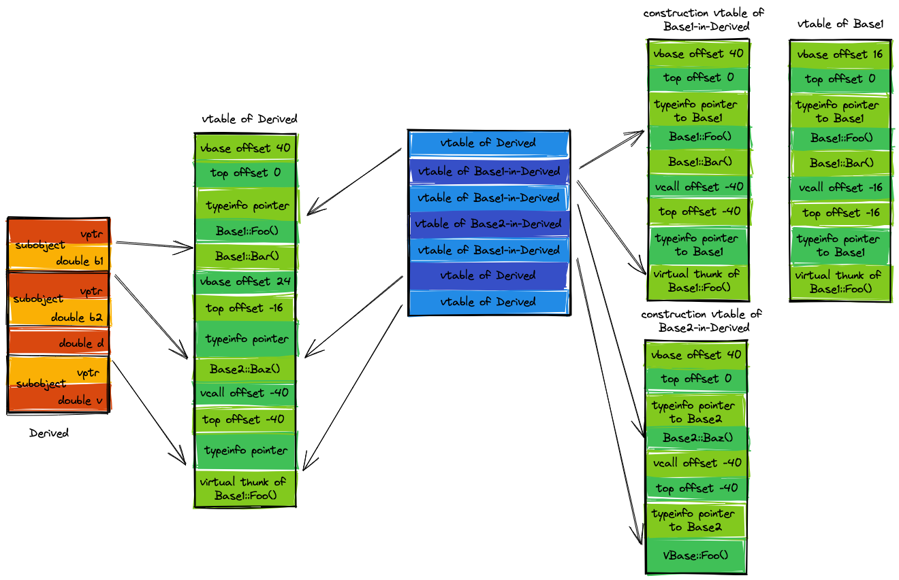

# [图说C++对象模型](https://www.cnblogs.com/QG-whz/p/4909359.html)


## 1 理解虚函数表


### 1.1 多态与虚表

C++中虚函数的作用主要是为了实现多态机制。多态，简单来说，是指在继承层次中，父类的指针可以具有多种形态——当它指向某个子类对象时，通过它能够调用到子类的函数，而非父类的函数。

```c++
class Base {     virtual void print(void);    }
class Drive1 :public Base{    virtual void print(void);    }
class Drive2 :public Base{    virtual void print(void);    }

Base * ptr1 = new Base; 
Base * ptr2 = new Drive1;  
Base * ptr3 = new Drive2;

ptr1->print(); //调用Base::print()
prt2->print(); //调用Drive1::print()
prt3->print(); //调用Drive2::print()
```

这是一种运行期多态，即父类指针唯有在程序运行时才能知道所指的真正类型是什么。这种运行期决议，是通过虚函数表来实现的。


### 1.2 使用指针访问虚表


```c++
class Base
{
public:
    Base(int i) :baseI(i){};
    virtual void print(void){cout << "调用了虚函数Base::print()";}
    virtual void setI(){cout<<"调用了虚函数Base::setI()";}
    virtual ~Base(){}
 
private:
    int baseI;
};
```

当一个类本身定义了虚函数，或其父类有虚函数时，为了支持多态机制，编译器将为该类添加一个虚函数指针（vptr）。虚函数指针一般都放在对象内存布局的第一个位置上，这是为了保证在多层继承或多重继承的情况下能以最高效率取到虚函数表。

当vprt位于对象内存最前面时，对象的地址即为虚函数指针地址。我们可以取得虚函数指针的地址：

```c++
Base b(1000);
int * vptrAdree = (int *)(&b);  
cout << "虚函数指针（vprt）的地址是：\t"<<vptrAdree << endl;
```

我们强行把类对象的地址转换为 int* 类型，取得了虚函数指针的地址。虚函数指针指向虚函数表，虚函数表中存储的是一系列虚函数的地址，虚函数地址出现的顺序与类中虚函数声明的顺序一致。**对虚函数指针地址取值，可以得到虚函数表的地址，也即是虚函数表第一个虚函数的地址**:

```c++
    typedef void(*Fun)(void);
    Fun vfunc = (Fun)*( (int *)*(int*)(&b));
    cout << "第一个虚函数的地址是：" << (int *)*(int*)(&b) << endl;
    cout << "通过地址，调用虚函数Base::print()：";
    vfunc();
```

- 我们把虚表指针的值取出来： ＊(int＊)(&b)，它是一个地址，虚函数表的地址
- 把虚函数表的地址强制转换成 int* : ( int ＊) ＊( int＊ )( &b )
- 再把它转化成我们Fun指针类型 ： (Fun )＊(int ＊)＊(int＊)(&b)

这样，我们就取得了类中的第一个虚函数，我们可以通过函数指针访问它。

【TODO Linux GCC 11.3 Segment fault】

同理,第二个虚函数setI()的地址为：

```c++
 (int * )(*(int*)(&b)+1)
```


## 2 对象模型概述

在C++中，有两种数据成员（class data members）：static和nonstatic，以及三种类成员函数（class member functions）: static、nonstatic和virtual。

```c++
class Base
{
public:
    Base(int i) :baseI(i){};
    int getI(){ return baseI; }
    static void countI(){};
    virtual ~Base(){}
    virtual void print(void){ cout << "Base::print()"; }
private:
    int baseI;
    static int baseS;
};
```

那么，这个类在内存中将被如何表示？5种数据都是连续存放的吗？如何布局才能支持C++多态？ C++标准与编译器将如何塑造出各种数据成员与成员函数呢？


### 2.1 简单对象模型

**说明：后文所有图中，用蓝色边框框起来的内容在内存上是连续的。**

此模型简单粗暴。在该模型下，对象由一系列的指针组成，每一个指针都指向一个数据成员或成员函数，也即是说，每个数据成员和成员函数在类中所占的大小是相同的，都为一个指针的大小。这样有个好处——很容易算出对象的大小，不过牺牲的是空间和执行期效率。想象一下，如果我们的Point3d类是这种模型，将会比C语言的struct多了许多空间来存放指向函数的指针，而且每次读取类的数据成员，都需要通过再一次寻址——又是时间上的消耗。
所以这种对象模型并没有被用于实际产品上


### 2.2 表格驱动模型

此模型在简单对象模型的基础上又添加一个间接层，它把类中的数据分成了两个部分：数据部分与函数部分，并使用两张表格，一张存放数据本身，一张存放函数的地址（也即函数比成员多一次寻址），而类对象仅仅含有两个指针，分别指向上面这两个表。这样看来，对象的大小是固定为两个指针大小。这个模型也没有用于实际应用于真正的C++编译器上。


### 2.3 非继承下的C++对象模型

在此模型下，nonstatic 数据成员被置于每一个类对象中，而static数据成员被置于类对象之外。static与nonstatic函数也都放在类对象之外，而对于virtual 函数，则通过虚函数表+虚指针来支持，具体如下：

- 每个类生成一个表格，称为虚表（virtual table，简称vtbl）。虚表中存放着一堆指针，这些指针指向该类每一个虚函数。虚表中的函数地址将按声明时的顺序排列，不过当子类有多个重载函数时例外，后面会讨论。
- 每个类对象都拥有一个虚表指针(vptr)，由编译器为其生成。虚表指针的设定与重置皆由类的复制控制（也即是构造函数、析构函数、赋值操作符）来完成。vptr的位置为编译器决定，传统上它被放在所有显示声明的成员之后，不过现在许多编译器把vptr放在一个类对象的最前端。关于数据成员布局的内容，在后面会详细分析。
  另外，虚函数表的前面设置了一个指向type_info的指针，用以支持RTTI（Run Time Type Identification，运行时类型识别）。RTTI是为多态而生成的信息，包括对象继承关系，对象本身的描述等，**只有具有虚函数的对象才会生成**。

在此模型下，Base的对象模型如图：


先在VS上验证类对象的布局：


可见对象b含有一个vfptr，即vprt。并且只有nonstatic数据成员被放置于对象内。我们展开vfprt：


vfptr中有两个指针类型的数据（地址），第一个指向了Base类的析构函数，第二个指向了Base的虚函数print，顺序与声明顺序相同。

```c++
void testBase( Base&p)
{
    cout << "对象的内存起始地址：" << &p << endl;
    cout << "type_info信息:" << endl;
    RTTICompleteObjectLocator str = *((RTTICompleteObjectLocator*)*((int*)*(int*)(&p) - 1));
 
 
    string classname(str.pTypeDescriptor->name);
    classname = classname.substr(4, classname.find("@@") - 4);
    cout <<  "根据type_info信息输出类名:"<< classname << endl;
 
    cout << "虚函数表地址:" << (int *)(&p) << endl;
 
    //验证虚表
    cout << "虚函数表第一个函数的地址：" << (int *)*((int*)(&p)) << endl;
    cout << "析构函数的地址:" << (int* )*(int *)*((int*)(&p)) << endl;
    cout << "虚函数表中，第二个虚函数即print()的地址：" << ((int*)*(int*)(&p) + 1) << endl;
 
    //通过地址调用虚函数print（）
    typedef void(*Fun)(void);
    Fun IsPrint=(Fun)* ((int*)*(int*)(&p) + 1);
    cout << endl;
    cout<<"调用了虚函数"；
    IsPrint(); //若地址正确，则调用了Base类的虚函数print（）
    cout << endl;
 
    //输入static函数的地址
    p.countI();//先调用函数以产生一个实例
    cout << "static函数countI()的地址：" << p.countI << endl;
 
    //验证nonstatic数据成员
    cout << "推测nonstatic数据成员baseI的地址：" << (int *)(&p) + 1 << endl;
    cout << "根据推测出的地址，输出该地址的值：" << *((int *)(&p) + 1) << endl;
    cout << "Base::getI():" << p.getI() << endl;
 
}
```

```c++
Base b(1000);
testBase(b);
```


## 3 继承下的C++对象模型


### 3.1 单继承

定义派生类如下：

```c++
class Derive : public Base
{
public:
    Derive(int d) :Base(1000),      DeriveI(d){};
    //overwrite父类虚函数
    virtual void print(void){ cout << "Drive::Drive_print()" ; }
    // Derive声明的新的虚函数
    virtual void Drive_print(){ cout << "Drive::Drive_print()" ; }
    virtual ~Derive(){}
private:
    int DeriveI;
};
```

在C++对象模型中，对于一般继承（这个一般是相对于虚继承而言），若子类重写（overwrite）了父类的虚函数，则子类虚函数将覆盖虚表中对应的父类虚函数(**注意子类与父类拥有各自的一个虚函数表**)；若子类没有overwrite父类虚函数，而是声明了新的虚函数，则该虚函数地址将扩充到虚函数表最后（在vs中无法通过监视看到扩充的结果，不过我们通过取地址的方法可以做到，子类新的虚函数确实在父类子物体的虚函数表末端）。

而对于虚继承，若子类overwrite父类虚函数，同样地将覆盖父类子物体中的虚函数表对应位置，而若子类声明了自己新的虚函数，则编译器将为子类增加一个新的虚表指针vptr，这与一般继承不同,在后面再讨论。


我们使用代码来验证以上模型：

```c++
typedef void (*Fun)(void);

int main()
{
    Derive d(2000);
    //[0]
    cout << "[0]Base::vptr";
    cout << "\t地址：" << (int *)(&d) << endl;
    // vprt[0]
    cout << "  [0]";
    Fun fun1 = (Fun) * ((int *)*((int *)(&d)));
    fun1();
    cout << "\t地址:\t" << *((int *)*((int *)(&d))) << endl;

    // vprt[1]析构函数无法通过地址调用，故手动输出
    cout << "  [1]"
         << "Derive::~Derive" << endl;

    // vprt[2]
    cout << "  [2]";
    Fun fun2 = (Fun) * ((int *)*((int *)(&d)) + 2);
    fun2();
    cout << "\t地址:\t" << *((int *)*((int *)(&d)) + 2) << endl;
    //[1]
    cout << "[2]Base::baseI=" << *(int *)((int *)(&d) + 1);
    cout << "\t地址：" << (int *)(&d) + 1;
    cout << endl;
    //[2]
    cout << "[2]Derive::DeriveI=" << *(int *)((int *)(&d) + 2);
    cout << "\t地址：" << (int *)(&d) + 2;
    cout << endl;
    getchar();
}
```


### 3.2 多继承


#### 3.2.1 一般的多重继承（非菱形继承）

单继承中（一般继承），子类会扩展父类的虚函数表。在多继承中，子类含有多个父类的子对象，该往哪个父类的虚函数表扩展呢？当子类overwrite了父类的函数，需要覆盖多个父类的虚函数表吗？

- **子类的虚函数被放在声明的第一个基类的虚函数表中。**
- **overwrite时，所有基类的print()函数都被子类的print()函数覆盖。**
- 内存布局中，父类按照其声明顺序排列。

其中第二点保证了父类指针指向子类对象时，总是能够调用到真正的函数。

```c++
class Base
{
public:
    Base(int i) : baseI(i){};
    virtual ~Base() {}
    int getI() { return baseI; }
    static void countI(){};
    virtual void print(void) { cout << "Base::print()"; }
private:
    int baseI;
    static int baseS;
};

class Base_2
{
public:
    Base_2(int i) : base2I(i){};
    virtual ~Base_2() {}
    int getI() { return base2I; }
    static void countI(){};
    virtual void print(void) { cout << "Base_2::print()"; }
private:
    int base2I;
    static int base2S;
};

class Drive_multyBase : public Base, public Base_2
{
public:
    Drive_multyBase(int d) : Base(1000), Base_2(2000), Drive_multyBaseI(d){};
    virtual void print(void) { cout << "Drive_multyBase::print"; }
    virtual void Drive_print() { cout << "Drive_multyBase::Drive_print"; }
private:
    int Drive_multyBaseI;
};

```

此时Drive_multyBase 的对象模型是这样的：


使用代码验证：

```c++
typedef void (*Fun)(void);

int main()
{
    Drive_multyBase d(3000);
    //[0]
    cout << "[0]Base::vptr";
    cout << "\t地址：" << (int *)(&d) << endl;

    // vprt[0]析构函数无法通过地址调用，故手动输出
    cout << "  [0]"
         << "Derive::~Derive" << endl;

    // vprt[1]
    cout << "  [1]";
    Fun fun1 = (Fun) * ((int *)*((int *)(&d)) + 1);
    fun1();
    cout << "\t地址:\t" << *((int *)*((int *)(&d)) + 1) << endl;

    // vprt[2]
    cout << "  [2]";
    Fun fun2 = (Fun) * ((int *)*((int *)(&d)) + 2);
    fun2();
    cout << "\t地址:\t" << *((int *)*((int *)(&d)) + 2) << endl;

    //[1]
    cout << "[1]Base::baseI=" << *(int *)((int *)(&d) + 1);
    cout << "\t地址：" << (int *)(&d) + 1;
    cout << endl;

    //[2]
    cout << "[2]Base_::vptr";
    cout << "\t地址：" << (int *)(&d) + 2 << endl;

    // vprt[0]析构函数无法通过地址调用，故手动输出
    cout << "  [0]"
         << "Drive_multyBase::~Derive" << endl;

    // vprt[1]
    cout << "  [1]";
    Fun fun4 = (Fun) * ((int *)*((int *)(&d)) + 1);
    fun4();
    cout << "\t地址:\t" << *((int *)*((int *)(&d)) + 1) << endl;

    //[3]
    cout << "[3]Base_2::base2I=" << *(int *)((int *)(&d) + 3);
    cout << "\t地址：" << (int *)(&d) + 3;
    cout << endl;

    //[4]
    cout << "[4]Drive_multyBase::Drive_multyBaseI=" << *(int *)((int *)(&d) + 4);
    cout << "\t地址：" << (int *)(&d) + 4;
    cout << endl;

    getchar();
}

```

运行结果：


#### 3.2.2 菱形继承

菱形继承也称为钻石型继承或重复继承，它指的是基类被某个派生类简单重复继承了多次。这样，派生类对象中拥有多份基类实例（这会带来一些问题）。

```c++
class B
{
public:
    int ib;

public:
    B(int i = 1) : ib(i) {}
    virtual void f() { cout << "B::f()" << endl; }
    virtual void Bf() { cout << "B::Bf()" << endl; }
};

class B1 : public B
{

public:
    int ib1;

public:
    B1(int i = 100) : ib1(i) {}
    virtual void f() { cout << "B1::f()" << endl; }
    virtual void f1() { cout << "B1::f1()" << endl; }
    virtual void Bf1() { cout << "B1::Bf1()" << endl; }
};

class B2 : public B
{
public:
    int ib2;

public:
    B2(int i = 1000) : ib2(i) {}
    virtual void f() { cout << "B2::f()" << endl; }
    virtual void f2() { cout << "B2::f2()" << endl; }
    virtual void Bf2() { cout << "B2::Bf2()" << endl; }
};

class D : public B1, public B2
{
public:
    int id;

public:
    D(int i = 10000) : id(i) {}
    virtual void f() { cout << "D::f()" << endl; }
    virtual void f1() { cout << "D::f1()" << endl; }
    virtual void f2() { cout << "D::f2()" << endl; }
    virtual void Df() { cout << "D::Df()" << endl; }
};
```

这时，根据单继承，我们可以分析出B1，B2类继承于B类时的内存布局。又根据一般多继承，我们可以分析出D类的内存布局如下图：


D类对象内存布局中，图中青色表示b1类子对象实例，黄色表示b2类子对象实例，灰色表示D类子对象实例。从图中可以看到，由于D类间接继承了B类两次，导致D类对象中含有两个B类的数据成员ib，一个属于来源B1类，一个来源B2类。这样不仅增大了空间，更重要的是引起了程序歧义：

```c++
D d;
d.ib =1 ;               //二义性错误,调用的是B1的ib还是B2的ib？
d.B1::ib = 1;           //正确
d.B2::ib = 1;           //正确
```

尽管我们可以通过明确指明调用路径以消除二义性，但二义性的潜在性还没有消除，我们可以通过虚继承来使D类只拥有一个ib实体。


## 4 虚继承

虚继承解决了菱形继承中最派生类拥有多个间接父类实例的情况。虚继承的派生类的内存布局与普通继承很多不同，主要体现在：

- **虚继承的子类，如果本身定义了新的虚函数，则编译器为其生成一个虚函数指针（vptr）以及一张虚函数表。该vptr位于对象内存最前面。**
  - **vs非虚继承：直接扩展父类虚函数表。**
- 虚继承的子类也单独保留了父类的vprt与虚函数表。这部分内容接与子类内容以一个四字节的0来分界。
- 虚继承的子类对象中，含有四字节的虚表指针偏移值。

为了分析最后的菱形继承，我们还是先从单虚继承继承开始。


### 4.1 虚基类表解析

**在C++对象模型中，虚继承而来的子类会生成一个隐藏的虚基类指针（vbptr），在Microsoft Visual C++中，虚基类表指针总是在虚函数表指针之后，因而，对某个类实例来说，如果它有虚基类指针，那么虚基类指针可能在实例的0字节偏移处（该类没有vptr时，vbptr就处于类实例内存布局的最前面，否则vptr处于类实例内存布局的最前面），也可能在类实例的4字节偏移处。**
一个类的虚基类指针指向的虚基类表，与虚函数表一样，虚基类表也由多个条目组成，条目中存放的是**偏移值**。第一个条目存放虚基类表指针（vbptr）所在地址到该类内存首地址的偏移值，由第一段的分析我们知道，这个偏移值为0（类没有vptr）或者-4（类有虚函数，此时有vptr）。我们通过一张图来更好地理解。


虚基类表的第二、第三...个条目依次为该类的最左虚继承父类、次左虚继承父类...的内存地址相对于虚基类表指针的偏移值。

### 4.2 简单虚继承

```c++
//类的内容与前面相同
class B{...}
class B1 : virtual public B
```

根据我们前面对虚继承的派生类的内存布局的分析，B1类的对象模型应该是这样的：


我们通过指针访问B1类对象的内存，以验证上面的C++对象模型：

```c++
int main()
{
    B1 a;
    cout << "B1对象内存大小为：" << sizeof(a) << endl;

    // 取得B1的虚函数表
    cout << "[0]B1::vptr";
    cout << "\t地址：" << (int *)(&a) << endl;

    // 输出虚表B1::vptr中的函数
    for (int i = 0; i < 2; ++i)
    {
        cout << "  [" << i << "]";
        Fun fun1 = (Fun) * ((int *)*(int *)(&a) + i);
        fun1();
        cout << "\t地址：\t" << *((int *)*(int *)(&a) + i) << endl;
    }

    //[1]
    cout << "[1]vbptr ";
    cout << "\t地址：" << (int *)(&a) + 1 << endl; // 虚基类指针的地址
    // 输出虚基类指针条目所指的内容
    for (int i = 0; i < 2; i++)
    {
        cout << "  [" << i << "]";
        cout << *(int *)((int *)*((int *)(&a) + 1) + i);
        cout << endl;
    }

    //[2]
    cout << "[2]B1::ib1=" << *(int *)((int *)(&a) + 2);
    cout << "\t地址：" << (int *)(&a) + 2;
    cout << endl;

    //[3]
    cout << "[3]值=" << *(int *)((int *)(&a) + 3);
    cout << "\t\t地址：" << (int *)(&a) + 3;
    cout << endl;

    //[4]
    cout << "[4]B::vptr";
    cout << "\t地址：" << (int *)(&a) + 3 << endl;

    // 输出B::vptr中的虚函数
    for (int i = 0; i < 2; ++i)
    {
        cout << "  [" << i << "]";
        Fun fun1 = (Fun) * ((int *)*((int *)(&a) + 4) + i);
        fun1();
        cout << "\t地址:\t" << *((int *)*((int *)(&a) + 4) + i) << endl;
    }

    //[5]
    cout << "[5]B::ib=" << *(int *)((int *)(&a) + 5);
    cout << "\t地址: " << (int *)(&a) + 5;
    cout << endl;
}
```

运行结果：


再来分析一下虚表指针的第二个条目值**12**的具体来源了，回忆上文讲到的：

> 第二、第三...个条目依次为该类的最左虚继承父类、次左虚继承父类...的内存地址相对于虚基类表指针的偏移值。

在我们的例子中，也就是B类实例内存地址相对于vbptr的偏移值，也即是：[4]-[1]的偏移值，结果即为12，从地址上也可以计算出来：007CFDFC-007CFDF4结果的十进制数正是12。现在，我们对虚基类表的构成应该有了一个更好的理解。


### 4.3 虚拟菱形继承

如果现有如下继承层次：

```c++
class B{...}
class B1: virtual public  B{...}
class B2: virtual public  B{...}
class D : public B1,public B2{...}
```

菱形虚拟继承下，派生类D类的对象模型又有不同的构成了。在D类对象的内存构成上，有以下几点：

- 在D类对象内存中，基类出现的顺序是：先是B1（最左父类），然后是B2（次左父类），最后是B（虚祖父类）
- D类对象的数据成员id放在B类前面，两部分数据依旧以0来分隔。
- 编译器没有为D类生成一个它自己的vptr，而是覆盖并扩展了最左父类的虚基类表，与简单继承的对象模型相同。
- 超类B的内容放到了D类对象内存布局的最后。

菱形虚拟继承下的C++对象模型为：


下面使用代码加以验证：

```c++
int main()
{
    D d;
    cout << "D对象内存大小为：" << sizeof(d) << endl;

    // 取得B1的虚函数表
    cout << "[0]B1::vptr";
    cout << "\t地址：" << (int *)(&d) << endl;

    // 输出虚表B1::vptr中的函数
    for (int i = 0; i < 3; ++i)
    {
        cout << "  [" << i << "]";
        Fun fun1 = (Fun) * ((int *)*(int *)(&d) + i);
        fun1();
        cout << "\t地址：\t" << *((int *)*(int *)(&d) + i) << endl;
    }

    //[1]
    cout << "[1]B1::vbptr ";
    cout << "\t地址：" << (int *)(&d) + 1 << endl; // 虚表指针的地址
    // 输出虚基类指针条目所指的内容
    for (int i = 0; i < 2; i++)
    {
        cout << "  [" << i << "]";
        cout << *(int *)((int *)*((int *)(&d) + 1) + i);
        cout << endl;
    }

    //[2]
    cout << "[2]B1::ib1=" << *(int *)((int *)(&d) + 2);
    cout << "\t地址：" << (int *)(&d) + 2;
    cout << endl;

    //[3]
    cout << "[3]B2::vptr";
    cout << "\t地址：" << (int *)(&d) + 3 << endl;

    // 输出B2::vptr中的虚函数
    for (int i = 0; i < 2; ++i)
    {
        cout << "  [" << i << "]";
        Fun fun1 = (Fun) * ((int *)*((int *)(&d) + 3) + i);
        fun1();
        cout << "\t地址:\t" << *((int *)*((int *)(&d) + 3) + i) << endl;
    }

    //[4]
    cout << "[4]B2::vbptr ";
    cout << "\t地址：" << (int *)(&d) + 4 << endl; // 虚表指针的地址
    // 输出虚基类指针条目所指的内容
    for (int i = 0; i < 2; i++)
    {
        cout << "  [" << i << "]";

        cout << *(int *)((int *)*((int *)(&d) + 4) + i);

        cout << endl;
    }

    //[5]
    cout << "[5]B2::ib2=" << *(int *)((int *)(&d) + 5);
    cout << "\t地址: " << (int *)(&d) + 5;
    cout << endl;

    //[6]
    cout << "[6]D::id=" << *(int *)((int *)(&d) + 6);
    cout << "\t地址: " << (int *)(&d) + 6;
    cout << endl;

    //[7]
    cout << "[7]值=" << *(int *)((int *)(&d) + 7);
    cout << "\t\t地址：" << (int *)(&d) + 7;
    cout << endl;

    // 间接父类
    //[8]
    cout << "[8]B::vptr";
    cout << "\t地址：" << (int *)(&d) + 8 << endl;

    // 输出B::vptr中的虚函数
    for (int i = 0; i < 2; ++i)
    {
        cout << "  [" << i << "]";
        Fun fun1 = (Fun) * ((int *)*((int *)(&d) + 8) + i);
        fun1();
        cout << "\t地址:\t" << *((int *)*((int *)(&d) + 8) + i) << endl;
    }

    //[9]
    cout << "[9]B::id=" << *(int *)((int *)(&d) + 9);
    cout << "\t地址: " << (int *)(&d) + 9;
    cout << endl;

    getchar();
}
```

运行结果：


# C++ vtables


## [Part 1 - Basics](https://shaharmike.com/cpp/vtable-part1/)


## [Part 2 - Multiple Inheritance](https://shaharmike.com/cpp/vtable-part2/)


## [Part 3 - Virtual Inheritance](https://shaharmike.com/cpp/vtable-part3/)


# VTable Notes

[VTable Notes on Multiple Inheritance in GCC C++ Compiler v4.0.1](https://ww2.ii.uj.edu.pl/~kapela/pn/cpp_vtable.html)


## The Basics: Single Inheritance

As we discussed in class, single inheritance leads to an object layoutwith base class data laid out before derived class data. So ifclasses A and B are defined thusly:

```c++
class A {
public:
  int a;
};

class B : public A {
public:
  int b;
};
```


then objects of type B are laid out like this (where "b" is a pointerto such an object):

```
b --> +-----------+
      |     x     |
      +-----------+
      |     y     |
      +-----------+
```

If you have *virtual* methods:

```c++
class A {
public:
  int a;
  virtual void v();
};

class B : public A {
public:
  int b;
};
```


then you'll have a vtable pointer as well:

```c++
                           +-----------------------+
                           |     0 (top_offset)    |
                           +-----------------------+
b --> +----------+         | ptr to typeinfo for B |
      |  vtable  |-------> +-----------------------+
      +----------+         |         A::v()        |
      |     x    |         +-----------------------+
      +----------+
      |     y    
1000
|
      +----------+
```


that is, `top_offset` and the `typeinfo` pointer live *above* the location to which the vtable pointer points.


## Simple Multiple Inheritance

Now consider multiple inheritance:

```c++
class A {
public:
  int a;
  virtual void v();
};

class B {
public:
  int b;
  virtual void w();
};

class C : public A, public B {
public:
  int c;
};
```

In this case, objects of type C are laid out like this:

```
                           +-----------------------+
                           |     0 (top_offset)    |
                           +-----------------------+
c --> +----------+         | ptr to typeinfo for C |
      |  vtable  |-------> +-----------------------+
      +----------+         |         A::v()        |
      |     a    |         +-----------------------+
      +----------+         |    -8 (top_offset)    |
      |  vtable  |---+     +-----------------------+
      +----------+   |     | ptr to typeinfo for C |
      |     b    |   +---> +-----------------------+
      +----------+         |         B::w()        |
      |     c    |         +-----------------------+
      +----------+
```

*...but why?* Why two vtables in one? Well, think about **typesubstitution**. If I have a pointer-to-C, I can pass it to a function that expects a pointer-to-A or to a function that expects a pointer-to-B. If a function expects a pointer-to-A and I want to pass it the value of my variable `c` (of type pointer-to-C), I'm already set. Calls to `A::v()` can be made through the (first) vtable, and the called function can access the member`a` through the pointer I pass in the same way as it can through *any* pointer-to-A.

However, if I pass the value of my pointer variable `c` to a function that expects a pointer-to-B, we *also* need a subobject of type B in our C to refer it to. This is why we have the second vtable pointer. We can pass the pointer value`(c + 8 bytes)` to the function that expects a pointer-to-B, and it's all set: it can make calls to`B::w()` through the (second) vtable pointer, and access the member `b` through the pointer we pass in the same way as it can through any pointer-to-B.

Note that this "pointer-correction" needs to occur for called methodstoo. Class C inherits `B::w()` in this case. When`w()` is called on through a pointer-to-C, the pointer(which becomes the **this** pointer inside of `w()` needsto be adjusted. This is often called ***this pointer adjustment***.

In some cases, the compiler will generate a *thunk* to fix up theaddress. Consider the same code as above but this time C overrides B'smember function `w()`:

```c++
class A {
public:
  int a;
  virtual void v();
};

class B {
public:
  int b;
  virtual void w();
};

class C : public A, public B {
public:
  int c;
  void w();
};
```

C's object layout and vtable now look like this:

```c++
                           +-----------------------+
                           |     0 (top_offset)    |
                           +-----------------------+
c --> +----------+         | ptr to typeinfo for C |
      |  vtable  |-------> +-----------------------+
      +----------+         |         A::v()        |
      |     a    |         +-----------------------+
      +----------+         |         C::w()        |
      |  vtable  |---+     +-----------------------+
      +----------+   |     |    -8 (top_offset)    |
      |     b    |   |     +----------
1000
-------------+
      +----------+   |     | ptr to typeinfo for C |
      |     c    |   +---> +-----------------------+
      +----------+         |    thunk to C::w()    |
                           +-----------------------+
```

Now, when `w()` is called on an instance of C through apointer-to-B, the thunk is called. What does the thunk do? Let's disassemble it (here, with gdb):

```
0x0804860c <_ZThn8_N1C1wEv+0>:  addl   $0xfffffff8,0x4(%esp)
0x08048611 <_ZThn8_N1C1wEv+5>:  jmp    0x804853c <_ZN1C1wEv>
```

So it merely adjusts the **this** pointer and jumps to`C::w()`. All is well.

But doesn't the above mean that B's vtable always points to this `C::w()` thunk? I mean, if we have a pointer-to-B that islegitimately a B (not a C), we don't want to invoke the thunk, right?

Right. The above embedded vtable for B in C is special to the B-in-C case.B's regular vtable is normal and points to `B::w()` directly.


## The Diamond: Multiple Copies of Base Classes (non-virtual inheritance)

Now to tackle the really hard stuff. Recall the usual problem ofmultiple copies of base classes when forming an inheritance diamond:

```c++
class A {
public:
  int a;
  virtual void v();
};

class B : public A {
public:
  int b;
  virtual void w();
};

class C : public A {
public:
  int c;
  virtual void x();
};

class D : public B, public C {
public:
  int d;
  virtual void y();
};
```

Note that D inherits from both B and C, and B and C both inherit from A.This means that D has *two* copies of A in it. The object layout and vtable embedding is what we would expect from the previous sections:

```
                           +-----------------------+
                           |     0 (top_offset)    |
                           +-----------------------+
d --> +----------+         | ptr to typeinfo for D |
      |  vtable  |-------> +-----------------------+
      +----------+         |         A::v()        |
      |     a    |         +-----------------------+
      +----------+         |         B::w()        |
      |     b    |         +-----------------------+
      +----------+         |         D::y()        |
      |  vtable  |---+     +-----------------------+
      +----------+   |     |   -12 (top_offset)    |
      |     a    |   |     +-----------------------+
      +----------+   |     | ptr to typeinfo for D |
      |     c    |   +---> +-----------------------+
      +----------+         |         A::v()        |
      |     d    |         +-----------------------+
      +----------+         |         C::x()        |
                           +-----------------------+
```

Of course, we expect A's data (the member `a`) to exist twice in D's object layout (and it is), and we expect A's virtual member functionsto be represented twice in the vtable (and `A::v()` is indeedthere). Okay, nothing new here.


## The Diamond: Single Copies of Virtual Bases

But what if we apply *virtual* inheritance? C++ virtual inheritanceallows us to specify a diamond hierarchy but be guaranteed only one copy of virtually inherited bases. So let's write our code this way:

```c++
class A {
public:
  int a;
  virtual void v();
};

class B : public virtual A {
public:
  int b;
  virtual void w();
};

class C : public virtual A {
public:
  int c;
  virtual void x();
};

class D : public B, public C {
public:
  int d;
  virtual void y();
};
```

All of a sudde 1000 n things get a *lot* more complicated. If we can onlyhave *one* copy of A in our representation of D, then we can nolonger get away with our "trick" of embedding a C in a D (and embeddinga vtable for the C part of D in D's vtable). But how can we handle theusual type substitution if we can't do this?

Let's try to diagram the layout:

```
                                   +-----------------------+
                                   |   20 (vbase_offset)   |
                                   +-----------------------+
                                   |     0 (top_offset)    |
                                   +-----------------------+
                                   | ptr to typeinfo for D |
                      +----------> +-----------------------+
d --> +----------+    |            |         B::w()        |
      |  vtable  |----+            +-----------------------+
      +----------+                 |         D::y()        |
      |     b    |                 +-----------------------+
      +----------+                 |   12 (vbase_offset)   |
      |  vtable  |---------+       +-----------------------+
      +----------+         |       |    -8 (top_offset)    |
      |     c    |         |       +-----------------------+
      +----------+         |       | ptr to typeinfo for D |
      |     d    |         +-----> +-----------------------+
      +----------+                 |         C::x()        |
      |  vtable  |----+            +-----------------------+
      +----------+    |            |    0 (vbase_offset)   |
      |     a    |    |            +-----------------------+
      +----------+    |            |   -20 (top_offset)    |
                      |            +-----------------------+
                      |            | ptr to typeinfo for D |
                      +----------> +-----------------------+
                                   |         A::v()        |
                                   +-----------------------+
```

Okay. So you see that A is now embedded in D in essentially the same way that other bases are. But it's embedded in D rather than inits directly-derived classes.


## Construction/Destruction in the Presence of Multiple Inheritance

How is the above object constructed in memory when the object itself is constructed? And how do we ensure that a partially-constructed object(and its vtable) are safe for constructors to operate on?

Fortunately, it's all handled very carefully for us. Say we're constructing a new object of type D (through, for example, `new D`).First, the memory for the object is allocated in the heap and a pointer returned. D's constructor is invoked, but before doing any D-specific construction it call's A's constructor on the object (after adjusting the **this** pointer, of course!). A's constructor fills in the A partof the D object as if it were an instance of A.

```c++
d --> +----------+
      |          |
      +----------+
      |          |
      +----------+
      |          |
      +----------+
      |          |       +-----------------------+
      +----------+       |     0 (top_offset)    |
      |          |       +-----------------------+
      +----------+       | ptr to typeinfo for A |
      |  vtable  |-----> +-----------------------+
      +----------+       |         A::v()        |
      |    a     |       +-----------------------+
      +----------+
```

Control is returned to D's constructor, which invokes B's constructor.(Pointer adjustment isn't needed here.) When B's constructor is done,the object looks like this:

```
                                             B-in-D
                          +-----------------------+
              
1000
            |   20 (vbase_offset)   |
                          +-----------------------+
                          |     0 (top_offset)    |
                          +-----------------------+
d --> +----------+        | ptr to typeinfo for B |
      |  vtable  |------> +-----------------------+
      +----------+        |         B::w()        |
      |    b     |        +-----------------------+
      +----------+        |    0 (vbase_offset)   |
      |          |        +-----------------------+
      +----------+        |   -20 (top_offset)    |
      |          |        +-----------------------+
      +----------+        | ptr to typeinfo for B |
      |          |   +--> +-----------------------+
      +----------+   |    |         A::v()        |
      |  vtable  |---+    +-----------------------+
      +----------+
      |    a     |
      +----------+
```

*But wait... B's constructor modified the A part of the object by changingit's vtable pointer!* How did it know to distinguish this kind of B-in-D from a B-in-something-else (or a standalone B for that matter)? Simple.The ***virtual table table*** told it to do this. This structure, abbreviated VTT, is a table of vtables used in construction. In our case,the VTT for D looks like this:

```
                                                                  B-in-D
                                               +-----------------------+
                                               |   20 (vbase_offset)   |
            VTT for D                          +-----------------------+
+-------------------+                          |     0 (top_offset)    |
|    vtable for D   |-------------+            +-----------------------+
+-------------------+             |            | ptr to typeinfo for B |
| vtable for B-in-D |-------------|----------> +-----------------------+
+-------------------+             |            |         B::w()        |
| vtable for B-in-D |-------------|--------+   +-----------------------+
+-------------------+             |        |   |    0 (vbase_offset)   |
| vtable for C-in-D |-------------|-----+  |   +-----------------------+
+-------------------+             |     |  |   |   -20 (top_offset)    |
| vtable for C-in-D |-------------|--+  |  |   +-----------------------+
+-------------------+             |  |  |  |   | ptr to typeinfo for B |
|    vtable for D   |----------+  |  |  |  +-> +-----------------------+
+-------------------+          |  |  |  |      |         A::v()        |
|    vtable for D   |-------+  |  |  |  |      +-----------------------+
+-------------------+       |  |  |  |  |
                            |  |  |  |  |                         C-in-D
                            |  |  |  |  |      +-----------------------+
                            |  |  |  |  |      |   12 (vbase_offset)   |
                            |  |  |  |  |      +-----------------------+
                            |  |  |  |  |      |     0 (top_offset)    |
                            |  |  |  |  |      +-----------------------+
                            |  |  |  |  |      | ptr to typeinfo for C |
                            |  |  |  |  +----> +-----------------------+
                            |  |  |  |         |         C::x()        |
                            |  |  |  |         +-----------------------+
                            |  |  |  |         |    0 (vbase_offset)   |
                            |  |  |  |         +-----------------------+
                            |  |  |  |         |   -12 (top_offset)    |
                            |  |  |  |         +-----------------------+
                            |  |  |  |         | ptr to typeinfo for C |
                            |  |  |  +--
1000
-----> +-----------------------+
                            |  |  |            |         A::v()        |
                            |  |  |            +-----------------------+
                            |  |  |
                            |  |  |                                    D
                            |  |  |            +-----------------------+
                            |  |  |            |   20 (vbase_offset)   |
                            |  |  |            +-----------------------+
                            |  |  |            |     0 (top_offset)    |
                            |  |  |            +-----------------------+
                            |  |  |            | ptr to typeinfo for D |
                            |  |  +----------> +-----------------------+
                            |  |               |         B::w()        |
                            |  |               +-----------------------+
                            |  |               |         D::y()        |
                            |  |               +-----------------------+
                            |  |               |   12 (vbase_offset)   |
                            |  |               +-----------------------+
                            |  |               |    -8 (top_offset)    |
                            |  |               +-----------------------+
                            |  |               | ptr to typeinfo for D |
                            +----------------> +-----------------------+
                               |               |         C::x()        |
                               |               +-----------------------+
                               |               |    0 (vbase_offset)   |
                               |               +-----------------------+
                               |               |   -20 (top_offset)    |
                               |               +-----------------------+
                               |               | ptr to typeinfo for D |
                               +-------------> +-----------------------+
                                               |         A::v()        |
                                               +-----------------------+
```

D's constructor passes a pointer into D's VTT to B's constructor (in this case, it passes in the address of the first B-in-D entry). And, indeed,the vtable that was used for the object layout above is a special vtable used just for the construction of B-in-D.

Control is returned to the D constructor, and it calls the C constructor(with a VTT address parameter pointing to the "C-in-D+12" entry). When C's constructor is done with the object it looks like this:

```
                                                                           B-in-D
                                                        +-----------------------+
                                                        |   20 (vbase_offset)   |
                                                        +-----------------------+
                                                        |     0 (top_offset)    |
                                                        +-----------------------+
                                                        | ptr to typeinfo for B |
                    +---------------------------------> +-----------------------+
                    |                                   |         B::w()        |
                    |                                   +-----------------------+
                    |                          C-in-D   |    0 (vbase_offset)   |
                    |       +-----------------------+   +-----------------------+
d --> +----------+  |       |   12 (vbase_offset)   |   |   -20 (top_offset)    |
      |  vtable  |
1000
--+       +-----------------------+   +-----------------------+
      +----------+          |     0 (top_offset)    |   | ptr to typeinfo for B |
      |    b     |          +-----------------------+   +-----------------------+
      +----------+          | ptr to typeinfo for C |   |         A::v()        |
      |  vtable  |--------> +-----------------------+   +-----------------------+
      +----------+          |         C::x()        |
      |    c     |          +-----------------------+
      +----------+          |    0 (vbase_offset)   |
      |          |          +-----------------------+
      +----------+          |   -12 (top_offset)    |
      |  vtable  |--+       +-----------------------+
      +----------+  |       | ptr to typeinfo for C |
      |    a     |  +-----> +-----------------------+
      +----------+          |         A::v()        |
                            +-----------------------+
```

As you see, C's constructor again modified the embedded A's vtable pointer.The embedded C and A objects are now using the special construction C-in-Dvtable, and the embedded B object is using the special construction B-in-Dvtable. Finally, D's constructor finishes the job and we end up with thesame diagram as before:

```
                                   +-----------------------+
                                   |   20 (vbase_offset)   |
                                   +-----------------------+
                                   |     0 (top_offset)    |
                                   +-----------------------+
                                   | ptr to typeinfo for D |
                      +----------> +-----------------------+
d --> +----------+    |            |         B::w()        |
      |  vtable  |----+            +-----------------------+
      +----------+                 |         D::y()        |
      |     b    |                 +-----------------------+
      +----------+                 |   12 (vbase_offset)   |
      |  vtable  |---------+       +-----------------------+
      +----------+         |       |    -8 (top_offset)    |
      |     c    |         |       +-----------------------+
      +----------+         |       | ptr to typeinfo for D |
      |     d    |         +-----> +-----------------------+
      +----------+                 |         C::x()        |
      |  vtable  |----+            +-----------------------+
      +----------+    |            |    0 (vbase_offset)   |
      |     a    |    |            +-----------------------+
      +----------+    |            |   -20 (top_offset)    |
                      |            +-----------------------+
                      |            | ptr to typeinfo for D |
                      +----------> +-----------------------+
                                   |         A::v()        |
                                   +-----------------------+
```

Destruction occurs in the same fashion but in reverse. D's destructoris invoked. After the user's destruction code runs, the destructor calls C's destructor and directs it to use the relevant portion of D's VTT. C's destructor manipulates the vtable pointers in the same way it did during construction; that is, the relevant vtable pointers now point into the C-in-D construction vtable. Then it runs the user's destruction code for C and returns control to D's destructor, which next invokes B's destructor with a reference into D's VTT. B'sdestructor sets up the relevant portions of the object to refer into the B-in-D construction vtable. It runs the user's destruction code for B and returns control to D's destructor, which finally invokes A's destructor. A's destructor changes the vtable for the A portion ofthe object to refer into the vtable for A. Finally, control returnsto D's destructor and destruction of the object is complete. The memory once used by the object is returned to the system.

Now, in fact, the story is somewhat more complicated. Have you everseen those "in-charge" and "not-in-charge" constructor and destructor specifications in GCC-produced warning and error messages or inGCC-produced binaries? Well, the fact is that there can be two constructor implementations and up to three destructor implementations.

An "in-charge" (or *complete object*) constructor is one that constructs virtual bases, and a "not-in-charge" (or *baseobject*) constructor is one that does not. Consider our above example. If a B is constructed, its constructor needs to call A's constructor to construct it. Similarly, C's constructor needs to construct A. However, if B and C are constructed as part of aconstruction of a D, their constructors *should not* construct A, because A is a virtual base and D's constructor will take care of constructing it exactly once for the instance of D. Consider thecases:

- If you do a `new A`, A's "in-charge" constructor is invoked to construct A.
- When you do a `new B`, B's "in-charge" constructor isinvoked. It will call the "not-in-charge" constructor for A.
- `new C` is similar to `new B`.
- A `new D` invokes D's "in-charge" constructor. We walked through this example. D's "in-charge" constructor calls the "not-in-charge" versions of A's, B's, and C's constructors (in that order).

An "in-charge" destructor is the analogue of an "in-charge"constructor---it takes charge of destructing virtual bases. Similarly, a "not-in-charge" destructor is generated. But there's a third one as well. An "in-charge deleting" destructor is one that *deallocates* the storage as well as destructing the object. So when is one called in preference to the other?

Well, there are two kinds of objects that can be destructed---those allocated on the stack, and those allocated in the heap. Consider this code (given our diamond hierarchy with virtual-inheritance from before):

```c++
D d;            // allocates a D on the stack and constructs it
D *pd = new D;  // allocates a D in the heap and constructs it
/* ... */
delete pd;      // calls "in-charge deleting" destructor for D
return;         // calls "in-charge" destructor for stack-allocated D
```

If you didn't have an "in-charge deleting" variety of D's destructor, then the delete operation would need to adjust the pointer just like the destructor thunk does. Remember, the C object is embedded in a D, and so our pointer-to-C above is adjusted to point into the middle of our D object. We can't just delete this pointer, since it isn't the pointer that was returned by `malloc()` when we constructed it.

So, if we didn't have an in-charge deleting destructor, we'd have to have thunks to the delete operator (and represent them in our vtables), or some thingelse similar.


## Thunks, Virtual and Non-Virtual


## Multiple Inheritance with Virtual Methods on One Side

What if we have a diamond inheritance hierarchywith virtual inheritance, as before, but only have virtual methods along oneside of it? So:

```c++
class A {
public:
  int a;
};

class B : public virtual A {
public:
  int b;
  virtual void w();
};

class C : public virtual A {
public:
  int c;
};

class D : public B, public C {
public:
  int d;
  virtual void y();
};
```

In this case the object layout is the following:

```
                                   +-----------------------+
                                   |   20 (vbase_offset)   |
                                   +-----------------------+
                                   |     0 (top_offset)    |
                                   +-----------------------+
                                   | ptr to typeinfo for D |
                      +----------> +-----------------------+
d --> +----------+    |            |         B::w()        |
      |  vtable  |----+            +-----------------------+
      +----------+                 |         D::y()        |
      |     b    |                 +-----------------------+
      +----------+                 |   12 (vbase_offset)   |
      |  vtable  |---------+       +-----------------------+
      +----------+         |       |    -8 (top_offset)    |
      |     c    |         |       +-----------------------+
      +----------+         |       | ptr to typeinfo for D |
      |     d    |         +-----> +-----------------------+
      +----------+
      |     a    |
      +----------+
```

So you can see the C subobject, which has no virtual methods, still has a vtable (albeit empty). Indeed, *all* instances of C have an empty vtable.


# C++ Object Layout

[What does C++ Object Layout Look Like? | Nimrod's Coding Lab](https://nimrod.blog/posts/what-does-cpp-object-layout-look-like/)

 

## Multiple Inheritance

```c++
struct Base1 {
    virtual ~Base1();
    virtual void Foo();
  	double b1;
};

struct Base2 {
    virtual ~Base2();
    virtual void Bar();
  	double b2;
};

struct Derived: public Base1, public Base2 {
    ~Derived();
    void Foo() override;
    double d;
};
```

The memory layout is like this:


For each base class that has a virtual table, the derived object has a corresponding `vptr`. It’s reasonable because these subobjects should have their own `vtpr`. When a base pointer is assigned a derived object, it should adjust to the subobject but not necessarily the beginning of this object. If the base class is the first one to be inherited, it works the same as the single-inheritance case. Consider the following case,

```cpp
Base1* pB = new Derived();
pB->foo();
```

It works fine. But what if we use `Base2` here?

```cpp
Base2* pB = new Derived();
// generated code
// Derived* tmp = new Derived();
// Base2* pB = tmp + sizeof(Base1);
```

The pointer `pB` is adjusted to the subobject `Base2` here. 

How about deleting the object through the base pointer?

```cpp
Base1* pB = new Derived();
delete pB; // this is OK since pB points to the beginning

Base2* pB = new Derived();
delete pB; // it must be adjusted back to the beginning
```

Even if the corresponding slot can store the correct destructor `~Derived::Derived()`, to make things work, the pointer `pB`, i.e. `*this` in the function parameter, must be readjusted to the beginning of the object. Of course, you can do the adjustment at runtime. But for **runtime efficiency**, the *thunk function* is generated at compile time since the offset is already known. What the thunk function might look as follows:

```cpp
void thunk_to_Derived_Desturctor(Base2* this) {
    this -= sizeof(Base1);
    Derived::~Derived(this);
}
```

This explains what the second slot of the Base2 subobject vtable, “thunk to ~Derived::Derived” is used for.


### Little Compiler Trick

When the leftmost base class has no virtual functions, compilers will move the first base class with virtual functions to the beginning of the object, so that the beginning of the object is always the `vptr`. This base class is also called the *primary base*. Little changes in the above case, where `Base1` doesn’t have any virtual functions anymore.

```cpp
struct Base1 {
    void Foo();
    double b1;
};
```

The memory will be like:


Although `Base1` is the leftmost base class of `Derived`, due to the lack of any virtual functions for `Base1`, the compiler changes the order in which the final object is composed.


## Virtual Inheritance

To solve the [*Diamond Inheritance Problem*](https://en.wikipedia.org/wiki/Multiple_inheritance#The_diamond_problem), C++ introduces the [*virtual inheritance*](https://en.cppreference.com/w/cpp/language/derived_class#Virtual_base_classes) mechanism to guarantee only one copy of virtually inherited bases under the diamond hierarchy. Consider the following code fragment,

```cpp
struct VBase {
    virtual void Foo();
    double v;
};

struct Base1 : virtual public VBase {
    void Foo() override;
    virtual void Bar();
    double b1;
};

struct Base2 : virtual public VBase {
    virtual void Baz();
    double b2;
};

struct Derived: public Base1, public Base2 {
    double d;
};
```

To keep only one virtual base in the derived object, a class can be spliced into two parts, the virtual base subobject, which will be shared in the diamond inheritance case, and the other parts. The virtual base is accessed through a virtual table pointer either. Let’s first see the memory layout of `Base1` because there is no big difference between `Derived` and `Base` in essence.


There’re two kinds of new things added to the vtable, *vbase offset* and *vcall offset*.


### Virtual Base(Vbase) Offset

This offset is used when you are to access the virtual bases of an object. Suppose you’re using a pointer of `VBase*` addressing at a `Base1` object. To get the real address of the subobject, the pointer is adjusted through this offset.

```cpp
VBase* pV = new Base1();
// generated code
// Base1* tmp = new Base1();
// VBase* pV = tmp + vbase_offset;
// or 
// pV = tmp + *(tmp->vptr + index) // index is determined at compile time, -3 here
```

The vbase offset is `16`here, it tells the compiler to jump over 16 bytes to get the virtual base. The real reason to do that is to deal with different offset when virtual base is inherited in different classes. There’ll be no such problem when it comes to non-virtual base class since the offset is determined.


### Virtual Call(Vcall) Offset

Vcall offsets play a similar role to vbase offsets. Consider the case

```cpp
VBase pV = new Base1();
pV->Foo();
```

Since the function `Foo` is overridden, the pointer needs to be readjusted back to the beginning of `Base1` object. Like what is done in thunk functions, add the offset to `*this` pointer and call the correct function instance. The difference here is the offset is stored in the `vcall offset` slot. Two indirections are performed to invoke the function. The special thunk is called *virtual thunks*. Generated code may be,

```cpp
void virtual_thunk_to_Base1_Foo(VBase* this) {
    int vcall_offset = *(this->vptr + index); // every virtual call has a corresponding index
    this += vcall_offset;
    Base1::Foo(this);
}
```

Now, the more complicated `Derived` class memory layout can be understood.


Let’s compare the layout with `Base1`’s. Due to the `double` member `d` and subobject `Base2`, the offset of `VBase` is different from its in `Base1`. To share the same thunk to `Base1::Foo` between both `Base1` and `Derived`, the vcall offset and virtual thunk are used. This will result in fewer thunks which may cause *fewer instruction cache misses*. The trade-off is one more time load before the offset is added. Quoted from the [Itanium C++ ABI Examples](https://itanium-cxx-abi.github.io/cxx-abi/abi-examples.html#vcall-impl), this trade-off is worthwhile.

> Since the offset is smaller than the code for a thunk, the load should miss in cache less frequently, so better cache miss behavior should produce better results in spite of the 2 or more cycles required for the vcall offset load.


## Pure Virtual Functions

Pure virtual functions are a kind of special function which means they’re not implemented and classes with pure virtual functions are disallowed to be instantiated.

Since pure virtual function has no definition, the ABI specifies a special function `__cxa_pure_virtual` as the placeholder for all pure functions. The corresponding virtual function pointer points to this placeholder in the virtual table.


## Other Components in the Virtual Table

So far, we have covered only three things in the virtual table, virtual function pointers, vbase offset, and vcall offset. The remaining two things, offset to top, and typeinfo pointer is explained here. They have little relationship with the content above.

### Offset to Top

This is the displacement to the top of the object from the vtable pointer. It’s used especially in `dynamic_cast<>`. Let’s explore more details here.

Recall the multiple inheritance case, suppose I already have a pointer of `Base2*` to a `Derived` object, how can we **safely** *down-cast* to a *Derived* pointer? Since this pointer is addressed at the subobject, rather than the top of `Derived`. To cast it back, the offset is added. The way looks like in the following Pseudo C++ Code,

```cpp
Derived* pD = pB + *(pB->vptr + index);
```

The index is determined by the compiler since the whole vtable is structured at compile time. `dynamic_cast` only works on *polymorphic classes*, i.e. classes with virtual functions. If `Base2` is non-polymorphic, there’s no virtual table pointer and the cast will fail.

But what if the `pB` is just a pointer to `Base2` instead of `Derived`. If can retrieve the offset through its `vptr` and get a “looking good” pointer? To solve this problem, the compiler needs to access the object’s *RTTI*(Run-Time Type Identification). `dynamic_cast<T>` will firstly check if our object is of type `T` via the type info and keep doing the cast if it is. That’s why the typeinfo pointer is introduced.

### Typeinfo Pointer

C++ supports a mechanism for runtime type information through `typeid` operator. The `typeid` expression refers to a compile-time generated object of the type [`std::type_info`](https://en.cppreference.com/w/cpp/types/type_info), which holds meta information about a type, e.g. its name. It is also what the typeinfo pointer in the virtual tables points to. All typeinfo pointers in a vtable shall point to the same object. They are always valid pointers for polymorphic classes, but in a virtual table of a class without virtual functions, i.e. virtual bases only, these pointers are null pointers.

Typeinfo pointers and offset to top are always present in a virtual table.

Now, let’s complete the memory layout of `Derived` under virtual inheritance.


# Virtual Table Tables(VTT)

[C++ Virtual Table Tables(VTT) | Nimrod's Coding Lab](https://nimrod.blog/posts/cpp-virtual-table-tables/)

As mentioned before, the virtual table pointer inside an object is assigned during the construction. *Virtual Table Table*(VTT) is a table holding vtable pointers to ensure virtual table pointers are set correctly during the construction of base classes under the virtual inheritance hierarchy. As known, when an object is constructed, its direct and indirect base classes are constructed from the basest one.


## Construction under Non-virtual Inheritance

```c++
struct Base1 {
    virtual ~Base1();
    virtual void Foo();
  	double b1;
};

struct Base2 {
    virtual ~Base2();
    virtual void Bar();
  	double b2;
};

struct Derived: public Base1, public Base2 {
    ~Derived();
    void Foo() override;
    double d;
};
```

To construct a `Derived` instance, we must first construct the `Base1` subobject, then `Base2`, and finally itself. Look at the assembly of Derived’s constructor([Godbolt](https://godbolt.org/z/YbYrE988d)):

```asm
Base1::Base1():
  movq $vtable for Base1+16, (%rdi)
  ret
  
Base2::Base2():
  movq $vtable for Base2+16, (%rdi)
  ret
  
Derived::Derived(): 
  movq %rdi, %rbx # store this pointer
  call Base1::Base1()
  leaq 16(%rbx), %rdi # this = this + 16; offset adjustment
  call Base2::Base2()
  movq $vtable for Derived+16, (%rbx) # this->vptr = &vtable_for_Derived + 16;
  movq $vtable for Derived+56, 16(%rbx) # this->vptr + 16 = &vtable_for_Derived + 56;
```

The register `%rdi` stores `this` pointer and is used as a hidden argument of constructors. After calling the two subobjects' constructors, Its two virtual table pointers are set. Take a look at the memory layout and you can understand the process.


## Construction under Virtual Inheritance

If there’s no virtual inheritance, each base class’s constructor is responsible for initializing its subobject respectively. But it doesn’t work anymore when it comes to a class with virtual bases. Under diamond hierarchy, two base classes will share the same virtual base subobject. Of course, it’s a bad idea to initialize the virtual base part twice! To solve this problem, the Itanium C++ ABI introduces two kinds of constructors, complete object constructor and base object constructor. The base object constructor will not be in charge of the construction of the virtual base part while the complete object constructor will do, including the base object one. Specifically, a complete object constructor is called whenever a whole object is created, handling all stuff.

In the following virtual base example,

```cpp
struct VBase {
    virtual void Foo();
    double v;
};

struct Base1 : virtual public VBase {
    void Foo() override;
    virtual void Bar();
    double b1;
};

struct Base2 : virtual public VBase {
    virtual void Baz();
    double b2;
};

struct Derived: public Base1, public Base2 {
    double d;
};
```

When a `Base1` object is created, its complete object constructor first calls the base object constructor for the virtual base class `VBase` and handles the other parts.

`Base1` has two virtual pointers, one for its virtual functions and one for its virtual base. Since the virtual base is only owned by `Base1`, the two virtual pointers will finally point to the virtual table of `Base1` after the constructor of `VBase` is called. So far is ok, the process is similar to the non-virtual case.

Let’s think about what will happen during the construction of `Derived`. The order in the complete object constructor for `Derived` will be `VBase` -> `Base1` -> `Base2` -> `remaining things`. Constructors for base cases here are all base object constructors. When subobject `Base1` is constructed, where should its virtual table pointer point to? The virtual table of `Base1`? No! The virtual base subobject offset in `Derived` is different from its in `Base1`! Here comes the problem. A special virtual table called construction virtual tables is introduced to address this issue. When the subobject `Base1` is constructed in `Derived`, its virtual pointer is set to the address of a *Base1-in-Derived* virtual table. There’re two construction virtual tables here, `Base1-in-Derived` and `Base2-in-Derived`. All of the virtual table addresses which be assigned during the construction (of a class containing virtual bases) are stored in *virtual table tables*(VTT). Take a look at what the VTT for `Derived` will be like.



I put the virtual table for `Base1` and for `Base1-in-Derived` together and pay attention to the difference. The virtual base related entries are replaced with the value of that in the virtual table for `Derived`. To be specific, these entries are `vbase offset` and `vcall offset`. Not all the pointers in VTT are used during the construction. Take a look at the code behind([Godbolt](https://godbolt.org/z/7oKWKTbxc))

```asm
Base1::Base1() # base object constructor
  movq (%rsi), %rax
  movq 8(%rsi), %rdx
  movq %rax, (%rdi) # this->vptr = &vtable_for_Base1_in_Derived + 24
  movq -24(%rax), %rax # get the vbase offset
  movq %rdx, (%rdi,%rax) # this->vptr = &vtable_for_Base1_in_Derived + 
  ret

Derived::Derived(): # complete object constructor
  movq %rdi, %rbx # stores this
  leaq 40(%rdi), %rdi # adjsut this to subobject VBase
  call VBase::VBase()
  movl $VTT for Derived+8, %esi # stores pointer to vtable_for_Base1_in_Derived to %rsi
  call Base1::Base1()
  leaq 16(%rbx), %rdi # adjust this to subobject Base2
  movl $VTT for Derived+24, %esi # stores pointer to vtable_for_Base2_in_Derived to %rsi
  call Base2::Base2()
  movq $vtable for Derived+24, (%rbx) # this->vptr = &vtable_for_Derived + 24; // vptr shared by Derived and Base1
  movq $vtable for Derived+96, 40(%rbx) # this->vptr + 40 = &vtable_for_Derived + 96; // vptr for virtual base VBase
  movq $vtable for Derived+64, 16(%rbx) # this->vptr + 16 = &vtable_for_Derived + 64; // vptr owned by Base2
```

The last three lines are easy to understand.

The interesting part here is storing the value of pointers of VTT into register `%rsi`. `%rsi` is not directly used in `Derived::Derived`, but in the base object constructor `Base1::Base1` (and `Base2::Base2`). For `Base1`’s constructor, it deems `%rsi` as a hidden argument that stores its virtual table! It knows I can set my vptr to the right place from `%rsi`. In `Base1::Base1`, the first pointer to the construction vtable for `Base1-in-Derived` is assigned to `(%rdi)`, i.e. the `Base1`’s self vptr. And then, the virtual base offset is fetched through `movq -24(%rax)`, since the compiler already knows the vbase offset is 24 bytes above the *address point*(`(%rax)`). The second vptr, the one for `VBase`, is set afterward.

This explains why VTT should exist. Since all address points are known at compile-time, the compiler of course can simply replace the indirect access through VTT to the concrete offset to their corresponding virtual tables. The advantage of VTT is under different inheritance hierarchies, no matter what `Base1` in, `Base1-in-A` or `Base1-in-B`, they can share the same base object constructor `Base1::Base1`, owing to the continuous layout of VTT! All that’s known is `%rsi` stores the correct address point.


