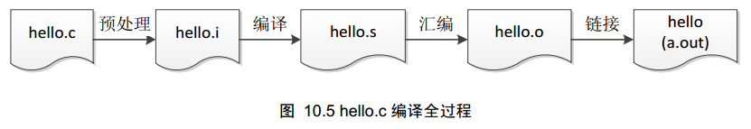

# 编译


## [静态链接和静态库实践指北](https://zhuanlan.zhihu.com/p/595527528)


### **什么是链接，链接做了什么？**

Linux下的ELF文件类型包含**可重定向文件**（这类文件包含了代码和数据，可以被用来链接成可执行文件或共享目标文件，目标文件.o和静态库.a都可以归为这一类），可执行文件以及共享目标文件（即动态库）。

在编译一个可执行文件的过程中，首先会得到一些.o文件，这些.o文件都是属于可重定向文件，它们彼此之间是相互独立的。之后链接器ld来把这些独立的.o文件都组装起来。这个组装的过程就是“链接”，在链接的过程中，ld链接器首先会对目标文件.o进行相似段合并，然后为各个段以及符号分配空间地址、进行符号解析与重定向。

**可重定向文件的特点**：可重定向，包含 .rel.text、.rel.data等重定位表，并且VMA（虚拟地址）和LMA（加载地址）未知，即均为0（0x0000000000000000）;

**链接之后的改变：**得到的可执行文件或共享库已经被重定向过了，不再需要重定向表，因此 .rel.text、.rel.data不再存在；同时，VMA和LMA已经被具体赋值，不再是0.


| 文件格式   | 归属阶段                                                     | 文件特点                                                     | 判断方式                                                     |
| ---------- | ------------------------------------------------------------ | ------------------------------------------------------------ | ------------------------------------------------------------ |
| 静态库     | 待链接，可重定向文件.o的集合。                               | .a文件中的每个目标文件.o均包含 .rel.text, .rel.data等重定向表，并且各个段的VMA和LMA为0x0 | objdump -r libxxx.a objdump -h -j .text libxxx.a             |
| 动态库     | 链接之后生成，已进行相似段合并和地址相对偏移量计算，真正的重定向发生在装载时而非编译时 | 不再包含.rel.text和.rel.data等重定向表，VMA和LMA均不为0x0，这个地址是相对于共享库本身而言的偏移量；但会包含.rel.dyn、got、plt等动态库在运行时被重定向所需的重定向表 | objdump -r libxxx.so objdump -h -j .text libxxx.so readelf -l libxxx.so objdump -R ibxxx.so |
| 可执行文件 | 可能（1）：链接之后生成，已进行相似段合并和地址相对偏移量计算，真正的重定向发生在装载时而非编译时；可能（2）：所有的依赖库均为静态链接，则链接之后生成的可执行文件，已进行相似段合并和地址重定向，VMA的值是绝对虚拟内存地址 | 如果动态链接libc.so，则本质上输出的文件格式为DYN (Shared object file)，基本文件件性质和动态库的so类似，包含.rel.dyn、got、plt等在运行时被重定向所需的重定向表，并且依赖了动态链接器ld-xxx.so；如果是通过-static选项编译生成，并且不依赖任何动态库，则生成的文件格式为EXEC (Executable file)，此时不再包含重定向表 .rel.dyn、.rel.text和.rel.data，VMA和LMA均不为0x0，此时这个地址代表的是被分配到的可用虚拟内存中的绝对地址 | objdump -r xxx_exe objdump -h -j .text xxx_exe readelf -l xxx_exe ldd xxx_exe objdump -R xxx_exe |


### 编译静态库和编译动态库的区别是什么？

| 行为           | cmake所执行的"链接"                                          | 特点描述                                                     |
| -------------- | ------------------------------------------------------------ | ------------------------------------------------------------ |
| 编译静态库     | 使用ar，对.o文件进行合并                                     | 虚假的链接，只是使用ar合并了.o文件                           |
| 编译动态库     | 使用ld链接器，执行相似段合并、地址偏移量计算                 | 发生了“有效”的链接，但没有做真正意义的重定向。               |
| 编译可执行文件 | 使用ld链接器，执行相似段合并、地址偏移量计算（也有可能发生了真正的重定向） | 发生了“有效”的链接。可能做了重定向也可能没有，取决于是否有动态库依赖。 |

提示：对于动态库和依赖的动态库的可执行文件，ld链接器仅仅做了地址偏移量计算，因此也不是真正的重定向，它们真正的重定向发生在装载时，这个过程由ld-xxx.so动态链接器完成，而非在编译时；


### 静态链接和编译静态库是同一个概念吗？

"静态链接"强调的指的是，编译可执行文件或动态库时，去链接一个静态库.a，其实相当于链接了一堆已经被编译好的.o，然后使用ld执行执行相似段合并、地址分配和重定向，对于编译可执行文件和动态库而言，“静态链接”一定发生了真正的链接。而编译静态库，本质上只是对.o文件的打包合并，可以认为它和真正的链接过程并没有什么关系。


### 两个同名目标文件.o在ar创建静态库后，会不会有一个被覆盖？

哪怕在不同的文件目录下存在同名的.o文件，比如liba/func.o和libb/func.o，ar在创建静态库的时候，会将两个同名的.o文件都保存下来。


### 编译动态库可以链接静态库，编译静态库也可以链接静态库，两者有何区别？

**动态库链接静态库：**是**“有效”**的链接，在编译动态库时，虽然ld链接器没有执行真正的重定向，但是它还是执行了“链接”过程中的其他步骤，如相似段合并、地址分配等。而编译一个动态库时，去链接一个静态库，比如编译libA.so链接了libB.a，那么libB.a中的.o文件会被ld链接器遍历查找，把其中libA.so所必须用到的部分.o加入到相似段合并的过程中。

**静态库链接静态库：**编译静态库不会发生链接，也不需要去检查符号间的依赖关系。所以这种操作没有任何实际的意义


### 编译静态库可以链接一个动态库吗？

编译静态库，可以链接一个动态库，但这种链接没有实际的意义，无论你是否链接这个动态库，都不会影响这个静态库的生成。


### 使用静态库时出现各种undefined，如何处理？

在实际应用的过程中，经常会出现这样一种情况。我们通过cmake管理并编译了一个libA.a的静态库，这个libA.a可能依赖的另一个libB.a（或libB.so）的库。在使用这个libA.a的时候，可能会发生一个最常见的错误，那就是“符号未定义（undefined）”！这是因为编译libA.a的时候并没有发生真实的链接，只是把libA.a自己的那部分.o文件打包在一起了，并没有将libB.a中的.o也合并进来（没有真实的链接，也就不存在相似段合并的过程），但我们的libA.a又必须依赖libB.a，它引用了libB.a中的某些符号，于是导致在使用libA.a来编译其他可执行文件或库的时候，出现了各种undefined的问题。

那么怎么解决呢？至少有两种可以行的方案。分别是在CMakeLists.txt中明确地逐个链接所有需要的库，另一种做法是，将编译得到的libA.a和它所依赖的libB.a合并一个库，然后供第三方使用。

```shell
ar crsT libmerge.a libxxx.a libxxxb.a  # 必须要有参数T
ar -tvO libmerge.a # 查看合并后的文件
```

数T表示将后续所有静态库中的.o文件打包到第一个参数指定的静态库文件中，如果不加该参数，得到的将会是后面几个.a文件的集合。可以使用命令ar -tv查看打包的内容。


### 为什么静态库出现了诡异的全局变量未初始化的问题？

当静态库中定了一个全局变量，而需要编译生成的可执行文件虽然依赖了该静态库，但是并没有访问该全局变量。那么ld链接器会认为该全局变量是多余的，不会把这个符号保留在最终得到可执行文件中。于是，在运行的时候，这个该全局变量符号就不会被初始化（因为在可执行文件的段表中根本不存在这个符号）。

解决方法：

一、在可执行文件的代码中使用该全局变量。

二、修改CMakeLists.txt中的链接选项，以 gcc 为例，可以增加 '-Wl,--whole-archive' 来指定对于静态库的链接属性，将整个静态库链接到可执行文件中。


### 如何处理使用静态库时遇到的符号重定义错误？

设想这样一个场景，我们需要编译一个动态库或可执行文件，它需要链接不同的静态库，libnna.a和libnnb.a，但是这两个静态库里面又恰好都包含了libonnx.a，那么在链接阶段，就会出现符号重定义的错误。那么该怎么解决这个问题呢？

如果确信重定义的符号的实现是完全相同的，那么可以参考以下的解决方式。对于gcc，可以添加"-Wl,-allow-multiple-definition"来允许重复符号的存在，在链接的时候，ld链接器只会使用遇到的该符号的第一个定义；而对于MSVC则可以添加“/FORCE:MULTIPLE”。比如OpenBLAS就是通过这种方式来处理符号重定义问题的。

```cmake
if (NOT MSVC)
    target_link_libraries(${OpenBLAS_LIBNAME}_shared "-Wl,-allow-multiple-definition")
else()
    set(CMAKE_SHARED_LINKER_FLAGS "${CMAKE_SHARED_LINKER_FLAGS} /FORCE:MULTIPLE")
endif()
```


# CMake


## CMake实践应用专题

[CMake实践应用专题](https://www.zhihu.com/column/c_1369781372333240320)


## Learn CMake's Scripting Language in 15 Minutes

from: [Learn CMake's Scripting Language in 15 Minutes (preshing.com)](https://preshing.com/20170522/learn-cmakes-scripting-language-in-15-minutes/)

### Hello World

If you create a file named `hello.txt` with the following contents:

```cmake
message("Hello world!")         # A message to print
```

…you can run it from the command line using `cmake -P hello.txt`. (The `-P` option runs the given script, but doesn’t generate a build pipeline.) As expected, it prints “Hello world!”.

```shell
$ cmake -P hello.txt
Hello world!
```


### All Variables Are Strings

In CMake, every variable is a string. You can substitute a variable inside a string literal by surrounding it with `${}`. This is called a **variable reference**. Modify `hello.txt` as follows:

```cmake
message("Hello ${NAME}!")       # Substitute a variable into the message
```

Now, if we define `NAME` on the `cmake` command line using the `-D` option, the script will use it:

```shell
$ cmake -DNAME=Newman -P hello.txt
Hello Newman!
```

When a variable is undefined, it defaults to an empty string:

```shell
$ cmake -P hello.txt
Hello !
```

To define a variable inside a script, use the [`set`](https://cmake.org/cmake/help/latest/command/set.html) command. The first argument is the name of the variable to assign, and the second argument is its value:

```cmake
set(THING "funk")
message("We want the ${THING}!")
```

Quotes around arguments are optional, as long as there are no **spaces** or **variable references** in the argument. For example, I could have written `set("THING" funk)` in the first line above – it would have been equivalent. For most CMake commands (except `if` and `while`, described below), the choice of whether to quote such arguments is simply a matter of style. When the argument is the name of a variable, I tend not to use quotes.

### You Can Simulate a Data Structure using Prefixes

CMake does not have classes, but you can simulate a data structure by defining a group of variables with names that begin with the same prefix. You can then look up variables in that group using nested `${}` variable references. For example, the following script will print “John Smith lives at 123 Fake St.”:

```cmake
set(JOHN_NAME "John Smith")
set(JOHN_ADDRESS "123 Fake St")
set(PERSON "JOHN")
message("${${PERSON}_NAME} lives at ${${PERSON}_ADDRESS}.")
```

You can even use variable references in the name of the variable to set. For example, if the value of `PERSON` is still “JOHN”, the following will set the variable `JOHN_NAME` to “John Goodman”:

```cmake
set(${PERSON}_NAME "John Goodman")
```

### Every Statement is a Command

In CMake, every statement is a command that takes a list of **string arguments** and has **no return value**. Arguments are separated by (unquoted) spaces. As we’ve already seen, the `set` command defines a variable at file scope.

As another example, CMake has a [`math`](https://cmake.org/cmake/help/latest/command/math.html) command that performs arithmetic. The first argument must be `EXPR`, the second argument is the name of the variable to assign, and the third argument is the expression to evaluate – all strings. Note that on the third line below, CMake substitutes the *string* value of `MY_SUM` into the enclosing argument before passing the argument to `math`.

```cmake
math(EXPR MY_SUM "1 + 1")                   # Evaluate 1 + 1; store result in MY_SUM
message("The sum is ${MY_SUM}.")
math(EXPR DOUBLE_SUM "${MY_SUM} * 2")       # Multiply by 2; store result in DOUBLE_SUM
message("Double that is ${DOUBLE_SUM}.")
```

There’s a [CMake command](https://cmake.org/cmake/help/latest/manual/cmake-commands.7.html) for just about anything you’ll need to do. The [`string`](https://cmake.org/cmake/help/latest/command/string.html) command lets you perform advanced string manipulation, including regular expression replacement. The [`file`](https://cmake.org/cmake/help/latest/command/file.html) command can read or write files, or manipulate filesystem paths.

### Flow Control Commands

Even flow control statements are commands. The [`if`](https://cmake.org/cmake/help/latest/command/if.html)/`endif` commands execute the enclosed commands conditionally. Whitespace doesn’t matter, but it’s common to indent the enclosed commands for readablity. The following checks whether CMake’s built-in variable [`WIN32`](https://cmake.org/cmake/help/latest/manual/cmake-variables.7.html#variables-that-describe-the-system) is set:

```cmake
if(WIN32)
    message("You're running CMake on Windows.")
endif()
```

CMake also has [`while`](https://cmake.org/cmake/help/latest/command/if.html)/`endwhile` commands which, as you might expect, repeat the enclosed commands as long as the condition is true. Here’s a loop that prints all the [Fibonacci numbers](https://en.wikipedia.org/wiki/Fibonacci_number) up to one million:

```cmake
set(A "1")
set(B "1")
while(A LESS "1000000")
    message("${A}")                 # Print A
    math(EXPR T "${A} + ${B}")      # Add the numeric values of A and B; store result in T
    set(A "${B}")                   # Assign the value of B to A
    set(B "${T}")                   # Assign the value of T to B
endwhile()
```

CMake’s `if` and `while` conditions aren’t written the same way as in other languages. For example, to perform a numeric comparison, you must specify `LESS` as a string argument, as shown above. The [documentation](https://cmake.org/cmake/help/latest/command/if.html) explains how to write a valid condition.

`if` and `while` are different from other CMake commands in that if the name of a variable is specified without quotes, the command will use the variable’s value. In the above code, I took advantage of that behavior by writing `while(A LESS "1000000")` instead of `while("${A}" LESS "1000000")` – both forms are equivalent. Other CMake commands don’t do that.

### Lists are Just Semicolon-Delimited Strings

CMake has a special substitution rule for **unquoted** arguments. If the entire argument is a variable reference without quotes, and the variable’s value contains **semicolons**, CMake will split the value at the semicolons and pass **multiple arguments** to the enclosing command. For example, the following passes three arguments to `math`:

```cmake
set(ARGS "EXPR;T;1 + 1")
math(${ARGS})                                   # Equivalent to calling math(EXPR T "1 + 1")
```

On the other hand, **quoted** arguments are never split into multiple arguments, even after substitution. CMake always passes a quoted string as a single argument, leaving semicolons intact:

```cmake
set(ARGS "EXPR;T;1 + 1")
message("${ARGS}")                              # Prints: EXPR;T;1 + 1
```

If more than two arguments are passed to the `set` command, they are joined by semicolons, then assigned to the specified variable. This effectively creates a list from the arguments:

```cmake
set(MY_LIST These are separate arguments)
message("${MY_LIST}")                           # Prints: These;are;separate;arguments
```

You can manipulate such lists using the [`list`](https://cmake.org/cmake/help/latest/command/list.html) command:

```cmake
set(MY_LIST These are separate arguments)
list(REMOVE_ITEM MY_LIST "separate")            # Removes "separate" from the list
message("${MY_LIST}")                           # Prints: These;are;arguments
```

The [`foreach`](https://cmake.org/cmake/help/latest/command/foreach.html)/`endforeach` command accepts multiple arguments. It iterates over all arguments except the first, assigning each one to the named variable:

```cmake
foreach(ARG These are separate arguments)
    message("${ARG}")                           # Prints each word on a separate line
endforeach()
```

You can iterate over a list by passing an unquoted variable reference to `foreach`. As with any other command, CMake will split the variable’s value and pass multiple arguments to the command:

```cmake
foreach(ARG ${MY_LIST})                         # Splits the list; passes items as arguments
    message("${ARG}")                           # Prints each item on a separate line
endforeach()
```

### Functions Run In Their Own Scope; Macros Don’t

In CMake, you can use a pair of [`function`](https://cmake.org/cmake/help/latest/command/function.html)/`endfunction` commands to define a function. Here’s one that doubles the numeric value of its argument, then prints the result:

```cmake
function(doubleIt VALUE)
    math(EXPR RESULT "${VALUE} * 2")
    message("${RESULT}")
endfunction()

doubleIt("4")                           # Prints: 8
```

Functions run in their own scope. None of the variables defined in a function pollute the caller’s scope. If you want to return a value, you can pass the name of a variable to your function, then call the [`set`](https://cmake.org/cmake/help/latest/command/set.html) command with the special argument `PARENT_SCOPE`:

```cmake
function(doubleIt VARNAME VALUE)
    math(EXPR RESULT "${VALUE} * 2")
    set(${VARNAME} "${RESULT}" PARENT_SCOPE)    # Set the named variable in caller's scope
endfunction()

doubleIt(RESULT "4")                    # Tell the function to set the variable named RESULT
message("${RESULT}")                    # Prints: 8
```

Similarly, a pair of [`macro`](https://cmake.org/cmake/help/latest/command/function.html)/`endmacro` commands defines a macro. Unlike functions, macros run in the same scope as their caller. Therefore, all variables defined inside a macro are set in the caller’s scope. We can replace the previous function with the following:

```cmake
macro(doubleIt VARNAME VALUE)
    math(EXPR ${VARNAME} "${VALUE} * 2")        # Set the named variable in caller's scope
endmacro()

doubleIt(RESULT "4")                    # Tell the macro to set the variable named RESULT
message("${RESULT}")                    # Prints: 8
```

Both functions and macros accept an arbitrary number of arguments. Unnamed arguments are exposed to the function as a list, through a special variable named `ARGN`. Here’s a function that doubles every argument it receives, printing each one on a separate line:

```cmake
function(doubleEach)
    foreach(ARG ${ARGN})                # Iterate over each argument
        math(EXPR N "${ARG} * 2")       # Double ARG's numeric value; store result in N
        message("${N}")                 # Print N
    endforeach()
endfunction()

doubleEach(5 6 7 8)                     # Prints 10, 12, 14, 16 on separate lines
```

### Including Other Scripts

CMake variables are defined at file scope. The [`include`](https://cmake.org/cmake/help/latest/command/include.html) command executes another CMake script in the **same scope** as the calling script. It’s a lot like the `#include` directive in C/C++. It’s typically used to define a common set of functions or macros in the calling script. It uses the variable [`CMAKE_MODULE_PATH`](https://cmake.org/cmake/help/latest/variable/CMAKE_MODULE_PATH.html) as a search path.

The [`find_package`](https://cmake.org/cmake/help/v3.3/command/find_package.html) command looks for scripts of the form `Find*.cmake` and also runs them in the same scope. Such scripts are often used to help find external libraries. For example, if there is a file named `FindSDL2.cmake` in the search path, `find_package(SDL2)` is equivalent to `include(FindSDL2.cmake)`. (Note that there are several ways to use the `find_package` command – this is just one of them.)

CMake’s [`add_subdirectory`](https://cmake.org/cmake/help/latest/command/add_subdirectory.html) command, on the other hand, creates a **new scope**, then executes the script named `CMakeLists.txt` from the specified directory in that new scope. You typically use it to add another CMake-based subproject, such as a library or executable, to the calling project. The targets defined by the subproject are added to the build pipeline unless otherwise specified. None of the variables defined in the subproject’s script will pollute the parent’s scope unless the `set` command’s `PARENT_SCOPE` option is used.

As an example, here are some of the scripts involved when you run CMake on the [Turf](https://github.com/preshing/turf) project:


### Getting and Setting Properties

A CMake script defines **targets** using the [`add_executable`](https://cmake.org/cmake/help/latest/command/add_executable.html), [`add_library`](https://cmake.org/cmake/help/latest/command/add_library.html) or [`add_custom_target`](https://cmake.org/cmake/help/latest/command/add_custom_target.html) commands. Once a target is created, it has **properties** that you can manipulate using the [`get_property`](https://cmake.org/cmake/help/latest/command/get_property.html) and [`set_property`](https://cmake.org/cmake/help/latest/command/set_property.html) commands. Unlike variables, targets are visible in every scope, even if they were defined in a subdirectory. All target properties are strings.

```cmake
cmakeadd_executable(MyApp "main.cpp")        # Create a target named MyApp

# Get the target's SOURCES property and assign it to MYAPP_SOURCES
get_property(MYAPP_SOURCES TARGET MyApp PROPERTY SOURCES)

message("${MYAPP_SOURCES}")             # Prints: main.cpp
```

Other [target properties](https://cmake.org/cmake/help/latest/manual/cmake-properties.7.html#properties-on-targets) include `LINK_LIBRARIES`, `INCLUDE_DIRECTORIES` and `COMPILE_DEFINITIONS`. Those properties are modified, indirectly, by the [`target_link_libraries`](https://cmake.org/cmake/help/latest/command/target_link_libraries.html), [`target_include_directories`](https://cmake.org/cmake/help/latest/command/target_include_directories.html) and [`target_compile_definitions`](https://cmake.org/cmake/help/latest/command/target_compile_definitions.html) commands. At the end of the script, CMake uses those target properties to generate the build pipeline.

There are properties for other CMake entities, too. There is a set of [directory properties](https://cmake.org/cmake/help/latest/manual/cmake-properties.7.html#properties-on-directories) at every file scope. There is a set of [global properties](https://cmake.org/cmake/help/latest/manual/cmake-properties.7.html#properties-of-global-scope) that is accessible from all scripts. And there is a set of [source file properties](https://cmake.org/cmake/help/latest/manual/cmake-properties.7.html#properties-on-source-files) for every C/C++ source file.

Congratulations! You now know the CMake scripting language – or at least, it should be easier to understand large scripts using CMake’s [command reference](https://cmake.org/cmake/help/latest/manual/cmake-commands.7.html). Otherwise, the only thing missing from this guide, that I can think of, is [generator expressions](https://cmake.org/cmake/help/latest/manual/cmake-generator-expressions.7.html#manual:cmake-generator-expressions(7)). Let me know if I forgot anything else!


## Modern Cmake

[Modern CMake](https://blog.shunzi.tech/post/6.NULL-1-ModernCMake/)

### step0. Hello world

- 了解 Makefile 最基本的格式

  - CXX 是 Make 的内置变量，还有一些其他的内置变量

    - 普通变量：
      - 简单赋值 ( := )
      - 递归赋值 ( = )
      - 条件赋值 ( ?= )
      - 追加赋值 ( += )
    - 自动化变量
    
  - targets：规则的目标，可以是 Object File（一般称它为中间文件），也可以是可执行文件，还可以是一个标签；
  
  - prerequisites：是我们的依赖文件，要生成 targets 需要的文件或者是目标。可以是多个，也可以是没有；

  - command：make 需要执行的命令（任意的 shell 命令）。可以有多条命令，每一条命令占一行。

  - > 注意：我们的目标和依赖文件之间要使用冒号分隔开，命令的开始一定要使用Tab键。

```Makefile
name: dependencies
	commands

# or
targets : prerequisites
    commands

# or
targets : prerequisites; command
    command
```

- 源代码程序 main.cpp

```C++
#include <iostream>

int main(int argc, const char *argv[])
{
    std::cout << "Hello world!" << std::endl;
    return 0;
}
```

- Makefile

```Makefile
hello: main.cpp
	$(CXX) -o hello main.cpp
	echo "OK"
```

- 执行
  - 这里 make 后的 hello 就对应了前面 Makefile 里定义的 hello

```bash
$ make hello
$ ./hello
```


### step1. 优化前面的 Makefile

- 虽然前面的 Makefile 足够简单，但是还不够优雅，特别是需要添加新的源代码文件时候可能需要修改的地方过多，所以将其优化。

- Makefile

  - 定义了全局变量 CC, CXX

  - 定义了伪目标 all 和 clean

  - 定义了中间文件变量（编译是需要首先将源文件编译成 .o 的文件，再编译成可执行文件）

    此处定义的是汇编过后的机器码作为中间文件变量

    - 预处理：C 编译器对各种预处理命令进行处理，包括头文件包含、宏定义的扩展、条件编译的选择等；
    - 编译，将预处理得到的源代码文件，进行“翻译转换”，产生出机器语言的目标程序，得到机器语言的汇编文件；
    - 汇编，将汇编代码翻译成了机器码，但是还不可以运行；
    - 链接，处理可重定位文件，把各种符号引用和符号定义转换成为可执行文件中的合适信息，通常是虚拟地址。
      [](https://raw.githubusercontent.com/zjs1224522500/PicGoImages/master//img/blog/20220209101007.png)

  - 执行 `make all` 时对应跳转到执行 `make hello`，再跳转到执行 `make main.o`，相应地将 `main.cpp` 编译成了 `main.o`，然后 hello 的 command 将对应的目标文件链接起来构成对应的可执行文件 hello

  - `make clean` 删除对应的编译的中间文件和可执行文件

- 注意

  - **全局变量定义的部分可通过 make CXX=g++ 形式覆盖**
- **链接到目标文件过程中的 $@ 是自动变量，表示 target 名**

```Makefile
#
# := 用于给变量赋值，除此之外还有 =、?=、+= 等不同的赋值方式。
#
# 一般全大写变量用来表示允许调用 make 的时候传入的变量，
# 全小写变量表示仅内部使用的变量。
#
# 这里 CC 和 CXX 指定了要使用的 C 和 C++ 编译器。
#
CC := clang
CXX := clang++

#
# Makefile 中的核心概念是 target（目标），定义 target 的基本
# 格式是（注意每一行 command 是必须用 tab 缩进的）：
#
#   name: dependencies
#   	commands
#
# 要构建某个 target 时，使用如下命令：
#
#   make target_name
#
# 下面 all 是一个 target，它依赖另一个 target：hello，
# 意味着要构建 all，首先需要构建 hello。而 all 的 commands
# 部分为空，表示构建 all 不需要额外命令。
#
# .PHONY 表示 all 不是一个真实会生成的文件，而是一个“伪目标”。
#
.PHONY: all
all: hello

#
# 由于后面需要多次使用 main.o 等目标文件列表，这里赋值给变量 objects。
#
objects := main.o

#
# hello 是我们最终要生成的可执行文件名，它依赖 objects 中的所有目标文件。
#
# 它的 commands 部分使用 CXX 指定的编译器将所有目标文件链接成 hello 可执行文件。
#
hello: $(objects)
	$(CXX) -o $@ $(objects)

# main.o 目标文件依赖 main.cpp 源文件。
main.o: main.cpp
	$(CXX) -c main.cpp

#
# clean 用于清除构建生成的临时文件、目标文件和可执行文件。
# 和 all 类似，它是一个“伪目标”。
#
.PHONY: clean
clean:
	rm -f hello $(objects)

```

### step2. 引入新的头文件和源码


新添加了一个头文件和源代码文件

- answer.hpp

```C++
#pragma once

namespace answer {
    int find_the_ultimate_answer();
} // namespace answer
```

- answer.cpp

```C++
#include "answer.hpp"

namespace answer {
    int find_the_ultimate_answer() {
        return 42;
    }
} // namespace answer
```

- main.cpp

```C++
#include <iostream>

#include "answer.hpp"

int main(int argc, const char *argv[]) {
    int expected_answer = answer::find_the_ultimate_answer();
    for (;;) {
        std::cout << "What is the ultimate answer?" << std::endl;
        int answer;
        std::cin >> answer;
        if (answer == expected_answer) {
            std::cout << "Correct!" << std::endl;
            break;
        }
    }
    return 0;
}
```

- 此时的 Makefile
  - 因为新引入了 answer 源码，所以多了一个目标文件 answer.o
  - 相应的目标文件 `make answer.o` 需要添加对应的步骤，因为有对应的规范，所以 Make 其实可以通过对应的目标名推断出同名的 .cpp 文件，**只需要指定目标文件所依赖的头文件，使头文件变动时可以重新编译对应目标文件**。

```Makefile
CC := clang
CXX := clang++

.PHONY: all
all: answer

# 在这里添加了 answer.o 目标文件。
objects := main.o answer.o

answer: $(objects)
	$(CXX) -o $@ $(objects)

#
# Make 可以自动推断 .o 目标文件需要依赖同名的 .cpp 文件，所以其实不需要在依赖中
# 指定 main.cpp 和 answer.cpp，也不需要写编译 commands，它知道要用 CXX 变量制定的命令作为 C++ 编译器。
#
# 这里只需要指定目标文件所依赖的头文件，使头文件变动时可以重新编译对应目标文件。
#
main.o: answer.hpp
answer.o: answer.hpp

.PHONY: clean
clean:
	rm -f answer $(objects)
```


#### Makefile 其他规则

##### 通配符

- Makefile 是可以使用 shell 命令的，所以 shell 支持的通配符在 Makefile 中也是同样适用的。

  

```Makefile
.PHONY:clean
clean:
    rm -rf *.o test

test:*.c
    gcc -o $@ $^

# 不能使用 OBJ=*.c
# 要使用一个函数 "wildcard"，这个函数在我们引用变量的时候，会帮我们展开
OBJ=$(wildcard *.c)
test:$(OBJ)
    gcc -o $@ $^

# "%.o" 把我们需要的所有的 ".o" 文件组合成为一个列表，
# 从列表中挨个取出的每一个文件，"%" 表示取出来文件的文件名（不包含后缀）
# 然后找到文件中和 "%"名称相同的 ".c" 文件
# 然后执行下面的命令，直到列表中的文件全部被取出来为止
test:test.o test1.o
    gcc -o $@ $^
%.o:%.c
    gcc -o $@ $^
```


##### 自动化变量

- http://c.biancheng.net/view/7094.html
- 执行 make 的时候，make 会自动识别命令中的自动化变量，并自动实现自动化变量中的值的替换，这个类似于编译C语言文件的时候的预处理的作用。
  - \$@：表示规则的目标文件名。如果目标是一个文档文件（Linux 中，一般成 .a文件为文档文件，也成为静态的库文件），那么它代表这个文档的文件名。在多目模式规则中，它代表的是触发规则被执行的文件名。
  - \$%：当目标文件是一个静态库文件时，代表静态库的一个成员名。
  - \$<：规则的第一个依赖的文件名。如果是一个目标文件使用隐含的规则来重建，它代表由隐含规则加入的第一个依赖文件。
  - \$?：所有比目标文件更新的依赖文件列表，空格分隔。如果目标文件时静态库件，代表的是库文件（.o 文件）。
  - \$^：代表的是所有依赖文件列表，使用空格分隔。如果目标是静态库文件，它代表的只能是所有的库成员（.o 文件）名。一个文件可重复的出现在目标的依中，变量“\$\^”只记录它的第一次引用的情况。就是说变量“\$\^”会去掉重复的赖文件。
  - \$+：类似“$^”，但是它保留了依赖文件中重复出现的文件。主要用在程序链时库的交叉引用场合。
  - \$*：在模式规则和静态模式规则中，代表“茎”。“茎”是目标模式中“%”所代表的分（当文件名中存在目录时，“茎”也包含目录部分）。

```Makefile
#  "$@" 代表的是目标文件test
#  “$^” 代表的是依赖的文件
test:test.o test1.o test2.o
         gcc -o $@ $^
#  “$<” 代表的是依赖文件中的第一个
test.o:test.c test.h
         gcc -o $@ $<
test1.o:test1.c test1.h
         gcc -o $@ $<
test2.o:test2.c test2.h
         gcc -o $@ $<

# 库文件的制作依赖于这三个文件。当修改了其中的某个依赖文件，
# 在命令行执行 make 命令，库文件 "lib" 就会自动更新。
# "$?" 表示修改的文件
lib:test.o test1.o test2.o
    ar r $?
```

#### 其他规则

- http://c.biancheng.net/view/7153.html
- **未来使用时再补充**

### step3. okokok

- Makefile - no
- CMake - yes

### step4. 使用 CMake 来编译

- CMake 本身可以支持不同的底层，如 Makefile, Ninja 等，例如要产生Ninja，加上 -G Ninja 即可：`cmake -G Ninja`
- `CMakeLists.txt` 基本格式：

```Makefile
cmake_minimum_required(VERSION 3.9)
project(answer)

add_executable(answer main.cpp answer.cpp)
```


```Makefile
# 指定最小 CMake 版本要求
cmake_minimum_required(VERSION 3.9)
# 设置项目名称
project(answer)

#[[
添加可执行文件 target，类似于原来 Makefile 的：

    answer: main.o answer.o
    main.o: main.cpp answer.hpp
    answer.o: answer.cpp answer.hpp

CMake 会自动找到依赖的头文件，因此不需要特别指定，当头文件修改的时候，会重新编译依赖它的目标文件。
#]]
# 当前头文件就在当前目录，所以无需特别指定
# 如需指定，可以使用 include_directories
# 格式 add_executable(target srcfiles)
add_executable(answer main.cpp answer.cpp)

#[[
使用如下命令构建本项目：

    cmake -B build      # 生成构建目录
    cmake --build build # 执行构建
    ./build/answer      # 运行 answer 程序
#]]
```

- 执行命令
  - `cmake -B <buildPath>` 使用"-B"参数指定生成目录，这样CMake生成的文件都会集中在这个文件
  - `cmake --build <buildPath>` 执行类似于 Makefile 中的 make 的效果，同时支持底层为 Ninja 时的 build 操作，类似于一个封装
  - `./build/answer` 执行对应的目标程序

```bash
cmake -B build      # 生成构建目录，-B 指定生成的构建系统代码放在 build 目录
cmake --build build # 执行构建
./build/answer      # 运行 answer 程序
```

### step5. CMake 拆分库 (库复用)

- 项目中可以复用的部分可以拆成 library，然后在后面的其他可执行程序中引用该库

```Makefile
# 添加一个 libanswer 的静态库
add_library(libanswer STATIC answer.cpp)

# 依然指定可执行文件
add_executable(answer main.cpp)
# 链接对应的库
target_link_libraries(answer libanswer)
```

- CMakeLists.txt

```Makelist
cmake_minimum_required(VERSION 3.9)
project(answer)

# 添加 libanswer 库目标，STATIC 指定为静态库
add_library(libanswer STATIC answer.cpp)

add_executable(answer main.cpp)

# 为 answer 可执行目标链接 libanswer
target_link_libraries(answer libanswer)
```

### step6. 使用子目录来编译

- 功能独立的模块可以放到单独的子目录：
  - 与之对应的，在子目录下也需要编写 CMakeLists.txt 

```
.
├── answer
│  ├── answer.cpp
│  ├── CMakeLists.txt
│  └── include
│     └── answer
│        └── answer.hpp
├── CMakeLists.txt
└── main.cpp
```

- 原来的 CMakeLists.txt
  - `add_subdirectory` 添加 answer 子目录
  - 然后对应的依赖的的 libanswer 会去子目录中寻找

```cmake
cmake_minimum_required(VERSION 3.9)
project(answer)

# 添加 answer 子目录
add_subdirectory(answer)

add_executable(answer_app main.cpp)
target_link_libraries(answer_app libanswer)

```

- 子目录中的 CMakeLists.txt

  - `CMAKE_CURRENT_SOURCE_DIR `是 CMake 内置变量，表示当前 CMakeLists.txt 文件所在目录，此处其实可以省略

  - `target_include_directories` PUBLIC 参数表示这个包含目录是 libanswer 的公开接口一部分，链接 libanswer 的 target 可以 #include 该目录中的文件。从而使得 main.cpp 可以直接 `#include <answer/answer.hpp>`

```cmake
add_library(libanswer STATIC answer.cpp)

#[[
message 可用于打印调试信息或错误信息，除了 STATUS外还有 DEBUG WARNING SEND_ERROR FATAL_ERROR 等。
#]]
message(STATUS "Current source dir: ${CMAKE_CURRENT_SOURCE_DIR}")

#[[
给 libanswer 库目标添加 include 目录，PUBLIC 使这个 include 目录能被外部使用者看到。
当链接 libanswer 库时，这里指定的 include 目录会被自动添加到使用此库的 target 的 include 路径中。
#]]
target_include_directories(libanswer PUBLIC ${CMAKE_CURRENT_SOURCE_DIR}/include)
```

### step7. 使用其他已有的动态库

此时假设我们的 answer.cpp 需要发起网络请求来获取数据

- `answer.hpp`

```C++
#pragma once

#include <string>

namespace answer {
    namespace v1 {
        int find_the_ultimate_answer();
    } // namespace v1

    namespace v2 {
        std::string find_the_ultimate_answer();
    } // namespace v2

    using namespace v2;
} // namespace answer
```

- `answer.cpp`

```C++
#include "answer/answer.hpp"

#include <curl/curl.h>

namespace answer {
    namespace v1 {
        int find_the_ultimate_answer() {
            return 42;
        }
    } // namespace v1

    namespace v2 {
        std::string find_the_ultimate_answer() {
            // 使用 CURL 调用 WolframAlpha API 获得答案
            const auto url = "https://api.wolframalpha.com/v1/result?appid=YAPKJY-8XT9VEYPX9&i=what+is+ultimate+answer";
            const auto curl = curl_easy_init();
            curl_easy_setopt(curl, CURLOPT_URL, url);
            curl_easy_setopt(curl, CURLOPT_FOLLOWLOCATION, 1L);
            const auto write_func = [](char *ptr, size_t size, size_t nmemb, void *userdata) {
                auto &result = *static_cast<std::string *>(userdata);
                result.append(ptr, size * nmemb);
                return size * nmemb;
            };
            using WriteFunction = size_t (*)(char *, size_t, size_t, void *);
            curl_easy_setopt(curl, CURLOPT_WRITEFUNCTION, static_cast<WriteFunction>(write_func));
            std::string result = "";
            curl_easy_setopt(curl, CURLOPT_WRITEDATA, &result);
            curl_easy_perform(curl); // 暂时不考虑 API 请求失败的情况
            curl_easy_cleanup(curl);
            return result;
        }
    } // namespace v2
} // namespace answer

```

- 虽然我们在代码中指定了对应的头文件，并编写了相关代码，但是本质是没有依赖对应的 libcurl 库的。所以我们需要在子目录下对应修改 CMakeLists.txt
  - `find_package` 寻找已经安装的第三方库的头文件和库文件的位置，参数 REQUIRED 要求必须找到，没找到就报错。
  - `target_link_libraries` 相应地链接 libcurl，使用了 PRIVATE 表明只有当前子模块 answer 能使用对应的接口。
  - **注意**：CURL 和 CURL::libcurl 是约定的名字，其它第三方库的包名和 library 名可在网上查。

```cmake
#[[
find_package 用于在系统中寻找已经安装的第三方库的头文件和库文件
的位置，并创建一个名为 CURL::libcurl 的库目标，以供链接。
#]]
find_package(CURL REQUIRED)

add_library(libanswer STATIC answer.cpp)

target_include_directories(libanswer PUBLIC ${CMAKE_CURRENT_SOURCE_DIR}/include)

#[[
为 libanswer 库链接 libcurl，这里 PRIVATE 和 PUBLIC 的区别是：
CURL::libcurl 库只会被 libanswer 看到，根级别的 main.cpp 中无法 include curl 的头文件。
#]]
target_link_libraries(libanswer PRIVATE CURL::libcurl)

```

### step8. 继续解耦

- 此时的文件目录

```
.
├── answer
│   ├── answer.cpp
│   ├── CMakeLists.txt
│   └── include
│       └── answer
│           └── answer.hpp
├── CMakeLists.txt
├── curl_wrapper
│   ├── CMakeLists.txt
│   ├── curl_wrapper.cpp
│   └── include
│       └── curl_wrapper
│           └── curl_wrapper.hpp
├── main.cpp
├── wolfram
│   ├── alpha.cpp
│   ├── CMakeLists.txt
│   └── include
│       └── wolfram
│           └── alpha.hpp
```

- 对应的依赖关系如下：answer -> wolffram -> curl_wapper -> libcurl （代码此处不再粘贴）
  - curl_wapper: 对外提供两个接口
    - std::string http_get_string(const std::string &url);
    - std::string url_encode(const std::string &s);
  - wolffram: 对外提供一个接口
    - std::string simple_query(const std::string &appid, const std::string &query);
  - answer 还是和之前一样：
    - find_the_ultimate_answer();
- 此时各个目录下的 CMakeLists.txt 如下：

```cmake
# CMakeLists.txt
add_subdirectory(answer)
add_subdirectory(curl_wrapper)
add_subdirectory(wolfram)
add_executable(answer_app main.cpp)
target_link_libraries(answer_app libanswer)

# answer/CMakeLists.txt
add_library(libanswer STATIC answer.cpp)
target_include_directories(libanswer PUBLIC ${CMAKE_CURRENT_SOURCE_DIR}/include)
target_link_libraries(libanswer PRIVATE wolfram)

# wolfram/CMakeLists.txt
add_library(wolfram STATIC alpha.cpp)
target_include_directories(wolfram PUBLIC ${CMAKE_CURRENT_SOURCE_DIR}/include)
target_link_libraries(wolfram PRIVATE curl_wrapper)

# curl_wrapper/CMakeLists.txt
find_package(CURL REQUIRED)
add_library(curl_wrapper STATIC curl_wrapper.cpp)
target_include_directories(curl_wrapper
                           PUBLIC ${CMAKE_CURRENT_SOURCE_DIR}/include)
target_link_libraries(curl_wrapper PRIVATE CURL::libcurl)
```

### step9. CMake 参数传递

- 上文所述使用的公开的 API 常常因为用户的不同而需要不同的设置，那么可以在 CMake 编译时指定相应的参数进行传递 `-D<para_name>`，但是需要在 CMakeLists.txt 中添加相应的支持。
- 因为 AppID 在原来的程序中只有 answer 模块才使用到，所以只需修改该模块的 CMakeLists.txt
  - `set(WOLFRAM_APPID "" CACHE STRING "WolframAlpha APPID")` 注意各个字段的含义
  - `target_compile_definitions`：要让 C++ 代码能够拿到 CMake 中的变量，可添加编译时宏定义
  - `cmake -B build -DWOLFRAM_APPID=xxx`：命令行参数传递
  - `ccmake`：直接 TUI 修改变量传递参数

```MakeList
#[[
创建一个可配置的变量，可以由上级 CMakeLists 或 cmake 命令指定变量值。
这里由于 APPID 是一个不应该放在代码里的值，所以建议在 cmake命令中通过 -D 参数传入。
#]]
# 格式：参数名 默认值 变量类型(CACHE)  数据类型(STRING) 参数描述
set(WOLFRAM_APPID "" CACHE STRING "WolframAlpha APPID")

if(WOLFRAM_APPID STREQUAL "")
    message(SEND_ERROR "WOLFRAM_APPID must not be empty")
endif()

add_library(libanswer STATIC answer.cpp)
target_include_directories(libanswer PUBLIC ${CMAKE_CURRENT_SOURCE_DIR}/include)

#[[
将 WOLFRAM_APPID 添加到编译 .cpp 文件时的 definition 列表，从而可在 C++ 代码中使用。宏定义名 WOLFRAM_APPID
#]]
target_compile_definitions(libanswer PRIVATE WOLFRAM_APPID="${WOLFRAM_APPID}")

target_link_libraries(libanswer PRIVATE wolfram)
```

### step10. CMake 编译不同类型的库

- 上面的例子中因为经过充分的解耦，answer 模块的代码已经足够简单了，Modern C++ 可以直接在头文件中实现代码来省略源文件，这种情况被称之为 header-only

```C++
#pragma once

#include <string>
#include <wolfram/alpha.hpp>

// header-only 库的所有实现代码均在头文件中

namespace answer {
    namespace v1 {
        int find_the_ultimate_answer() {
            return 42;
        }
    } // namespace v1

    namespace v2 {
        std::string find_the_ultimate_answer() {
            return wolfram::simple_query(WOLFRAM_APPID, "what is the ultimate answer?");
        }
    } // namespace v2

    using namespace v2;
} // namespace answer
```

- 针对这种库的编译可以使用特殊的库类型 INTERFACE，相应地也需要修改其他语句
  - 通过 `target_xxx` 给 INTERFACE library 添加属性都要用 INTERFACE。

```cmake
add_library(libanswer INTERFACE)
target_include_directories(libanswer INTERFACE ${CMAKE_CURRENT_SOURCE_DIR}/include)
target_compile_definitions(libanswer INTERFACE WOLFRAM_APPID="${WOLFRAM_APPID}")
target_link_libraries(libanswer INTERFACE wolfram)
```

### step11. 指定 C++ 标准

- 上文使用的 auto 关键字源于 C++ 11，需要在 CMakeLists.txt 相应地进行指定和约束
- 但也可以针对 target 要求编译 feature（即指定要使用 C/C++ 的什么特性）`target_compile_features`
- 注意两者的区别：
  - `CMAKE_CXX_STANDARD` 会应用于所有能看到这个变量的 target，而 `target_compile_features` 只应用于单个 target
  - `target_compile_features` 可以指定更细粒度的 C++ 特性，例如 `cxx_auto_type`、`cxx_lambda` 等。这里使用了 cxx20 的标准是为了使用 require 的关键字

```cmake
# CMakeLists.txt
set(CMAKE_CXX_STANDARD 11)

# answer/CMakeLists.txt
#[[
指明 libanswer 要求 C++20。
这里和直接设置 CMAKE_CXX_STANDARD 的区别是：
    1. 设置 CMAKE_CXX_STANDARD 之后，从设置它的那一级开始include 的 subdirectory 都会继承这个变量，且应用于
       所有能看到这个变量的 target；而 target_compile_features 只应用于单个 target。
    2. target_compile_features 可以指定更细粒度的 C++ 特性，例如 cxx_auto_type、cxx_lambda 等。
#]]
target_compile_features(libanswer INTERFACE cxx_std_20)
```

- C++20 在本例中的使用，重点 `answer::check_the_answer`

```C++
// main.cpp
int main(int argc, const char *argv[]) {
    for (;;) {
        std::cout << "What is the ultimate answer?" << std::endl;
        std::string answer;
        std::cin >> answer;
        auto expected_answer = answer::find_the_ultimate_answer();
        if (answer::check_the_answer(answer, expected_answer)) {
            std::cout << "Correct!" << std::endl;
            break;
        }
    }
    return 0;
}
```

- 具体的 `answer::check_the_answer` 实现

```C++
    namespace v2 {
        std::string find_the_ultimate_answer() {
            return wolfram::simple_query(WOLFRAM_APPID, "what is the ultimate answer?");
        }

        // 下面是非常 fancy 的两个函数，使用了 C++14 的 auto 返回类型、
        // C++17 的 if constexpr 和 C++20 的 constraints。

        namespace impl {
            template <typename T>
            auto to_string(T &&t) {
                if constexpr (requires { std::to_string(t); }) {
                    return std::to_string(std::forward<T>(t));
                } else if constexpr (requires { std::string(t); }) {
                    return std::string(std::forward<T>(t));
                }
            }
        } // namespace impl

        template <typename T, typename U>
        requires requires(T &&t, U &&u) {
            impl::to_string(std::forward<T>(t));
            impl::to_string(std::forward<U>(u));
        }
        auto check_the_answer(T &&given, U &&expected) {
            return impl::to_string(std::forward<T>(given)) == impl::to_string(std::forward<U>(expected));
        }
    } // namespace v2

    using namespace v2;
```

### step12. CTest

- 现在的目录结构

  ```c++
  root@aep-shunzi:/shunzi/modern-cmake-by-example# tree
  .
  ├── answer
  │   ├── CMakeLists.txt
  │   ├── include
  │   │   └── answer
  │   │       └── answer.hpp
  │   └── tests
  │       ├── CMakeLists.txt
  │       └── test_check_the_answer.cpp
  ├── CMakeLists.txt
  ├── curl_wrapper
  │   ├── CMakeLists.txt
  │   ├── curl_wrapper.cpp
  │   └── include
  │       └── curl_wrapper
  │           └── curl_wrapper.hpp
  ├── main.cpp
  ├── wolfram
  │   ├── alpha.cpp
  │   ├── CMakeLists.txt
  │   └── include
  │       └── wolfram
  │           └── alpha.hpp
  ```
  
- 要使用 CTest 运行 CMake 项目的测试程序，需要在 CMakeLists.txt 添加一些内容：

  - `include(CTest)` 主 CMakeLists 需要添加对 ctest 的支持

  - `BUILD_TESTING` 在引入 CTest 之后将会引入一个默认的 CACHE 变量来标识是否编译 Test，默认值为 ON，也可以通过 `-D` 参数传递来修改

  - `add_subdirectory(tests)` 在 answer 模块中添加新的测试目录作为子目录，此时的文件结构

  - `add_test ` 添加相应的测试用例
    
    - `<name>` 指定本测试的名称
    - `Debug/Release` 选项可以控制在不同的编译版本下是否进行测试
    - `WORKING_DIRECTORY` 设置工作路径
    - `command` 表示可运行程序
    
    ```MakeList
    add_test(NAME <name> [CONFIGURATIONS [Debug|Release|...]]
           [WORKING_DIRECTORY dir]
           COMMAND <command> [arg1 [arg2 ...]])
    复制代码
    ```
  
- 使用 CTest 的大体结构

```cmake
# CMakeLists.txt
cmake_minimum_required(VERSION 3.14) # 提高了 CMake 版本要求
project(answer)
#[[
判断当前目录是否是 CMake 调用的 top-level，如果是，引入 CTest 支持。

这会引入一个 BUILD_TESTING 选项（类似之前的 CACHESTRING，这是一个 CACHE BOOL），默认值为 ON，
可以在之后的 CMake 脚本中通过该选项判断是否需要 include 测试用例子目录。
#]]
if(CMAKE_PROJECT_NAME STREQUAL PROJECT_NAME)
    include(CTest)
endif()

# answer/CMakeLists.txt
if(BUILD_TESTING)
    add_subdirectory(tests)
endif()

# answer/tests/CMakeLists.txt
#[[
add_test 添加 CTest 可以识别到的测试程序，建议使用项目名前缀，方便在运行测试时和别的第三方库的测试区分。
#]]
add_executable(test_some_func test_some_func.cpp)
add_test(NAME answer.test_some_func COMMAND test_some_func)
```

- answer 模块添加的测试代码 `answer/tests/test_check_the_answer.cpp`

  这里使用了 Catch2 框架来进行单元测试，相应地需要添加 Catch2 的依赖

```C++
#include <catch2/catch_test_macros.hpp>
#include <answer/answer.hpp>

using namespace answer;

// 使用 Catch2 编写测试用例

TEST_CASE("Can compare string and string", "[check_the_answer]") {
    REQUIRE(check_the_answer("Hello", "Hello") == true);
    REQUIRE(check_the_answer("Hello", "world") == false);
    REQUIRE(check_the_answer("13", std::string("13")) == true);
}

TEST_CASE("Can compare string and integer", "[check_the_answer]") {
    REQUIRE(check_the_answer("13", 13) == true);
    REQUIRE(check_the_answer("13", 14) == false);
    REQUIRE(check_the_answer(13, "13") == true);
    REQUIRE(check_the_answer(13, std::string("13")) == true);
    REQUIRE(check_the_answer(13, std::string("14")) == false);
}
```

- 具体的 answer/test 模块的 CMakeLists.txt

  - 除了使用 `find_package` 找到系统中安装的第三方库，也可通过 CMake 3.11 新增的 **FetchContent** 功能下载使用第三方库，使用步骤如下

    - `include(FetchContent)` 首先导入该功能
    
    - `FetchContent_Declare ` 定义依赖的库对应的信息
      
      `SOURCE_DIR` Declare 中可以指定要安装的目录

    - `FetchContent_MakeAvailable` 根据定义信息下载和构建对应的库并进行依赖
      
      `FetchContent_MakeAvailable` 要求 CMake 3.14，如果要支持旧版本，或者需要更细粒度的控制，可以使用如下替代：

      ```cmake
      FetchContent_GetProperties(catch2)
      if(NOT catch2_POPULATED)
          FetchContent_Populate(catch2)
          add_subdirectory(${catch2_SOURCE_DIR} ${catch2_BINARY_DIR})
      endif()
      ```

    - `target_link_libraries(${TEST_NAME} PRIVATE Catch2::Catch2WithMain)` 相应地在后面依赖该库

```cmake
# 导入 FetchContent 相关命令
include(FetchContent)

# 描述如何获取 Catch2
FetchContent_Declare(
    catch2 # 建议使用全小写
    GIT_REPOSITORY https://github.com/catchorg/Catch2.git
    GIT_TAG v3.0.0-preview3)

# 一条龙下载、构建 Catch2
FetchContent_MakeAvailable(catch2)

#[[
FetchContent 要求 CMake 3.11 或更高版本，在此之前可以使用 Git submodule + add_subdirectory 的方式
使用没有安装在系统中的第三方库。即使支持 FetchContent也可以选择使用 Git submodule，各有优劣。

FetchContent_MakeAvailable 要求 CMake 3.14，如果要支持更旧版本，或者需要更细粒度的控制，可以使用如下替代：

    FetchContent_GetProperties(catch2)
    if(NOT catch2_POPULATED)
        FetchContent_Populate(catch2)
        add_subdirectory(${catch2_SOURCE_DIR} ${catch2_BINARY_DIR})
    endif()
#]]

# macro（宏）类似于 C/C++ 中的宏
macro(answer_add_test TEST_NAME)
    add_executable(${TEST_NAME} ${ARGN}) # ${ARGN} 类似于 C/C++ 中的 __VA_ARGS__
    #[[
    add_test 添加 CTest 可以识别到的测试程序，建议使用项目名前缀，方便在运行测试时和别的第三方库的测试区分。
    #]]
    add_test(NAME answer.${TEST_NAME} COMMAND ${TEST_NAME})
    target_link_libraries(${TEST_NAME} PRIVATE libanswer)
    #[[
    链接 Catch2::Catch2WithMain 以使用 Catch2 提供的宏，链接
    Catch2WithMain 时，测试程序中不需要手动编写 main 函数。
    #]]
    target_link_libraries(${TEST_NAME} PRIVATE Catch2::Catch2WithMain)
endmacro()

# 调用上面的 macro 添加测试程序
answer_add_test(test_check_the_answer test_check_the_answer.cpp)
```

- 原 CMakeLists.txt 中使用了一种相对特殊的语法。`macro` 类似于定义了一个宏。

  - `macro(answer_add_test TEST_NAME)` 对应定义了函数名 `answer_add_test` 和函数参数 `TEST_NAME`
  - `add_executable(${TEST_NAME} ${ARGN})` 本例中相应地使用对应的参数创建了对应的测试程序，其中 `${ARGN}` 类似于 C/C++ 中的 `__VA_ARGS__`，即可变数量的参数数组
  - `add_test(NAME answer.${TEST_NAME} COMMAND ${TEST_NAME})` 添加 CTest 可以识别到的测试程序
- `target_link_libraries(${TEST_NAME} PRIVATE libanswer)` 给相应的测试程序链接对应的库
  - `answer_add_test(test_check_the_answer test_check_the_answer.cpp)` 相应地调用对应的宏定义，本例中对应了一个测试程序，test_check_the_answer 以及其其所依赖的源文件 test_check_the_answer.cpp

- 格式

```cmake
macro(answer_add_test TEST_NAME)
    add_executable(${TEST_NAME} ${ARGN}) # ${ARGN} 类似于 C/C++ 中的 __VA_ARGS__
    add_test(NAME answer.${TEST_NAME} COMMAND ${TEST_NAME})
    target_link_libraries(${TEST_NAME} PRIVATE libanswer)
    target_link_libraries(${TEST_NAME} PRIVATE Catch2::Catch2WithMain)
endmacro()

answer_add_test(test_check_the_answer test_check_the_answer.cpp)
answer_add_test(test_another_function test_another_function.cpp)
```

- `ctest --test-dir build -R "^answer."` 运行 ctest，制定相应的目录和对应的 test 名称

#### macro 和 function 的区别

- [CMake语法—宏和函数（macro vs function）](https://www.cnblogs.com/Braveliu/p/15621973.html)
- 在 CMake 中也可以定义 function，那么 CMake 中的 function 和 macro 的区别其实是和 C/C++ 中的宏定义与函数的区别是一致的。
  - 函数会产生新作用域；宏是把执行代码替换到调用位置
  - 函数内可以使用return；宏中不建议使用return
  - 在函数中可以调用宏
  - 函数中有一些特有的默认变量
    - `${CMAKE_CURRENT_FUNCTION}` 当前函数名称
    - `${CMAKE_CURRENT_FUNCTION_LIST_DIR}` 当前函数路径
    - `${CMAKE_CURRENT_FUNCTION_LIST_FILE}` 当前函数所属文件
    - `${CMAKE_CURRENT_FUNCTION_LIST_LINE}` 当前函数定义的起始行数

### step13. 重新使用 Makefile 来提升效率

- 使用 Makefile 的简单特性来简化编译运行过程
  - `make build WOLFRAM_APPID=xxx` 简化 build 过程，并传递相关参数
  - `make test` 简化 test 运行，执行 CTest
  - `make run` 简化运行过程，直接执行
  - `make clean` 简化重编译的过程，删除 build 目录

```Makefile
WOLFRAM_APPID :=

.PHONY: build
build: configure
	cmake --build build

.PHONY: configure
configure:
	cmake -B build -DWOLFRAM_APPID=${WOLFRAM_APPID}

.PHONY: run
run:
	./build/answer_app

.PHONY: test
test:
	ctest --test-dir build -R "^answer."

.PHONY: clean
clean:
	rm -rf build

#
# 可以使用 Make 来更方便地调用 CMake 命令：
#
#     make build WOLFRAM_APPID=xxx
#     make test
#     make run
#     make clean
```

### Other

- CMake 本质也是代码，应该格式化，格式化工具：https://github.com/cheshirekow/cmake_format
- Linux 内核是可以修改并替换的，只需要下载内核源码，然后：

```bash
$ make defconfig # 有各种 xxxconfig
$ make menuconfig # TUI 界面修改 config
$ make # 构建 Linux 内核
$ make modules_install # 安装内核模块
$ make install # 安装内核
```