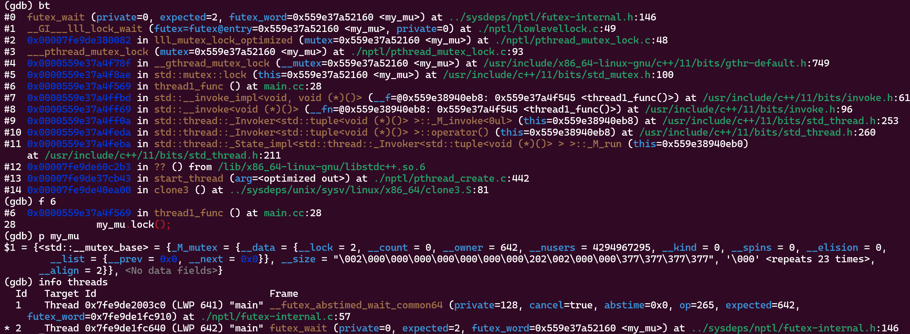

# GDB


## 基础使用指南

[程序调试利器——GDB使用指南](https://juejin.cn/post/7207090090102276157#heading-18)


### 准备使用GDB

#### 在docker容器内使用GDB

GDB需要使用ptrace 方法发送PTRACE_ATTACH请求给被调试进程，用来监视和控制另一个进程。

Linux 系统使用
 /proc/sys/kernel/yama/ptrace_scope设置来对ptrace施加安全控制。默认ptrace_scope的设置的值是1。默认设置下，进程只能通过PTRACE_ATTACH请求，附加到子进程。当设置为0时，进程可以通过PTRACE_ATTACH请求附加到任何其它进程。

在docker容器内，即使是root用户，仍有可能没有修改这个文件的权限。使得在使用GDB调试程序时会产生“ptrace: Operation not permitted “错误。

为了解决docker容器内使用GDB的问题，我们需要使用特权模式运行docker容器，以便获得修改
 /proc/sys/kernel/yama/ptrace_scope文件的权限。

```bash
# 以特权模式运行docker容器
docker run --privileged xxx
# 进入容器，输入如下指令改变PTRACE_ATTACH请求的限制
echo 0 > /proc/sys/kernel/yama/ptrace_scope
```

#### 启用生成core文件

默认情况下，程序Crash是不生成core文件的，因为默认允许的core文件大小为0。

为了在程序Crash时，能够生成core文件来帮助排查Crash的原因，我们需要修改允许的core文件大小设置

```bash
# 查看当前core文件大小设置
ulimit -a 
# 设置core文件大小为不限制
ulimit -c unlimited
# 关闭core文件生成功能
ulimit -c 0
```

修改core文件设置后，再次查看core文件的设置时，会看到下面的结果


这样，当程序Crash时，会在程序所在的目录，生成名称为core.xxx的core文件。

当程序运行在Docker容器内时，在容器内进行上述设置后，程序Crash时仍然无法生成core文件。这时需要我们在Docker容器的宿主机上，明确指定core文件的生成位置。

```bash
# 当程序Crash时，在/tmp目录下生成core文件
echo '/tmp/core.%t.%e.%p' > /proc/sys/kernel/core_pattern
```

设置中的字段的含义如下：

- /tmp 存放core文件的目录
- core 文件名前缀
- %t 系统时间戳

- %e 进程名称

- %p 进程ID


#### 生成调试符号表

调试符号表是二进制程序和源代码的变量，函数，代码行，源文件的一个映射。一套符号表对应特定的一套二进制程序，如果程序发生了变化，那么就需要一套新的符号表。

如果没有调试符号表，包含代码位置，变量信息等很多调试相关的能力和信息将无法使用。在编译时加入-ggdb编译选项，就会在生成的二进制程序中加入符号表，此时生成的二进制程序的大小会有显著的增加。

-ggdb 用来生成针对gdb的调试信息，也可以使用-g来代替

另外，只要条件允许，建议使用-O0来关闭编译优化，用来避免调试时，源代码和符号表对应不上的奇怪问题。

-O0 关闭编译优化

#### 使用screen来恢复会话

GDB调试依赖于GDB控制台来和进程进行交互，如果我们的连接终端关闭，那么原来的控制台就没有办法再使用了。此时我们可以通过开启另一个终端，关闭之前的GDB进程，并重新attach到被调试进程，但此时的断点，监视和捕获都要重新设置。另一种方法就是使用screen。使用screen运行的程序，可以完全恢复之前的会话，包括GDB控制台。

```bash
# 安装screen
apt install screen
# 查看安装结果
screen -v //output: Screen version 4.08.00 (GNU) 05-Feb-20

# 使用screen启动调试
screen gdb xxx
# 查看screen会话列表
screen -ls
# 恢复screen会话
screen -D -r [screen session id]
```


### 启动GDB的几种方式


#### 使用GDB加载程序，在GDB命令行启动运行

这是经典的使用GDB的方式。程序可以通过GDB命令的参数来加载，也可以在进入GDB控制台后，通过file命令来加载。

```ini
# 使用GDB加载可执行程序
gdb [program]
# 使用GDB加载可执行程序并传递命令行参数
gdb --args [program] [arguments]

# 开始调试程序
(gdb) run
# 传递命令行参数并开始调试程序
(gdb) run arg1 arg2
# 开始调试程序并在main函数入口中断
(gdb) start
# 传递命令行参数，开始调试程序并在main函数入口中断
(gdb) start arg1 arg2
```


#### 附加GDB到运行中的进程

GDB可以直接通过参数的方式，附加到一个运行中的进程。也可以在进入GDB控制台后，通过attach命令附加到进程。

需要注意的是一个进程只允许附加一个调试进程，如果被调试的进程当前已经出于被调试状态，那么要么通过detach命令来解除另一个GDB进程的附加状态，要么强行结束当前附加到进程的GDB进程，否则不能通过GDB附加另一个调试进程。

```ini
# 通过GDB命令附加到进程
gdb --pid [pid]

# 在GDB控制台内，通过attach命令附加的进程
gdb
(gdb) attach [pid]
```


#### 调试core文件

在程序Crash后，如果生成了core文件，我们可以通过GDB加载core文件，调试发生异常时的程序信息。core文件是没有限制当前机器相关信息的，我们可以拷贝core文件到另一台机器进行core分析，但前提是产生core文件的程序的符号表，需要和分析core文件时加载的程序的符号表保持一致。

使用GDB调试core文件

```css
# 使用GDB加载core文件进行异常调试
gdb --core [core file] [program]
```


#### 使用GDB加载程序并自动运行

在自动化测试场景中，需要程序能够以非中断的方式流畅地运行，同时又希望附加GDB，以便随时可以了解程序的状态。这时我们可以使用--ex参数，指定GDB完成程序加载后，自动运行的命令。

```css
# 使用GDB加载程序，并在加载完成后自动运行run命令
gdb --ex r --args [program] [arguments]
```


### 使用GDB


#### Hello, GDB

我们先从一个Hello world的例子，通过GDB设置断点来调试程序，近距离接触下GDB。

首先使用记事本或其它工具编写下面的main.cc代码：

```c
#include <iostream>
#include <string>

int main(int argc, char *argv[]) {
  std::string text = "Hello world";
  std::cout << text << std::endl;
  return 0;
}
```

接下来我们使用g++编译器编译源码，并设置-ggdb -O0编译选项。

```css
g++ -ggdb -O0 -std=c++17 main.cc -o main
```

生成可执行程序后，我们使用GDB加载可执行程序，并设置断点。

```css
# 使用gdb加载main
gdb main

# 在main.cc源文件的第六行设置断点
(gdb) b main.cc:6

# 运行程序
(gdb) run
复制代码
```

之后，程序会运行到断点位置并停下来，接下来我们使用一些常用的GDB指令来检查程序的当前状态

```scss
# 输出text变量数据 “Hello world“
(gdb) p text
# 输出局部变量列表，当前断点位置只有一个text局部变量
(gdb) info locals
# 输出当前栈帧的方法参数，当前栈帧函数是main，参数包含了argc和argv 
(gdb) info args
# 查看堆栈信息，当前只有一个栈帧 
(gdb) bt
# 查看当前栈帧附近的源码
(gdb) list
# 继续运行程序
(gdb) c
# 退出GDB
(gdb) q
```


#### Segmentation Fault问题排查

Segmentation Fault是进程访问了由操作系统内存保护机制规定的受限的内存区域触发的。当发生Segmentation Fault异常时，操作系统通过发起一个“SIGSEGV”信号来终止进程。此外，Segmentation Fault不能被异常捕捉代码捕获，是导致程序Crash的常见诱因。

对于C&C++等贴近操作系统的开发语言，由于提供了灵活的内存访问机制，所以自然成为了Segmentation Fault异常的重灾区，由于默认的Segmentation Fault异常几乎没有详细的错误信息，使得开发人员处理此类异常时变得更为棘手。

在实际开发中，使用了未初始化的指针，空指针，已经被回收了内存的指针，栈溢出，堆溢出等方式，都会引发Segmentation Fault。

如果启用了core文件生成，那么当程序Crash时，会在指定位置生成一个core文件。通过使用GDB对core文件的分析，可以帮助我们定位引发Segmentation Fault的原因。

为了模拟Segmentation Fau我们首先在main.cc中添加一个自定义类Employee

```c
class Employee{
public:
    std::string name;
};

```

然后编写代码，模拟使用已回收的指针，从而引发的Segmentation Fault异常

```c
void simulateSegmentationFault(const std::string& name) {
    try {
        Employee *employee = new Employee();
        employee->name = name;
        std::cout << "Employee name = " << employee->name << std::endl;
        delete employee;
        std::cout << "After deletion, employee name = " << employee->name << std::endl;

    } catch (...) {
        std::cout << "Error occurred!" << std::endl;
    }
}
```

最后，在main方法中，添加对simulateSegmentationFault方法的调用

```c
int main(int argc, char *argv[]) {
  std::string text = "Hello world";
  std::cout << text << std::endl;
  simulateSegmentationFault(text);
  return 0;
}
```

编译并执行程序，我们会得到如下的运行结果

```ini
$ ./main
Hello world
Employee name = Hello world
Segmentation fault (core dumped)
```

从结果上来看，首先我们的异常捕获代码对于Segmentation Fault无能为力。其次，发生异常时没有打印任何对我们有帮助的提示信息。

由于代码非常简单，从日志上很容易了解到问题发生在”std::cout << "After deletion, employee name = " << employee->name << std::endl;” 这一行。在实际应用中，代码和调用都非常复杂，很多时候仅通过日志没有办法准确定位异常发生的位置。这时，就轮到GDB出场了

```css
# 使用GDB加载core文件
gdb --core [core文件路径] main
```


注意其中的”Reading symbols from main..”，如果接下来打印了找不到符号表的信息，说明main程序中没有嵌入调试符号表，此时变量，行号，等信息均无法获取。若要生成调试符号表，可以参考 “3.3. 生成调试符号表”。

成功加载core文件后，我们首先使用bt命令来查看Crash位置的错误堆栈。从堆栈信息中，可以看到\__GI__IO_fwrite方法的buf参数的值是0x0【TODO未复现】,这显然不是一个合法的数值。序号为5的栈帧，是发生异常前，我们自己的代码压入的最后一个栈帧，信息中甚至给出了发生问题时的调用位置在main.cc文件的第15行（main.cc:15），我们使用up 5 命令向前移动5个栈帧，使得当前处理的栈帧移动到编码为5的栈帧。

```bash
# 显示异常堆栈
(gdb) bt
#向上移动5个栈帧
(gdb) up 5
```


此时可以看到传入的参数name是没有问题的，使用list命令查看下问题调用部分的上下文，再使用info locals命令查看调用时的局部变量的情况。最后使用 p *employe命令，查看employee指针指向的数据

```python
# 显示所有的参数
(gdb) info args
# 显示栈帧所在位置的上下文代码
(gdb) list
# 显示所有的局部变量
(gdb) info locals
# 打印employee指针的数据
(gdb) p *employee
```


此时可以看到在main.cc代码的第15行，使用std::cout输出Employee的name属性时，employee指针指向的地址的name属性已经不再是一个有效的内存地址（0x0）【TODO未复现】。


#### 程序阻塞问题排查

程序阻塞在程序运行中是非常常见的现象。并不是所有的阻塞都是程序产生了问题，阻塞是否是一个要解决的问题，在于我们对于程序阻塞的预期。比如一个服务端程序，当完成了必要的初始化后，需要阻塞主线程的继续执行，避免服务端程序执行完main方法后退出。就是正常的符合预期的阻塞。但是如果是一个客户端程序，执行完了所有的任务后在需要退出的时候，还处于阻塞状态无法关闭进程，就是我们要处理的程序阻塞问题。除了上面提到的程序退出阻塞，程序阻塞问题一般还包括：

- 并发程序中产生了死锁，线程无法获取到锁对象
- 远程调用长时间阻塞无法返回
- 程序长时间等待某个事件通知
- 程序产生了死循环
- 访问了受限的资源和IO，出于排队阻塞状态

对于大多数阻塞来说，被阻塞的线程会处于休眠状态，放置于等待队列，并不会占用系统的CPU时间。但如果这种行为不符合程序的预期，那么我们就需要查明程序当前在等待哪个锁对象，程序阻塞在哪个方法，程序在访问哪个资源时卡住了等问题.

下面我们通过一个等待锁释放的阻塞，使用GDB来分析程序阻塞的原因。首先引入线程和互斥锁头文件

```arduino
#include <thread>
#include <mutex>
```

接下来我们使用两个线程，一个线程负责加锁，另一个线程负责解锁

```c
std::mutex my_mu; 

void thread1_func() {
    for (int i = 0; i < 5; ++i) {
        my_mu.lock();
        std::cout << "thread1 lock mutex succeed!" << std::endl;
        std::this_thread::yield();
    }
}

void thread2_func() {
    for (int i = 0; i < 5; ++i) {
        my_mu.unlock();
        std::cout << "thread2 unlock mutex succeed!" << std::endl;
        std::this_thread::yield();
    }
}

void simulateBlocking() {
    std::thread thread1(thread1_func);
    std::thread thread2(thread2_func);
    thread1.join();
    thread2.join();
}
```

最后，重新编译main程序，并在g++编译时，加入lpthread链接参数，用来链接pthread库

```css
g++ -ggdb -O0 -std=c++17  main.cc -o main -lpthread
```

直接运行main程序，此时程序大概率会阻塞，并打印出类似于如下的信息


为了调查程序阻塞的原因，我们使用命令把gdb关联到运行中的进程

```css
gdb --pid xxx
```

进入GDB控制台后，依旧是先使用bt打印当前的堆栈信息

```bash
# 打印堆栈信息
(gdb) bt
# 直接跳转到我们的代码所处的编号为2的栈帧
(gdb) f 5
# 查看代码
(gdb) list
```


此时我们通过查看堆栈信息，知道阻塞的位置是在main.cc的45行，即thread1.join()没有完成。但这并不是引发阻塞的直接原因。我们还需要继续调查为什么thread1没有结束

```bash
# 查看所有运行的线程
(gdb) info threads
# 查看编号为2的线程的堆栈，代码中的thread1在gdb中的线程id是2
(gdb) thread apply 2 bt
# 切换到线程2
(gdb) thread 2


复制代码
```


由于示例程序比较简单，所有运行的线程只有两个，我们可以很容易地找到我们需要详细调查的thread1所在的线程。

当进程当前运行较多线程时，想找到我们程序中的特定线程并不容易。info threads中给出的线程ID，是GDB的thread id，和thread1线程的id并不相同。而LWP中的线程ID，则是系统赋予线程的唯一ID，同样和我们在进程内部直接获取的线程ID不相同。这里我们通过thread apply命令，直接调查编号为2的线程的堆栈信息，确认了其入口函数是thread1_func，正是我们要找到thread1线程。我们也可以通过thread apply all bt命令，查看所有线程的堆栈信息，用来查找我们需要的线程。更简单的方式是调用gettid函数，获取操作系统为线程分配的轻量进程ID。

接下来，我们调查thread1的堆栈，找到阻塞的位置并调查阻塞的互斥锁my_mu的信息，找到当前持有该锁的线程id(Linux系统线程ID)，再次通过info threads查到持有锁的线程。最后发现是因为当前线程持有了互斥锁，当再次请求获取锁对象my_mu时，由于my_mu不可重入，导致当前线程阻塞，形成死锁。

```bash
# 查看thread1的堆栈
(gdb) bt
# 直接跳转到我们的代码所处的栈帧
(gdb) f 6
# 查看锁对象my_mu
(gdb) p my_mu
# 确认持有锁的线程
(gdb) info threads
```




#### 数据篡改问题排查

数据篡改不一定会引发异常，但很可能会导致业务结果不符合预期。对于大量使用了三方库的项目来说，想知道数据在哪里被修改成了什么，并不是一件容易的事。对于C&C++来说，还存在着指针被修改后，导致指针原来指向的对象可能无法回收的问题。单纯使用日志，想要发现一个变量在何时被哪个程序修改成了什么，几乎是不可能的事，通过使用GDB的监控断点，我们可以方便地调查这类问题。

我们仍然使用多线程模式，一个线程模拟读取数据，当发现数据被修改后，打印一条出错信息。另一个线程用来模拟修改数据。

这里我们使用的Employee对象的原始的name和修改后的name都大于15个字符，如果长度小于这个数值，你将会观察到不一样的结果。

```c
void check_func(Employee& employee) {
    auto tid = gettid();
    std::cout << "thread1 " << tid << " started" << std::endl;
    while (true) {
        if (employee.name.compare("origin employee name") != 0) {
            std::cout << "Error occurred, Employee name changed, new value is:" << employee.name << std::endl;
            break;
        }
        std::this_thread::yield();
    }
}

void modify_func(Employee& employee) {
    std::this_thread::sleep_for(std::chrono::milliseconds(0));
    employee.name = std::string("employee name changed");
}

void simulateDataChanged() {
    Employee employee("origin employee name");
    std::thread thread1(check_func, std::ref(employee));
    std::thread thread2(modify_func, std::ref(employee));
    thread1.join();
    thread2.join();
}
```

在main方法中，加入simulateDataChanged方法的调用，之后编译并运行程序，会得到如下的结果:


现在，我们假设修改了name属性的modify_func在一个三方库中，我们对其内部实现不了解。我们需要通过GDB，找到谁动了employee对象的name属性

```bash
# 使用gdb加载main
(gdb) gdb main
# 在进入gdb控制台后，在simulateDataChanged方法上增加断点
(gdb) b main.cc:simulateDataChanged
# 运行程序
(gdb) r
# 连续执行两次下一步，使程序执行到employee对象创建完成后
(gdb) n
(gdb) n
```


之后，我们对employee.name属性进行监控，只要name属性的值发生了变化，就会触发GDB中断

```r
# 监视employee.name变量对应的地址数据
(gdb) watch -location employee.name
# 继续执行
(gdb) c

# 在触发watch中断后，查看中断所在位置的堆栈
(gdb) bt
#直接跳转到我们的代码所处的栈帧
(gdb) f 1
```


在触发中断后，我们发现是中断位置是在modify_func方法中。正是这个方法，在内部修改了employee的name属性。至此调查完毕。


#### 堆内存重复释放问题排查

堆内存的重复释放，会导致内存泄露，被破坏的内存可以被攻击者利用，从而产生更为严重的安全问题。目标流行的C函数库(比如libc)，会在内存重复释放时，抛出“double free or corruption (fasttop)”错误，并终止程序运行。为了修复堆内存重复释放问题，我们需要找到所有释放对应堆内存的代码位置，用来判断哪一个释放堆内存的操作是不正确的。

使用GDB可以解决我们知道哪一个变量产生了内存重复释放，但我们不知道都在哪里对此变量释放了内存空间的问题。如果我们对产生内存重复释放问题的变量一无所知，那么还需要借助其它的工具来辅助定位。

下面我们使用两个线程，在其中释放同一块堆内存，用来模拟堆内存重复释放问题

```c
void free1_func(Employee* employee) {
    auto tid = gettid();
    std::cout << "thread " << tid << " started" << std::endl;
    employee->name = "new employee name1";
    delete employee;
}

void free2_func(Employee* employee) {
    auto tid = gettid();
    std::cout << "thread " << tid << " started" << std::endl;
    employee->name = "new employee name2";
    delete employee;
}

void simulateDoubleFree() {
    Employee *employee = new Employee("origin employee name");
    std::thread thread1(free1_func, employee);
    std::thread thread2(free2_func, employee);
    thread1.join();
    thread2.join();
}


复制代码
```

编译程序并运行，程序会因为employee变量的double free问题而终止


现在我们使用GDB来找到所有释放employee变量堆内存的代码的位置，以便决定那个释放操作是不需要的

```bash
# 使用GDB加载程序
gdb main
# 在employee变量创建完成后的位置设置断点
(gdb) b main.cc:93
# 运行程序
(gdb) r
```

在程序中断后，我们打印employee变量的堆内存地址，并在所有释放此内存地址的位置添加条件断点之后继续执行程序

```ini
# 查看employee变量
(gdb) p employee //$1 = (Employee *) 0x55555556fed0

# 在释放employee变量时，增加条件断点
(gdb) b  __GI___libc_free if mem == 0x55555556fed0
# 继续运行程序
(gdb) c
```

在程序中断时，我们找到了释放employee变量堆内存的第一个位置，位于main.cc文件89行的delete employee操作。继续执行程序，我们会找到另一处释放了employee堆内存的代码的位置。至此，我们已经可以调整代码来修复此double free问题。


## 常用的GDB命令

| 命令                          | 缩写 | 说明                             |
| ----------------------------- | ---- | -------------------------------- |
| show logging                  |      | 查看当前的日志设置               |
| set logging enabled [on\|off] |      | 启用/禁用日志                    |
| file [program]                |      | 加载要调试的程序                 |
| attach [pid]                  |      | 附加到进程                       |
| detach                        |      | 从附加的进程分离                 |
| run [args]                    | r    | 开始调试程序                     |
| start [args]                  |      | 开始调试程序，并在main函数处中断 |
| show args                     |      | 查看程序启动参数                 |
| backtrace | bt | 查看线程栈 |
|up [frame count]||选择前面的栈帧。不加帧数时默认为1|
|down [frame count]||选择后面的栈帧。不加帧数时默认为1|
|continue|c|继续运行|
|next|n|在当前栈帧中，运行到下一条命令（Step Over）|
|step|s|运行到下一条命令（Step Into）|
|reverse-next||反向执行next命令|
|reverse-step||反向执行step命令|
|finish|fin|执行完当前方法，返回到上一栈帧（Step Out）|
|frame [frame num]|f|跳转到指定编号的栈帧|
|list [filename]:[function \| line num]|l|显示源码。如果不指定行号或者方法名，则显示当前栈帧附近的源码|
|info args||查看当前栈帧的参数（方法参数）|
|info locals||查看当前栈帧的局部参数|
|print \<var\>|p|打印变量|
|ptype \<var\>||查看变量类型|
|set [expression]||修改变量的值|
|call [function call expression]||调用函数|
|info b||查看缎带你|
|break [file]:[method name \| line num]|b|设置断点|
|break xxx if [cond]||设置条件断点|
|delete [breakno]|del|删除断点。不加编号则删除所有断点|
|disable [breakno]||禁用断点。不加编号则禁用所有断点|
|enable [breakno]||启用断点。不加编号则启用所有断点|
|watch [-location] \<var\>||设置监视|
|watch xxx if [cond]||设置条件监视|
|condition [breakno or watchno] [cond]|cond|修改普通的断点或监视为条件断点或条件监视|
|catch [catch\|throw] [name]||捕获事件|
|info thread||查看所有的线程|
|thread [threadno]||切换到指定编号的线程|
|thread apply \<threadno \| all\> \<command\>||在指定线程上应用命令|
|info registers||查看寄存器内存|
|disassemble [/m] [function \| address]|disass|反汇编指定方法。如不指定方法或地址，则反汇编当前方法|
|kill||强行终止正在运行的程序|
|quit|q|推出GDB|


# gperf


```shell
wget https://github.com/gperftools/gperftools/releases/download/gperftools-2.10/gperftools-2.10.tar.gz
tar -zxvf gperftools-2.10.tar.gz
cd gperftools-2.10
./configure
make -j8
sudo make install

sudo apt install -y graphviz
sudo apt install -y libunwind-dev
```


