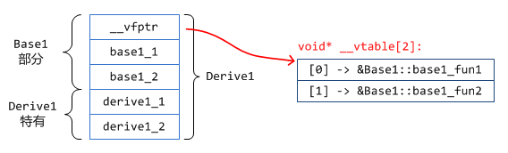
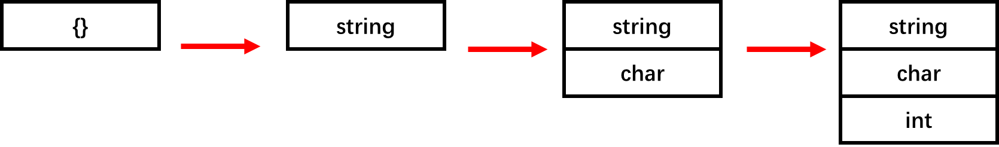

# 资料汇总


# C语言


## 基础语法

左值：代表内存中的数据，可以对其进行赋值。比如某个变量，或者数组的某个元素a[i]


求数组长度一般借用运算符sizeof，并利用宏来表示

```c
#define SIZE (sizeof(a ) / sizeof(a[0]))

for(i=0; i<SIZE; i++)
    a[i] = 0
```


在C语言中，实际参数是通过值传递的。

当函数的参数是一维数组，且需要用到数组的长度时，需要把数组长度作为另一个参数传入。运算符sizeof无法给出关于数组型形式参数的长度。

当形式参数是多维数组时,只能忽略第一维的长度。例如，sum_array函数求一个二维数组的元素的和。

```c
#define LEN 10

int sum_array(int a[][LEN], int n) 
{
    int i,j,sum=0;
    ...
}    
```


## 程序结构


### 局部变量

- 自动存储期限：函数返回时，回收局部变量的分配。
- 程序块作用域

在局部变量声明中放置关键字 static可以使变量从自动存储期限变为静态存储期限。因为具有静态存储期限的变量拥有永久的存储单元，所以在整个程序执行期间会保留变量的值，例如：

```c
void f(void) 
{
	static int i;
	...
}
```

静态局部变量始终有程序块作用域，它对其他函数而言是不可见的。概括来说，静态变量是隐彍来自其他函数的数据的地方，但是它会为将来同一个函数的调用保留这些数据。


### 外部变量

- 静态存储期限：存储在外部变量中的值将永久保留下来。
- 文件作用域：外部变量拥有文件作用域。从变量声明的点开始一直到闭合文件的末尾。结果是，跟随在外部变量声明后的所有函数都可以访问它。


## 指针

当函数的参数是个指针变量，又不希望函数内部修改其指向的值时，可以在参数声明中把 const放置在形式参数的类型说明之前：

```
void f(const int *p) 
{
	*p = 0 ; /*** WRONG ***/
}
```

const还可以放在变量类型的后面，要注意区分

```
void f(int * const p) 
{
	int j;
	*p = 0 ; /* legal */
	p = &j;  /*** WRONG ***/
}
```

极少出现的情况是需要同时保护指针变量和它所指向的对象，这时可以通过在变量类型的前和后都放置const来实现:

````
void f(const int * const p) 
{
	int j;
	*p = 0 ; /*** WRONG ***/
	p = &j;  /*** WRONG ***/
}
````


## 指针和数组

指针不仅可以指向普通变量，还可以指向数组元素。例如，假设已经声明a和p如下
`int a[10], * pi;`
通过下列写法可以使p指向a[0]:
`p = &a[0];`

现在可以通过p访问a[0]。例如，可以通过以下写法把值5存入a[0]中

`*p = 5;`


把指针p指向数组a的元素不是特别令人激动。但是，通过在p上执行指针算术运算（或者地址算术运算）可以访问到数组a的其他元素。C语言支持3种（而且只有3种）格式的指针算术运算：

- 指针加上整数
- 指针减去整数
- 两个指针相减

比如起初`p = &a[2];` 那么执行 `p +=2;` 后，p就指向了a[4]。

标量用于指针算术运算的整数要依赖于指针的类型。例如，如果 p的类型是 int\*，那么p+j通常既可以用2×j加上p，也可以用4×j加上p，依据就是int型的值要求的是2个字节还是4个字节。但是，如果p的类型为 double*，那么p+j可能是8×j加上p，因为 double型的值通常都是8个字节长。


可以用关系运算符（<、<=、＞、＞=）和判等运算符（==和!=）进行指针比较。只有在两个指针指向同一数组时，用关系运算符进行的指针比较才有意义。比较的结果依赖于数组中两个元素的相对位置。 

使用指针处理数组的示例：

```c
#define N 10
int a[N], sum, *p;
sum = 0;
for(p=&a[0]; p<&a[N]; p++) 
    sum += *p;
```


C程序员经常在处理数组元素的语句中组合\*(间接寻址)运算符和++运算符。比如，设p是指向数组a的指针，那么 `a[i++] = j` 等价于`*p++ = j`， `p++`的值是p（因为使用后缀++，所以p只有在表达式计算出来后オ可以自增）。因此，\*(p++)的值将是*p，即p当前指向的对象。因此对数组求和可以写成

```c
p = &a[0];
while(p < &a[N])
  sum += *p++;
```


其实可以直接用数组的名字作为指向数组第一个元素的指针。这样就简化了指针的算术运算。从而对数组求和可以写成

```
for(p=a; p<a+N; p++)
  sum += *p;
```

虽然可以把数组名用作指针，但是不能给数组名赋新的值。因此通常是把a复制给一个指针变量，然后改变该指针变量。


当指针指向数组，那么指针也可以进行下标操作。

```
@define N 100

int a[N], i, sum = 0, *p = a;

for(int i=0; i<N; i++)
  sum += p[i];
```


## 字符串

从本质上而言，C语言把字符串字面量作为字符数组来处理。当C语言编译器在程序中遇到长度为n的字符串字面量时，它会为字符串字面量分配长度为n+1的内存空间。这块内存空间将用来存储字符串字面量中的字符，以及一个额外的字符一空字符。空字符用来标志字符串的末尾。空字符是ASCⅡ字符集第一个字符，因此它用转义序列\0来表示。

既然字符串字面量是作为数组来存储的，那么编译器会把它看作是char\*类型的指针。

```
char *p;
p = "abc";

char ch;
ch = "abc"[1];
```


## 预处理器


大多数预处理指令属于下面3种类型

- 宏定义。#define指令定义一个宏，#undef指令删除一个宏定义。
- 文件包含。#include指令导致一个指定文件的内容被包含到程序中。
- 条件编译。#if、#ifdef、#ifndef、#elif、#else和# endif指令可以根据编译器可以测试的条件来将一段文本块包含到程序中或排除在程序之外。


### 宏定义

**简单的宏**

[#define指令 (简单的宏)]     #define 标识符 替换列表
替换列表是一系列的C语言记号，包括标识符、关键字、数字、字符常量、字符串字面量、运算符和点符号。当预处理器遇到一个宏定义时，会做一个“标识符”代表“替换列表”的记录。在文件后面的内容中，不管标识符在任何位置出现，预处理器都会用替换列表代替它。


**带参数的宏**

[#define指令 ——带参数的宏]    #define 标识符(x1,x2,...,xn) 替换列表

例如：

`#define MAX(x,y)     ( (x) > (y) ? (x)  : (y) )`

注意点：宏可能会不止一次地计算它的参数。函数对它的参数只会计算一次，而宏可能会计算两次甚至更多次。如果参数有副作用，多次计算参数的值可能会产生意外的结果。考虑下面的例子，其中MAx的一个参数有副作用
`n = MAX(i++, j);`
下面是这条语句在预处理之后的结果
`n = ( (i++) > (j) ? (i++): (j) );`
如果i大于j，那么i可能会被（错误地）增加了两次，同时n也就可能被赋予了错误的值。


**#运算符**

宏定义可以包含两个运算符：#和##。编译器不会识别这两种运算符，相反，它们会在预处理时被执行。

#运算符将一个宏的参数转换为字符串字面量。它仅允许出现在带参数的宏的替换列表中。例如定义PRINT_INT如下

`#define PRINT_INT(x) printf(#x " = %d\n", x)`

当调用`PRINT_INT(i/j);`时会变成 `printf("i/j" " = %d\n", i/j);`

在C语言中相邻的字符串字面量会被合并，因此上边的语句等价于 `printf("i/j = %d\n", i/j);`


**##运算符**

运算符可以将两个记号(例如标识符)“粘”在一起，成为一个记号。如果其中一个操作数是宏参数，“粘合”会在当形式参数被相应的实际参数替换后发生。考虑下面的宏:

`#define MK_ID(n) i##n`

当MK_ID被调用时(比如MK_ID(1))，预处理器首先使用自变量(这个例子中是1)替换参数n。接着，预处理器将和i连接成为一个记号(i1)。下面的声明使用 MK_ID 创建了3个标识符：
int MK_ID(1), MK_ID(2), MK_ID(3)
预处理后声明变为
int i1, i2, i3;


实际示例：定义max函数。在实际代码中可能需要比较类型参数的max函数，比如可能需要一个实际参数是int值的max函数，还需要参数为f1oat值的max函数，等等。除了实际参数的类型和返回值的类型之外，这些函数都一样。因此，这样定义每一个函数似乎是个很麻烦的做法。解决的办法是定义一个宏，并使它展开后成为max函数的定义。宏会有唯一的参数type，它表示形式参数和返回值的类型。这里还有个问题，如果我们是用宏来创建多个max函数，程序将无法编译。(C语言不允许在同一文件中出现两个同名的函数。)为了解决这个问题，我们是用##运算符为每个版本的max函数构造不同的名字。下面是宏的显示形式：

```c
#define GENERIC_MAX(type)		\
type type##_max(type x, type y)	\
{								\
	return x > y ? x : y;		\				
}
```

如何需要一个针对float值的max函数，那么就是GENERIC_MAX(float)


**宏定义中的圆括号**

对于在一个宏定义中哪里要加圆括号，有两条规则要遵守。首先，如果宏的替换列表中有运算符，那么始终要将替换列表放在括号中
`#define TWO_PI (2 * 3.14159)`
其次，如果宏有参数，每次参数在替换列表中出现时都要放在圆括号中：
`#define SCALE(x) ((x)*10)`


### 条件编译


**#if 和 #endif 指令**

格式：

[#if指令] #if    常量表达式

[#endif指令] #endif


例如：

```c
#define DEBUG 1

#if DEBUG
printf("Value of i: %d\n", i);
#endif
```


**defined运算符**

当defined应用于标识符时，如果标识符是一个定义过的宏，返回1，否则返回0。#defined运算符通常与#if指令结合使用，允许写成

```c
#if defined(DEBUG)
......
#endif
```

仅当 DEBUG被定义成宏时，#if和#endif之间的代码会被保留在程序中。DEBUG两侧的括号不是必需的，因此可以简单写成
#if defined DEBUG
由于defined运算符仅检测 DEBUG是否被定义为宏，所以不需要给 DEBUG-一个值
#define DEBUG


**#ifdef指令和#ifndef指令**

#ifdef指令的使用与#if指令类似：
#ifdef	标识符
当标识符被定义为宏时需要包含代码
#endif

#ifdef 等价于 #if defined

#ifndef 等价于 #if !defined


**#elif指令和#else指令**

在#if指令和#endif指令之间可以有多个#elif指令，但最多只能有一个#else指令。


# C++


## 多态

多态是以封装和继承为基础的。

C++ 多态分类及实现：
1. 重载多态（Ad-hoc Polymorphism，编译期）：函数重载、运算符重载
2. 子类型多态（Subtype Polymorphism，运行期）：虚函数
3. 参数多态性（Parametric Polymorphism，编译期）：类模板、函数模板
4. 强制多态（Coercion Polymorphism，编译期/运行期）：基本类型转换、自定义类型转换


**注意：**

- 可以将派生类的对象赋值给基类的指针或引用，反之不可
- 普通函数（非类成员函数）不能是虚函数
- **静态函数（static）不能是虚函数**
- **构造函数不能是虚函数**（因为在调用构造函数时，虚表指针并没有在对象的内存空间中，必须要构造函数调用完成后才会形成虚表指针）
- **内联函数不能是表现多态性时的虚函数**


**动态多态**

```c++
class Shape                     // 形状类
{
public:
    virtual double calcArea()
    {
        ...
    }
    virtual ~Shape();
};
class Circle : public Shape     // 圆形类
{
public:
    virtual double calcArea();
    ...
};
class Rect : public Shape       // 矩形类
{
public:
    virtual double calcArea();
    ...
};
int main()
{
    Shape * shape1 = new Circle(4.0);
    Shape * shape2 = new Rect(5.0, 6.0);
    shape1->calcArea();         // 调用圆形类里面的方法
    shape2->calcArea();         // 调用矩形类里面的方法
    delete shape1;
    shape1 = nullptr;
    delete shape2;
    shape2 = nullptr;
    return 0;
}
```


### 虚析构函数

虚析构函数是为了解决基类的指针指向派生类对象，并用基类的指针删除派生类对象。

```c++
class Shape
{
public:
    Shape();                    // 构造函数不能是虚函数
    virtual double calcArea();
    virtual ~Shape();           // 虚析构函数
};
class Circle : public Shape     // 圆形类
{
public:
    virtual double calcArea();
    ...
};
int main()
{
    Shape * shape1 = new Circle(4.0);
    shape1->calcArea();    
    delete shape1;  // 因为Shape有虚析构函数，所以delete释放内存时，先调用子类析构函数，再调用基类析构函数，防止内存泄漏。
    shape1 = NULL;
    return 0；
}
```


### 虚继承

虚继承用于解决多继承条件下的菱形继承问题（浪费存储空间、存在二义性）。

底层实现原理与编译器相关，一般通过**虚基类指针**和**虚基类表**实现，每个虚继承的子类都有一个虚基类指针（占用一个指针的存储空间，4字节）和虚基类表（不占用类对象的存储空间）（需要强调的是，虚基类依旧会在子类里面存在拷贝，只是仅仅最多存在一份而已，并不是不在子类里面了）；当虚继承的子类被当做父类继承时，虚基类指针也会被继承。

实际上，vbptr 指的是虚基类表指针（virtual base table pointer），该指针指向了一个虚基类表（virtual table），虚表中记录了虚基类与本类的偏移地址；通过偏移地址，这样就找到了虚基类成员，而虚继承也不用像普通多继承那样维持着公共基类（虚基类）的两份同样的拷贝，节省了存储空间。


### 虚继承、虚函数

- 相同之处：都利用了虚指针（均占用类的存储空间）和虚表（均不占用类的存储空间）
- 不同之处：
  - 虚继承
    - 虚基类依旧存在继承类中，只占用存储空间
    - 虚基类表存储的是虚基类相对直接继承类的偏移
  - 虚函数
    - 虚函数不占用存储空间
    - 虚函数表存储的是虚函数地址


## 强制类型转换运算符

### static_cast

- 用于非多态类型的转换
- 不执行运行时类型检查（转换安全性不如 dynamic_cast）
- 通常用于转换数值数据类型（如 float -> int）
- 可以在整个类层次结构中移动指针，子类转化为父类安全（向上转换），父类转化为子类不安全（因为子类可能有不在父类的字段或方法）

> 向上转换是一种隐式转换。

### dynamic_cast

- **用于多态类型的转换**
- 执行行运行时类型检查
- 只适用于指针或引用
- 对不明确的指针的转换将失败（返回 nullptr），但不引发异常
- 可以在整个类层次结构中移动指针，包括向上转换、向下转换

### const_cast

- 用于删除 const、volatile 和 __unaligned 特性（如将 const int 类型转换为 int 类型 ）

### reinterpret_cast

- 用于位的简单重新解释
- 滥用 reinterpret_cast 运算符可能很容易带来风险。 除非所需转换本身是低级别的，否则应使用其他强制转换运算符之一。
- 允许将任何指针转换为任何其他指针类型（如 `char*` 到 `int*` 或 `One_class*` 到 `Unrelated_class*` 之类的转换，但其本身并不安全）
- 也允许将任何整数类型转换为任何指针类型以及反向转换。
- reinterpret_cast 运算符不能丢掉 const、volatile 或 __unaligned 特性。
- reinterpret_cast 的一个实际用途是在哈希函数中，即，通过让两个不同的值几乎不以相同的索引结尾的方式将值映射到索引。

### bad_cast

- 由于强制转换为引用类型失败，dynamic_cast 运算符引发 bad_cast 异常。


## 运行时类型信息 (RTTI)


### dynamic_cast

- 用于多态类型的转换

### typeid

- typeid 运算符允许在运行时确定对象的类型
- type_id 返回一个 type_info 对象的引用
- **如果想通过基类的指针获得派生类的数据类型，基类必须带有虚函数**
- 只能获取对象的实际类型

### type_info

- type_info 类描述编译器在程序中生成的类型信息。 此类的对象可以有效存储指向类型的名称的指针。 type_info 类还可存储适合比较两个类型是否相等或比较其排列顺序的编码值。 类型的编码规则和排列顺序是未指定的，并且可能因程序而异。
- 头文件：`typeinfo`

typeid、type_info 使用

```c++
#include <iostream>
using namespace std;

class Flyable                       // 能飞的
{
public:
    virtual void takeoff() = 0;     // 起飞
    virtual void land() = 0;        // 降落
};
class Bird : public Flyable         // 鸟
{
public:
    void foraging() {...}           // 觅食
    virtual void takeoff() {...}
    virtual void land() {...}
    virtual ~Bird(){}
};
class Plane : public Flyable        // 飞机
{
public:
    void carry() {...}              // 运输
    virtual void takeoff() {...}
    virtual void land() {...}
};

class type_info
{
public:
    const char* name() const;
    bool operator == (const type_info & rhs) const;
    bool operator != (const type_info & rhs) const;
    int before(const type_info & rhs) const;
    virtual ~type_info();
private:
    ...
};

void doSomething(Flyable *obj)                 // 做些事情
{
    obj->takeoff();

    cout << typeid(*obj).name() << endl;        // 输出传入对象类型（"class Bird" or "class Plane"）

    if(typeid(*obj) == typeid(Bird))            // 判断对象类型
    {
        Bird *bird = dynamic_cast<Bird *>(obj); // 对象转化
        bird->foraging();
    }

    obj->land();
}

int main(){
	Bird *b = new Bird();
	doSomething(b);
	delete b;
	b = nullptr;
	return 0;
}
```


## 虚函数表实现机制

C++对象的内存布局, 可以有多种方式, 比如:

- 输出成员变量的偏移, 通过 `offsetof` 宏来得到
- 通过调试器查看, 比如常用的VS


### 没有虚函数的对象

类实现如下:

```c++
class Base1
{
public:
    int base1_1;
    int base1_2;

    void foo(){}
};
```

结果如下：

| 字段                       | 偏移 |
| -------------------------- | ---- |
| `sizeof(Base1)`            | 8    |
| `offsetof(Base1, base1_1)` | 0    |
| `offsetof(Base1, base1_2)` | 4    |


### 拥有多个虚函数的类对象

和前面一个例子差不多, 只是再加了一个虚函数. 定义如下:

```cpp
class Base1
{
public:
    int base1_1;
    int base1_2;

    virtual void base1_fun1() {}
    virtual void base1_fun2() {}
};
```

结果如下：

| 字段                       | 偏移 |
| -------------------------- | ---- |
| `sizeof(Base1)`            | 12   |
| `offsetof(__vfptr)`        | 0    |
| `offsetof(Base1, base1_1)` | 4    |
| `offsetof(Base1, base1_2)` | 8    |


其中`__vfptr`是一个指针，位于所有的成员变量之前，指向一个函数指针数组。当增加一个虚函数时，只是简单地向该类对应的虚函数表中增加一项而已，并不会影响到类对象的大小以及布局情况。


**同一个类的不同实例共用同一份虚函数表, 她们都通过一个所谓的虚函数表指针`__vfptr`(定义为`void**`类型)指向该虚函数表。**


虚函数表是在编译期间创建的。


### 单继承且本身不存在虚函数的继承类

```cpp
class Base1
{
public:
    int base1_1;
    int base1_2;

    virtual void base1_fun1() {}
    virtual void base1_fun2() {}
};

class Derive1 : public Base1
{
public:
    int derive1_1;
    int derive1_2;
};
```





### 子类未定义新的虚函数但覆盖了基类的虚函数


```cpp
class Base1
{
public:
    int base1_1;
    int base1_2;

    virtual void base1_fun1() {}
    virtual void base1_fun2() {}
};

class Derive1 : public Base1
{
public:
    int derive1_1;
    int derive1_2;

    // 覆盖基类函数
    virtual void base1_fun1() {}
};
```


### 子类定义新的虚函数


```cpp
class Base1
{
public:
    int base1_1;
    int base1_2;

    virtual void base1_fun1() {}
    virtual void base1_fun2() {}
};

class Derive1 : public Base1
{
public:
    int derive1_1;
    int derive1_2;

    virtual void derive1_fun1() {}
};
```


类对象大小以及成员便宜

| 字段                           | 偏移 |
| ------------------------------ | ---- |
| `sizeof(Derive1)`              | 20   |
| `offsetof(Derive1, derive1_1)` | 12   |
| `offsetof(Derive1, derive1_2)` | 16   |


### 多继承且子类覆写了虚函数自身也定义了新的虚函数


```cpp
class Base1
{
public:
    int base1_1;
    int base1_2;

    virtual void base1_fun1() {}
    virtual void base1_fun2() {}
};

class Base2
{
public:
    int base2_1;
    int base2_2;

    virtual void base2_fun1() {}
    virtual void base2_fun2() {}
};

// 多继承
class Derive1 : public Base1, public Base2
{
public:
    int derive1_1;
    int derive1_2;

    // 基类虚函数覆盖
    virtual void base1_fun1() {}
    virtual void base2_fun2() {}

    // 自身定义的虚函数
    virtual void derive1_fun1() {}
    virtual void derive1_fun2() {}
};
```


### 1个基类没有虚函数


```cpp
class Base1
{
public:
    int base1_1;
    int base1_2;
};

class Base2
{
public:
    int base2_1;
    int base2_2;

    virtual void base2_fun1() {}
    virtual void base2_fun2() {}
};

// 多继承
class Derive1 : public Base1, public Base2
{
public:
    int derive1_1;
    int derive1_2;

    // 自身定义的虚函数
    virtual void derive1_fun1() {}
    virtual void derive1_fun2() {}
};
```


需要注意的是把有虚函数的基类放在了前面


## Make Copyable Object Assignable

[How to Make a Copyable Object Assignable in C++ - Fluent C++ (fluentcpp.com)](https://www.fluentcpp.com/2020/11/06/how-to-make-a-copyable-object-assignable-in-cpp/)


Some types in C++ have a copy constructor that doesn’t have the same semantics as their assignment operator (`operator=`).

Take references, for example. References can be copied:

```c++
cint i = 42;
int& r1 = i;
int& r2 = r1; // r2 now points to i, like r1
```

But it doesn’t do the same thing as assigning to them:

```c++
int i1 = 42;
int& r1 = i1;
int i2 = 43;
int& r2 = i2;

r2 = r1; // r2 still points to i2
```

With the copy, `r2` points to the same thing as `r1`, but with the assignment `r2` still points to the same object it was pointing to before.


As for lambdas, it don’t even have an `operator=` to begin with (except in C++20 where they do if they don’t capture anything).


There is a case when the absence of `operator=` becomes a problem: when the object that doesn’t have an `operator=` is a member of a class. It makes it difficult for that class to have an `operator=` itself. For one thing, the compiler is not going to write it for you.


In C++11, `std::reference_wrapper<T>` has the same behaviour as a reference with one exception: it has an `operator=` that rebinds the reference.

This means that after calling `operator=` between two `std::reference_wrapper`s, they point to the same object:

```c++
#include <functional>
// ...

int i1 = 42;
auto r1 = std::ref(i1); // std::ref creates a std::reference_wrapper
int i2 = 43;
auto r2 = std::ref(i2);

r2 = r1; // r2 now points to the i1, like r1
```

The fact that `std::reference_wrapper<T>` has an `operator=` allows the compiler to generate an `operator=` for the classes that contains it. And the fact that it rebinds gives the `operator=` of the containing class a natural behaviour.


Let’s design a component, inspired from `std::reference_wrapper`, that would add to any type an `operator=` which is consistent with its copy constructor, let’s call it `assignable`.

`assignable` needs an `operator=` that relies on the copy constructor of its underlying type， we can implement that with a `std::optional`.

```c++
template<typename T>
class assignable
{
public:
    assignable& operator=(assignable const& other)
    {
        value_.emplace(*other.value_);
        return *this;
    }

    assignable& operator=(assignable&& other) = default;
    assignable(assignable&& other) = default;
    assignable(assignable const& other) = default;
    
    assignable(T const& value) : value_(value) {}
    assignable(T&& value) : value_(std::move(value)) {}
    
    T const& get() const { return value_; }
    T& get() { return value_; }
    
    template<typename... Args>
    decltype(auto) operator()(Args&&... args)
    {
        return (*value_)(std::forward<Args>(args)...);
    }
private:
    optional<T> value_;
};

// need specialization for reference, 
// because optional references didn’t make it in C++17
template<typename T>
class assignable<T&>
{
public:
    explicit assignable(T& value) : value_(value) {}
    
    T const& get() const { return value_; }
    T& get() { return value_; }
    
    template<typename... Args>
    decltype(auto) operator()(Args&&... args)
    {
        return value_(std::forward<Args>(args)...);
    }
private:
    std::reference_wrapper<T> value_;
};
```


## 自动类型推导


### auto

**auto 总是推导出“值类型”，绝不会是“引用”；**

**auto 可以附加上 const、volatile、\*、& 这样的类型修饰符，得到新的类型。**

```c++
auto        x = 10L;    	// auto推导为long，x是long
auto&       x1 = x;      	// auto推导为long，x1是long&
auto*       x2 = &x;    	// auto推导为long，x2是long*
const auto& x3 = x;        	// auto推导为long，x3是const long&
auto        x4 = &x3;    	// auto推导为const long*，x4是const long*
```


### decltype

decltype 的形式很像函数，后面的圆括号里就是可用于计算类型的表达式（和 sizeof 有点类似），其他方面就和 auto 一样了，也能加上 const、\*、& 来修饰。

```c++
int x = 0;          		// 整型变量
decltype(x)     x1;      	// 推导为int，x1是int
decltype(x)&    x2 = x;    	// 推导为int，x2是int&，引用必须赋值
decltype(x)*    x3;      	// 推导为int，x3是int*
decltype(&x)    x4;      	// 推导为int*，x4是int*
decltype(&x)*   x5;      	// 推导为int*，x5是int**
decltype(x2)    x6 = x2;  	// 推导为int&，x6是int&，引用必须赋值
```

**decltype 不仅能够推导出值类型，还能够推导出引用类型，也就是表达式的“原始类型”**。


既然 decltype 类型推导更精确，那是不是可以替代 auto 了呢？
实际上，它也有个缺点，就是写起来略麻烦，特别在用于初始化的时候，表达式要重复两次（左边的类型计算，右边的初始化），把简化代码的优势完全给抵消了。
所以，C++14 就又增加了一个“**decltype(auto)**”的形式，既可以精确推导类型，又能像 auto 一样方便使用。

```c++
int x = 0;            			// 整型变量
decltype(auto)     x1 = (x);  	// 推导为int&，因为(expr)是引用类型
decltype(auto)     x2 = &x;   	// 推导为int*
decltype(auto)     x3 = x1;   	// 推导为int&
```


**使用建议**

在变量声明时应该尽量多用 auto.

decltype 是 auto 的高级形式，更侧重于编译阶段的类型计算，所以常用在泛型编程里，获取各种类型，配合 typedef 或者 using 会更加方便。比如，定义函数指针在 C++ 里一直是个比较头疼的问题，因为传统的写法很怪，借助 decltype 可以很容易得到指针类型。

```c++
// UNIX信号函数的原型
void (*signal(int signo, void (*func)(int)))(int)
// 使用decltype可以轻松得到函数指针类型
using sig_func_ptr_t = decltype(&signal) ;
```


在定义类的时候，因为 auto 被禁用了，所以这也是 decltype 可以“显身手”的地方。它可以搭配别名任意定义类型，再应用到成员变量、成员函数上，变通地实现 auto 的功能。

```c++
class DemoClass final
{
public:
    using set_type = std::set<int>;        // 集合类型别名
private:
    set_type      m_set;                   // 使用别名定义成员变量
    // 使用decltype计算表达式的类型，定义别名
    using iter_type = decltype(m_set.begin());
    iter_type     m_pos;                   // 类型别名定义成员变量
};
```


## 智能指针


### shared_ptr


#### 基本实现原理

```c++
template <typename T>
struct control_block {
    /* Constructors, T deleter... */
    size_t weak_counter; // Once its value reaches 0, this control_block is being released.
    size_t shared_counter; // Once its value reaches 0, underlying_elememt is being released.
    T* underlying_element;
};

template <typename T>
class weak_ptr {
public:
    /* Constructors... */
private:
    control_block<T>* cb;
};

template <typename T>
class shared_ptr {
public:
    /* Constructors, access methods, etc... */
private:
    T* underlying_element; // Might be part of access optimization.
    control_block<T>* cb;
};
```


**shared_ptr所管理的对象不能有非常复杂、严重阻塞的操作，否则一旦shared_ptr在某个不确定时间点析构释放资源，就会阻塞整个线程甚至进程。**


#### **循环引用问题**

使用weak_ptr解决，比如下面的双链表表示：

```c++
class Node final
{
public:
    using this_type     = Node;
    using shared_type   = std::weak_ptr<this_type>;
public:
    shared_type     next;    // 因为用了别名，所以代码不需要改动
};
auto n1 = make_shared<Node>();  // 工厂函数创建智能指针
auto n2 = make_shared<Node>();  // 工厂函数创建智能指针
n1->next = n2;             		// 两个节点互指，形成了循环引用
n2->next = n1;
assert(n1.use_count() == 1);    // 因为使用了weak_ptr，引用计数为1
assert(n2.use_count() == 1);   	// 打破循环引用，不会导致内存泄漏
if (!n1->next.expired()) {     	// 检查指针是否有效
    auto ptr = n1->next.lock();  // lock()获取shared_ptr
    assert(ptr == n2);
}
```


#### **The Aliasing Constructor**

**The aliasing constructor gives us the ability to point to an object, that its life time depends in another object’s pointer.** Assume we have the following classes:

```c++
class A {};
class B { public: A a; };
```

Now we want to hold a pointer to B, and another pointer to B::a. Here how it looks **without** the aliasing constructor:

```c++
auto empty_a_deleter = [](A* a) {};
std::shared_ptr<B> b(new B());
std::shared_ptr<A> ba(&b->a, empty_a_deleter);
```

The issue here, is that if ‘b’ gets deleted before ‘ba’, than ‘ba’ will point to illegal location. In order to solve it, we can use the aliasing constructor:

```c++
std::shared_ptr<B> b(new B()); // use_count = 1
std::shared_ptr<A> ba(b, b->a); // b.use_count = 2
b.release(); // use_count is back to 1, and ba is still valid.
```

This ability might gives some performance advantage alongside safety when you have a need to access a really deep element inside a structure, and don’t want to go through the chain of access each time.

Note: Since C++20 you can use the aliasing constructor on a moved shared_ptr instance:

```c++
std::shared_ptr<int> b(new B()); // use_count = 1
std::shared_ptr<int> ba(std::move(b), &b->a); // use_count = 1
```


#### std::enable_shared_from_this

Suppose you’re implementing a class `WeirdClass`. And suppose you know that this class will be managed by `shared_ptr`. And suppose that for some reason you would like to return a `shared_ptr` **to yourself** (yourself being an instance of `WeirdClass`). How would you do that? Let’s consider the following:

```cpp
#include <iostream>
#include <memory>

struct WeirdClass {
  std::shared_ptr<WeirdClass> CreateSharedPtrToThis() {
    return std::shared_ptr<WeirdClass>(this);  // DON'T DO THIS.
  }
};

int main() {
  auto weird_class = std::make_shared<WeirdClass>();
  auto tmp = weird_class->CreateSharedPtrToThis();
}  // ERROR: double delete
```

This kind of error can generally be avoided by not calling `shared_ptr`’s constructor directly, but `std::make_shared` instead.

However, in this specific case the object is already allocated - we merely want to copy a `shared_ptr` that already exists, but is unknown in the context of `WeirdClass`. What do we do? This is exactly why `std::enable_shared_from_this` was invented:

```cpp
#include <iostream>
#include <memory>

struct WeirdClass : std::enable_shared_from_this<WeirdClass> {
  std::shared_ptr<WeirdClass> CreateSharedPtrToThis() {
    return shared_from_this();
  }
};

int main() {
  auto weird_class = std::make_shared<WeirdClass>();
  auto tmp = weird_class->CreateSharedPtrToThis();
}  // no problem!
```


## 左值、右值

[C++ Rvalue References Explained (thbecker.net)](http://thbecker.net/articles/rvalue_references/section_01.html)


### 什么是左值、右值

首先不考虑引用以减少干扰，可以从2个角度判断：左值**可以取地址、位于等号左边**；而右值**没法取地址，位于等号右边**。

```cpp
int a = 5;
```

- a可以通过 & 取地址，位于等号左边，所以a是左值。
- 5位于等号右边，5没法通过 & 取地址，所以5是个右值。

再举个例子：

```cpp
struct A {
    A(int a = 0) {
        a_ = a;
    }
    int a_;
};

A a = A();
```

- 同样的，a可以通过 & 取地址，位于等号左边，所以a是左值。
- A()是个临时值，没法通过 & 取地址，位于等号右边，所以A()是个右值。

可见左右值的概念很清晰，有地址的变量就是左值，没有地址的字面值、临时值就是右值。


### 什么是左值引用、右值引用

引用本质是别名，可以通过引用修改变量的值，传参时传引用可以避免拷贝，其实现原理和指针类似。 


#### 左值引用

左值引用大家都很熟悉，**能指向左值，不能指向右值的就是左值引用**：

```cpp
int a = 5;
int &ref_a = a; // 左值引用指向左值，编译通过
int &ref_a = 5; // 左值引用指向了右值，会编译失败
```

**引用是变量的别名，由于右值没有地址，没法被修改，所以左值引用无法指向右值。**

但是，const左值引用是可以指向右值的：

```cpp
const int &ref_a = 5;  // 编译通过
```

const左值引用不会修改指向值，因此可以指向右值，这也是为什么要使用`const &`作为函数参数的原因之一，如`std::vector`的`push_back`：

```cpp
void push_back (const value_type& val);
```

如果没有`const`，`vec.push_back(5)`这样的代码就无法编译通过了。


#### 右值引用

右值引用的标志是`&&`，顾名思义，右值引用专门为右值而生，**可以指向右值，不能指向左值**：

```cpp
int &&ref_a_right = 5; // ok
 
int a = 5;
int &&ref_a_left = a; // 编译不过，右值引用不可以指向左值
 
ref_a_right = 6; // 右值引用的用途：可以修改右值
```


#### 右值引用有办法指向左值吗？

有办法，`std::move`：

```cpp
int a = 5; // a是个左值
int &ref_a_left = a; // 左值引用指向左值
int &&ref_a_right = std::move(a); // 通过std::move将左值转化为右值，可以被右值引用指向
 
cout << a; // 打印结果：5
```

在上边的代码里，看上去是左值a通过std::move移动到了右值ref_a_right中，那是不是a里边就没有值了？并不是，打印出a的值仍然是5。

`std::move`是一个非常有迷惑性的函数，不理解左右值概念的人们往往以为它能把一个变量里的内容移动到另一个变量，**但事实上std::move移动不了什么，唯一的功能是把左值强制转化为右值**，让右值引用可以指向左值。其实现等同于一个类型转换：`static_cast<T&&>(lvalue)`。 所以，**单纯的std::move(xxx)不会有性能提升**。

同样的，右值引用能指向右值，本质上也是把右值提升为一个左值，并定义一个右值引用通过std::move指向该左值：

```cpp
int &&ref_a = 5;
ref_a = 6; 
 
等同于以下代码：
 
int temp = 5;
int &&ref_a = std::move(temp);
ref_a = 6;
```


#### 左值引用、右值引用本身是左值还是右值？

**被声明出来的左、右值引用都是左值**。 因为被声明出的左右值引用是有地址的，也位于等号左边。仔细看下边代码：

```cpp
// 形参是个右值引用
void change(int&& right_value) {
    right_value = 8;
}
 
int main() {
    int a = 5; // a是个左值
    int &ref_a_left = a; // ref_a_left是个左值引用
    int &&ref_a_right = std::move(a); // ref_a_right是个右值引用
 
    change(a); // 编译不过，a是左值，change参数要求右值
    change(ref_a_left); // 编译不过，左值引用ref_a_left本身也是个左值
    change(ref_a_right); // 编译不过，右值引用ref_a_right本身也是个左值
     
    change(std::move(a)); // 编译通过
    change(std::move(ref_a_right)); // 编译通过
    change(std::move(ref_a_left)); // 编译通过
 
    change(5); // 当然可以直接接右值，编译通过
     
    cout << &a << ' ';
    cout << &ref_a_left << ' ';
    cout << &ref_a_right;
    // 打印这三个左值的地址，都是一样的
}
```

看完后你可能有个问题，std::move会返回一个右值引用`int &&`，它是左值还是右值呢？ 从表达式`int &&ref = std::move(a)`来看，右值引用`ref`指向的必须是右值，所以move返回的`int &&`是个右值。所以右值引用既可能是左值，又可能是右值吗？ 确实如此：**右值引用既可以是左值也可以是右值，如果有名称则为左值，否则是右值**。

或者说：**作为函数返回值的 && 是右值，直接声明出来的 && 是左值**。 这同样也符合前面对左值，右值的判定方式：其实引用和普通变量是一样的，`int &&ref = std::move(a)`和 `int a = 5`没有什么区别，等号左边就是左值，右边就是右值。

至此，从上述分析中我们得到如下结论：

1. **从性能上讲，左右值引用没有区别，传参使用左右值引用都可以避免拷贝。**
2. **右值引用可以直接指向右值，也可以通过std::move指向左值；而左值引用只能指向左值(const左值引用也能指向右值)。**
3. **作为函数形参时，右值引用更灵活。虽然const左值引用也可以做到左右值都接受，但它无法修改，有一定局限性。**

```cpp
void f(const int& n) {
    n += 1; // 编译失败，const左值引用不能修改指向变量
}

void f2(int && n) {
    n += 1; // ok
}

int main() {
    f(5);
    f2(5);
}
```


### 右值引用和 std::move 的应用场景


#### 实现移动语义

在实际场景中，右值引用和std::move被广泛用于在STL和自定义类中**实现移动语义，避免拷贝，从而提升程序性能**。 在没有右值引用之前，一个简单的数组类通常实现如下，有`构造函数`、`拷贝构造函数`、`赋值运算符重载`、`析构函数`等。

```cpp
class Array {
public:
    Array(int size) : size_(size) {
        data = new int[size_];
    }
     
    // 深拷贝构造
    Array(const Array& temp_array) {
        size_ = temp_array.size_;
        data_ = new int[size_];
        for (int i = 0; i < size_; i ++) {
            data_[i] = temp_array.data_[i];
        }
    }
     
    // 深拷贝赋值
    Array& operator=(const Array& temp_array) {
        delete[] data_;
 
        size_ = temp_array.size_;
        data_ = new int[size_];
        for (int i = 0; i < size_; i ++) {
            data_[i] = temp_array.data_[i];
        }
    }
 
    ~Array() {
        delete[] data_;
    }
 
public:
    int *data_;
    int size_;
};
```

该类的拷贝构造函数、赋值运算符重载函数已经通过使用左值引用传参来避免一次多余拷贝了，但是内部实现要深拷贝，无法避免。 这时，有人提出一个想法：是不是可以提供一个`移动构造函数`，把被拷贝者的数据移动过来，被拷贝者后边就不要了，这样就可以避免深拷贝了，如：

```cpp
class Array {
public:
    Array(int size) : size_(size) {
        data = new int[size_];
    }
     
    // 深拷贝构造
    Array(const Array& temp_array) {
        ...
    }
     
    // 深拷贝赋值
    Array& operator=(const Array& temp_array) {
        ...
    }
 
    // 移动构造函数，可以浅拷贝
    Array(const Array& temp_array, bool move) {
        data_ = temp_array.data_;
        size_ = temp_array.size_;
        // 为防止temp_array析构时delete data，提前置空其data_      
        temp_array.data_ = nullptr;
    }
     
 
    ~Array() {
        delete [] data_;
    }
 
public:
    int *data_;
    int size_;
};
```

这么做有2个问题：

- 不优雅，表示移动语义还需要一个额外的参数(或者其他方式)。
- 无法实现！`temp_array`是个const左值引用，无法被修改，所以`temp_array.data_ = nullptr;`这行会编译不过。当然函数参数可以改成非const：`Array(Array& temp_array, bool move){...}`，这样也有问题，由于左值引用不能接右值，`Array a = Array(Array(), true);`这种调用方式就没法用了。

**右值引用的出现解决了这个问题**，在STL的很多容器中，都实现了以**右值引用为参数**的`移动构造函数`和`移动赋值重载函数`，或者其他函数，最常见的如std::vector的`push_back`和`emplace_back`。参数为左值引用意味着拷贝，为右值引用意味着移动。

```cpp
class Array {
public:
    ......
    // 优雅
    Array(Array&& temp_array) {
        data_ = temp_array.data_;
        size_ = temp_array.size_;
        // 为防止temp_array析构时delete data，提前置空其data_      
        temp_array.data_ = nullptr;
    }
 
public:
    int *data_;
    int size_;
};
```

如何使用：

```cpp
// 例1：Array用法
int main(){
    Array a;
 
    // 做一些操作
    .....
     
    // 左值a，用std::move转化为右值
    Array b(std::move(a));
}
```


#### 实例：vector::push_back 使用 std::move 提高性能

```cpp
int main() {
    std::string str1 = "aacasxs";
    std::vector<std::string> vec;
     
    vec.push_back(str1); // 传统方法，copy
    vec.push_back(std::move(str1)); // 调用移动语义的push_back方法，避免拷贝，str1会失去原有值，变成空字符串
    vec.emplace_back(std::move(str1)); // emplace_back效果相同，str1会失去原有值
    vec.emplace_back("axcsddcas"); // 当然可以直接接右值
}
 
// std::vector方法定义
void push_back (const value_type& val);
void push_back (value_type&& val);
 
void emplace_back (Args&&... args);
```

在vector和string这个场景，加个`std::move`会调用到移动语义函数，避免了深拷贝。


除非设计不允许移动，STL类大都支持移动语义函数，即`可移动的`。 另外，编译器会**默认**在用户自定义的`class`和`struct`中生成移动语义函数，但前提是用户没有主动定义该类的`拷贝构造`等函数。 **因此，可移动对象在<需要拷贝且被拷贝者之后不再被需要>的场景，建议使用**`std::move`**触发移动语义，提升性能。**

```cpp
moveable_objecta = moveable_objectb; 
改为： 
moveable_objecta = std::move(moveable_objectb);
```

还有些STL类是`move-only`的，比如`unique_ptr`，这种类只有移动构造函数，因此只能移动(转移内部对象所有权，或者叫浅拷贝)，不能拷贝(深拷贝):

```cpp
std::unique_ptr<A> ptr_a = std::make_unique<A>();

std::unique_ptr<A> ptr_b = std::move(ptr_a); // unique_ptr只有‘移动赋值重载函数‘，参数是&& ，只能接右值，因此必须用std::move转换类型

std::unique_ptr<A> ptr_b = ptr_a; // 编译不通过
```

**std::move本身只做类型转换，对性能无影响。** **我们可以在自己的类中实现移动语义，避免深拷贝，充分利用右值引用和std::move的语言特性。**


### 完美转发 std::forward

和`std::move`一样，`std::forward`也充满了迷惑性，虽然名字含义是转发，但并不会做转发，同样也是做类型转换.

与move相比，forward更强大，move只能转换出来右值，forward都可以。

> std::forward<T>(u) 有两个参数：T与 u。 1. 当T为左值引用类型时，u将被转换为T类型的左值； 2. 否则u将被转换为T类型右值。


例1，有main，A，B三个函数，调用关系为：`main->A->B`：

```cpp
void B(int&& ref_r) {
    ref_r = 1;
}
 
// A、B的入参是右值引用
// 有名字的右值引用是左值，因此ref_r是左值
void A(int&& ref_r) {
    B(ref_r);  // 错误，B的入参是右值引用，需要接右值，ref_r是左值，编译失败
     
    B(std::move(ref_r)); // ok，std::move把左值转为右值，编译通过
    B(std::forward<int>(ref_r));  // ok，std::forward的T是int类型，属于条件b，因此会把ref_r转为右值
}
 
int main() {
    int a = 5;
    A(std::move(a));
}
```


例2：

```cpp
void change2(int&& ref_r) {
    ref_r = 1;
}
 
void change3(int& ref_l) {
    ref_l = 1;
}
 
// change的入参是右值引用
// 有名字的右值引用是左值，因此ref_r是左值
void change(int&& ref_r) {
    change2(ref_r);  // 错误，change2的入参是右值引用，需要接右值，ref_r是左值，编译失败
     
    change2(std::move(ref_r)); // ok，std::move把左值转为右值，编译通过
    change2(std::forward<int &&>(ref_r));  // ok，std::forward的T是右值引用类型(int &&)，符合条件b，因此u(ref_r)会被转换为右值，编译通过
     
    change3(ref_r); // ok，change3的入参是左值引用，需要接左值，ref_r是左值，编译通过
    change3(std::forward<int &>(ref_r)); // ok，std::forward的T是左值引用类型(int &)，符合条件a，因此u(ref_r)会被转换为左值，编译通过
    // 可见，forward可以把值转换为左值或者右值
}
 
int main() {
    int a = 5;
    change(std::move(a));
}
```

上边的示例在日常编程中基本不会用到，`std::forward`最主要运于模版编程的参数转发中，想深入了解需要学习`万能引用(T &&)`和`引用折叠(eg:& && → ?)`等知识。


### auto&&

auto&& 除了用于模板中的转发，也可以用于变量，比如：

```c++
X getX();

// ...

auto&& rx = getX();
```

`rx` is a forwarding reference, so an lvalue reference if initialized from an lvalue, and an rvalue reference if initialized from an rvalue. In this case, `getX()` is an rvalue, so `rx` is an rvalue reference.

Is this code dangerous, as `rx` would become a dangling reference after the end of the statement?

**It turns out that this code is *not* dangerous, because the temporary object is *not* destroyed after the end of the statement where it is instantiated. The rvalue reference extends its lifetime, until the reference itself is destroyed, when it gets out of scope.**

This is very similar to what Herb Sutter calls the [most important const](https://herbsutter.com/2008/01/01/gotw-88-a-candidate-for-the-most-important-const/): **when a const reference binds to a temporary object, the lifetime of this object is extended to the point where the reference is destroyed.**

`&&` has the same effect as `const&` here: it extends the life of the temporary.

When can that be useful? A case I see is when the returned object is not moveable (for example an `std::array`), in a case where the [Return Value Optimizations](https://www.fluentcpp.com/2016/11/28/return-value-optimizations/) does not apply, and when we’d like to modify this value (so we wouldn’t use `const&`).


## lambda

[Under the hood of lambdas and std::function | Shahar Mike's Web Spot](https://shaharmike.com/cpp/lambdas-and-functions/)


### Syntax

Lambdas have 3 parts:

1. Capture list – these are variables that are copied inside the lambda to be used in the code;
2. Argument list – these are the arguments that are passed to the lambda at execution time;
3. Code – well.. code.

Here’s a simple example:

```cpp
int i = 0, j = 1;
auto func = [i, &j](bool b, float f){ ++j; cout << i << ", " << b << ", " << f << endl; };
func(true, 1.0f);
```

1. First line is simple - create 2 `int`s named `i` and `j`.
2. Second line defines a lambda that:
   - Captures `i` by value, `j` by reference,
   - Accepts 2 parameters: `bool b` and `float f`,
   - Prints `b` and `f` when invoked
3. Third line calls this lambda with `true` and `1.0f`

**It's useful to think of lambdas as classes**:

- Captures are the data members:
  - The data members for `f` above are `i` and `j`;
  - The lambda can access these members inside it’s code scope.
- When a lambda is created, a constructor copies the captured variables to the data members;
- It has an `operator()(...)` (for `f` the `...` is `bool, float`);
- It has a scope-lifetime and a destructor which frees members.

One last thing syntax-wise: you can also specify a default capture:

- `[&](){ i = 0; j = 0; }` is a lambda that captures `i` and `j` by reference. `[&]` means ‘capture by-reference all variables that are in use in the function’
- `[=](){ cout << k; }` is a lambda that captures `k` by value. Similarly, `[=]` means ‘capture by-value all variables that are in use in the function’
- You can also mix and match: `[&, i, j](){}` captures all variables by reference except for `i` and `j` which are captures by value. And of-course the opposite is also possible: `[=, &i, &j](){}`.


### Capture by value vs by reference

Above we mentioned capturing a lambda by value vs by reference. What’s the difference? Here’s a simple code that will illustrate:

```cpp
int i = 0;
auto foo = [i](){ cout << i << endl; };
auto bar = [&i](){ cout << i << endl; };
i = 10;
foo();
bar();
```

0
10


### Lambda’s type

One important thing to note is that a lambda is not a `std::function`. It is true that a lambda *can be assigned to* a `std::function`, but that is not its native type. 

As a matter of fact, there is no standard type for lambdas. A lambda’s type is implementation defined, and the only way to capture a lambda with no conversion is by using `auto`:

```cpp
auto f2 = [](){};
```

However, if your capture list is empty you may convert your lambda to a C-style function pointer:

```cpp
void (*foo)(bool, int);
foo = [](bool, int){};
```


### Lambda’s scope

All captured variables have the scope of the lambda:

```cpp
#include <iostream>
#include <functional>

struct MyStruct {
	MyStruct() { std::cout << "Constructed" << std::endl; }
	MyStruct(MyStruct const&) { std::cout << "Copy-Constructed" << std::endl; }
	~MyStruct() { std::cout << "Destructed" << std::endl; }
};

int main() {
	std::cout << "Creating MyStruct..." << std::endl;
	MyStruct ms;
	
	{
		std::cout << "Creating lambda..." << std::endl;
		auto f = [ms](){}; // note 'ms' is captured by-value
		std::cout << "Destroying lambda..." << std::endl;
	}

	std::cout << "Destroying MyStruct..." << std::endl;
}
```

Output:

Creating MyStruct...
Constructed
Creating lambda...
Copy-Constructed
Destroying lambda...
Destructed
Destroying MyStruct...
Destructed


### `mutable` lambdas

lambda’s `operator()` is const by-default, meaning it can’t modify the variables it captured *by-value* (which are analogous to class members). To change this default add `mutable`:

```cpp
int i = 1;
[&i](){ i = 1; }; // ok, 'i' is captured by-reference.
[i](){ i = 1; }; // ERROR: assignment of read-only variable 'i'.
[i]() mutable { i = 1; }; // ok.
```

This gets even more interesting when talking about copying lambdas. Key thing to remember - they behave like classes:

```cpp
int i = 0;
auto x = [i]() mutable { cout << ++i << endl; }
x();
auto y = x;
x();
y();
```

1
2
2


### Lambda’s size

Because lambdas have captures, there’s no single size for all lambdas. Example:

```cpp
auto f1 = [](){};
cout << sizeof(f1) << endl;

std::array<char, 100> ar;
auto f2 = [&ar](){};
cout << sizeof(f2) << endl;

auto f3 = [ar](){};
cout << sizeof(f3) << endl;
```

Output (64-bit build):

1
8
100


### Performance

Lambdas are also awesome when it comes to performance. Because they are objects rather than pointers they can be inlined very easily by the compiler, much like functors. This means that calling a lambda many times (such as with `std::sort` or `std::copy_if`) is much better than using a global function. This is one example of where C++ is actually faster than C.


### `std::function`

`std::function` is a templated object that is used to store and call any *callable* type, such as functions, objects, lambdas and the result of `std::bind`.

```cpp
#include <iostream>
#include <functional>
using namespace std;

void global_f() {
	cout << "global_f()" << endl;
}

struct Functor {
	void operator()() { cout << "Functor" << endl; }
};

int main() {
	std::function<void()> f;
	cout << "sizeof(f) == " << sizeof(f) << endl;

	f = global_f;
	f();

	f = [](){ cout << "Lambda" << endl;};
	f();

	Functor functor;
	f = functor;
	f();
}
```

Output:

$ clang++ main.cpp -std=c++14 && ./a.out  
sizeof(f) == 32 
global_f() 
Lambda 
Functor


### `std::function`’s Size

On clang++ the size of all `std::function`s (regardless of return value or parameters) is always 32 bytes. It uses what is called *small size optimization*, much like `std::string` does on many implementations. This basically means that for small objects `std::function` can keep them as part of its memory, but for bigger objects it defers to dynamic memory allocation. Here’s an example on a 64-bit machine:

```c++
#include <iostream>
#include <functional>
#include <array>
#include <cstdlib> // for malloc() and free()
using namespace std;

// replace operator new and delete to log allocations
void* operator new(std::size_t n) {
	cout << "Allocating " << n << " bytes" << endl;
	return malloc(n);
}
void operator delete(void* p) throw() {
	free(p);
}

int main() {
	std::array<char, 16> arr1;
	auto lambda1 = [arr1](){}; 
	cout << "Assigning lambda1 of size " << sizeof(lambda1) << endl;
	std::function<void()> f1 = lambda1;

	std::array<char, 17> arr2;
	auto lambda2 = [arr2](){}; 
	cout << "Assigning lambda2 of size " << sizeof(lambda2) << endl;
	std::function<void()> f2 = lambda2;
}
```

$ clang++ main.cpp -std=c++14 && ./a.out  
Assigning lambda1 of size 16 
Assigning lambda2 of size 17 
Allocating 17 bytes

17\.That’s the threshold beyond which std::function reverts to dynamic allocation (on clang). Note that the allocation is for the size of 17 bytes as the lambda object needs to be contiguous in memory.


## 模板编程

### Partial Specialization


```c++
template<class T>
struct IsPointer
{
	static constexpr bool value = false;
};

template<class T>
struct IsPointer<T*> // Partial Specialization, for pointers
{
	static constexpr bool value = true;
};

template<class T>
inline constexpr
bool IsPointer_V = IsPointer<T>::value;


template<class T>
void foo(T t)
{
    if constexpr (IsPointer<T>::value)
    	//-Do one thing
    else
    	//-Do another thing
    
    if constexpr (IsPointer_V<T>)
     	//-Do one thing
    else
    	//-Do another thing
}
```


```c++
template<class T>
struct RemoveCV
{
    using Type = T;
};

template<class T>
struct RemoveCV<T const>
{
    using Type = T;
};

template<class T>
struct RemoveCV<T volatile>
{
    using Type = T;
};

template<class T>
struct RemoveCV<T const volatile>
{
    using Type = T;
};

template<class T>
using RemoveCV_T= typename RemoveCV<T>::Type;
```


```c++
struct RemoveRef
{
	using Type = T;
};

template<class T>
struct RemoveRef<T&>
{
	using Type = T;
};

template<class T>
struct RemoveRef<T&&>
{
    using Type = T;
};

template<class T>
using RemoveRef_T= typename RemoveRef<T>::Type;
```


### Parameter Packs


```c++
template <typename T, typename... Types>
void print(T firstArg, Types... args)
{
    std::cout << firstArg << '\n';
    if constexpr(sizeof...(args) > 0) { // if args is not empty
   		print(args...); // OK: if no print() for no arguments declared
    }
}
```


### Fold Expression


```c++
template<typename... Values>
auto sum(Values const&... values)
{
    return (values + ...);
}
```


Note the two aspects of its syntax:

- the fact that it is surrounded by parentheses,
- the `+ ...` that creates the repetition of the application of the operation.


#### syntax

Fold expressions over a [parameter pack](http://en.cppreference.com/w/cpp/language/parameter_pack). (如果...在pack的前面，就是从前往后计算；反之则反)

| EXPRESSION            | EXPANSION                                      |
| --------------------- | ---------------------------------------------- |
| (... op pack)         | ((pack1 op pack2) op ...) op packN             |
| (init op ... op pack) | (((init op pack1) op pack2) op ...) op packN   |
| (pack op ...)         | pack1 op (... op (packN-1 op packN))           |
| (pack op ... op init) | pack1 op (... op (packN-1 op (packN op init))) |

Also by default we get the following values for empty parameter packs:

| OPERATOR | DEFAULT VALUE |
| -------- | ------------- |
| &&       | true          |
| \|\|     | false         |
| ,        | void()        |


#### associativity

**right associativity**

```c++
template<typename... Values>
auto f(Values const&... values)
{
    return (values - ...);
}
```

When we call it with `f(1, 2, 3)`, the fold expression expands to `1 - (2 - 3)`, which is equal to `1 - (-1)`, which is equal to `2`.


**left associativity**

```c++
template<typename... Values>
auto f(Values const&... values)
{
    return (... - values);
}
```

Then when we call it with `f(1, 2, 3)`, the fold expression expands to `(1 - 2) - 3`, which is equal to `-1 - 3`, which is equal to `-4`.

A way to remember it is that **the associativity is on the same side as the dot dot dot**.


### SFINAE

[Template SFINAE & type-traits | Shahar Mike's Web Spot](https://shaharmike.com/cpp/sfinae/)

[Jean Guegant's Blog – An introduction to C++'s SFINAE concept: compile-time introspection of a class member](https://jguegant.github.io/blogs/tech/sfinae-introduction.html) ⭐⭐⭐⭐⭐


SFINAE is a scary-looking C++ acronym, which joins a long list of hard-to-remember capital-letter concepts (such as RAII, RVO, RTTI, PIMPL, etc).

SFINAE stands for “Substitution Failure In Not An Error”. Simply put, it means that when a compiler fails to substitute a template parameter it should continue looking instead of giving up.

Here’s a quick example:

```cpp
#include <iostream>
using namespace std;

template <typename T> void foo(typename T::type) { cout << "1st" << endl; }
template <typename T> void foo(T) { cout << "2nd" << endl; }

struct MyStruct {
    using type = int;
};

int main() {
    foo<MyStruct>(2);  // ok - calls first version
    foo<int>(2);       // also ok - calls second version
}
```

One important thing to note is that SFINAE, like its name suggests, only happens during substitution. Essentially it means that, like above, providing an error during function matching (aka overload resolution) is OK and the compiler will continue on its journey to find the proper function. **However, failure inside a function’s body will yield an unrecoverable compiler error, after which the compiler will not continue to search for other functions.**

Here’s an example. 

```cpp
template <typename Container>
void zoo(const Container& container) {  // 1st version
    auto it = container.begin();
}

template <typename NonContainer>
void zoo(NonContainer&& non_container) {}  // 2nd version

int main() {
    std::less<int> l;

    // take a const-reference to ensure 1st version is called; If we used 'l'
    // the 2nd version would be preferred with NonContainer == std::less<int>&
    const std::less<int>& r = l;

    zoo(r);  // ERROR: no member named 'begin' in 'std::less<int>';
             // Compiler will *not* attempt to use the 2nd version of zoo
}
```


SFINAE has already been in C++98. C++11 introduces a new feature, not directly related but often used together: template-partial-specialization. By combining these 2 features together one can create some powerful tricks.

Here’s a simple implementation of `std::enable_if` (found in `<type_traits>`):

```cpp
// this is an actual complete implementation of std::enable_if found in std
// header <type_traits>
template <bool Condition, typename T = void>
struct enable_if {
    // No 'type' here, so any attempt to use it will fail substitution
};

// partial specialization for when Condition==true
template <typename T>
struct enable_if<true, T> {
    using type = T;
};
```

This simple-but-powerful `struct` allows us to set compile-time conditions on our functions and classes. The way one uses `enable_if` is by specifying a condition as the first template-parameter, and a type `T` (optional) that will be used if the condition is `true`. Take a minute to think about it as it’s not trivial.

Here’s a simple example of a function `bar()` which only accepts arguments that are `enum`s. Attempting to pass non-`enum` will fail compilation:

```cpp
// T must be an enum type.
// Second template argument is only used to enforce T's type, therefore it
// doesn't have a name and it is not used.
template <typename T,
          typename = typename enable_if<std::is_enum<T>::value, void>::type>
void bar(T t) {}

enum Enum1 { A, B };
enum class Enum2 { C, D };

int main() {
    bar(A);
    bar(Enum2::C);
    bar(1); // compile error - "no matching function for call to 'bar(int)'"
}
```

Another way to achieve basically the same thing is as follows:

```cpp
// If T is enum - return value is void, otherwise - substitution failure.
template <typename T>
typename std::enable_if<std::is_enum<T>::value, void>::type bar2(T t) {}

// Rest unchanged.
```

Here’s a summary of the differences between `bar()` and `bar2()`:

| bar()                                                       | bar2()                                         |
| ----------------------------------------------------------- | ---------------------------------------------- |
| 2 template arguments                                        | 1 template argument                            |
| Simple `void` return value                                  | Conditional, harder to understand return-value |
| Bypassable “security” (by specifying 2nd template argument) | Unbreakable                                    |
| Requires additional template parameter                      | No additional parameters                       |

Please note that the above `bar*()`s could have been implemented using `static_assert()` instead of `enable_if`. Choose the right tool for the job. Here’s a quick comparison:

| `enable_if`                                                  | `static_assert()`                                            |
| ------------------------------------------------------------ | ------------------------------------------------------------ |
| Allows complicated overload rules without template specialization | Forces compilation to fail when a criteria was not met       |
| Takes place during function matching                         | Only takes place **after** overload resolution, when a function has been selected |
| Long, harder to parse compilation errors                     | Compile error is user-defined (2nd parameter to `static_assert()`) |


 [decltype](http://en.cppreference.com/w/cpp/language/decltype) gives you the type of the of the expression it will evaluate.

```c++
// Type B with a serialize method.
struct B
{
    std::string serialize() const
    {
        return "I am a B!";
    }
};

B b;
decltype(b.serialize()) test = "test"; // Evaluate b.serialize(), which is typed as std::string.
// Equivalent to std::string test = "test";
```


[declval](http://en.cppreference.com/w/cpp/utility/declval) is an utility that gives you a "fake reference" to an object of a type that couldn't be easily construct. **declval** is really handy for our **SFINAE** constructions. 

```c++
struct Default {
    int foo() const {return 1;}
};

struct NonDefault {
    NonDefault(const NonDefault&) {}
    int foo() const {return 1;}
};

int main()
{
    decltype(Default().foo()) n1 = 1; // int n1
//  decltype(NonDefault().foo()) n2 = n1; // error: no default constructor
    decltype(std::declval<NonDefault>().foo()) n2 = n1; // int n2
    std::cout << "n2 = " << n2 << '\n';
}
```


The **auto specifier** *specifies that the type of the variable that is being declared will be automatically deduced*.

```c++
bool f();
auto test = f(); // Famous usage, auto deduced that test is a boolean, hurray!


//                             vvv t wasn't declare at that point, it will be after as a parameter!
template <typename T> decltype(t.serialize()) g(const T& t) {   } // Compilation error

// Less famous usage:
//                    vvv auto delayed the return type specification!
//                    vvv                vvv the return type is specified here and use t!
template <typename T> auto g(const T& t) -> decltype(t.serialize()) {   } // No compilation error.
```

As you can see, **auto** permits to use the trailing return type syntax and use **decltype** coupled with an expression involving one of the function argument. 


**判断类是否实现 `serialize()` 方法**

**写法一**

```c++
template <class T> struct hasSerialize
{
    // We test if the type has serialize using decltype and declval.
    template <typename C> static constexpr decltype(std::declval<C>().serialize(), bool()) test(int /* unused */)
    {
        // We can return values, thanks to constexpr instead of playing with sizeof.
        return true;
    }

    template <typename C> static constexpr bool test(...)
    {
        return false;
    }

    // int is used to give the precedence!
    static constexpr bool value = test<T>(int());
};
```

**You might be a bit puzzled by my usage of decltype. The C++ comma operator "," can create a chain of multiple expressions. In decltype, all the expressions will be evaluated, but only the last expression will be considered for the type.**


**写法二**

```c++
// Primary template, inherit from std::false_type.
// ::value will return false. 
// Note: the second unused template parameter is set to default as std::string!!!
template <typename T, typename = std::string>
struct hasSerialize
        : std::false_type
{

};

// Partial template specialisation, inherit from std::true_type.
// ::value will return true. 
template <typename T>
struct hasSerialize<T, decltype(std::declval<T>().serialize())>
        : std::true_type
{

};
```

This solution is more sneaky! It relies on a not-so-famous-property of default template parameters. The **default parameters** are propagated in the **specialisations**. So when we use **hasSerialize\<OurType\>::value**, the default parameter comes into play and we are actually looking for **hasSerialize\<OurType, std::string\>::value** both on the **primary template** and the **specialisation**. In the meantime, the **substitution** and the evaluation of **decltype** are processed and our **specialisation** has the signature **hasSerialize<OurType, std::string>** if **OurType** has a **serialize** method that returns a **std::string**, otherwise the substitution fails. The **specialisation** has therefore the precedence in the good cases. One will be able to use the [std::void_t](http://en.cppreference.com/w/cpp/types/void_t) C++17 helper in these cases.


In **C++14**, **Lambdas** accept **auto parameters**: the parameter type is deduced according the argument. **Lambdas** are implemented as an object having an newly created **unnamed type**, also called **closure type**. If a **lambda** has some **auto parameters**, its "Functor operator" **operator()** will be simply templated. Let's take a look:

```c++
// ***** Simple lambda unamed type *****
auto l4 = [](int a, int b) { return a + b; };
std::cout << l4(4, 5) << std::endl; // Output 9.

// Equivalent to:
struct l4UnamedType
{
    int operator()(int a, int b) const
    {
        return a + b;
    }
};

l4UnamedType l4Equivalent = l4UnamedType();
std::cout << l4Equivalent(4, 5) << std::endl; // Output 9 too.


// ***** auto parameters lambda unnamed type *****

// b's type is automagically deduced!
auto l5 = [](auto& t) -> decltype(t.serialize()) { return t.serialize(); };

std::cout << l5(b) << std::endl; // Output: I am a B!
std::cout << l5(a) << std::endl; // Error: no member named 'serialize' in 'A'.

// Equivalent to:
struct l5UnamedType
{
    template <typename T> auto operator()(T& t) const -> decltype(t.serialize()) // /!\ This signature is nice for a SFINAE!
    {
        return t.serialize();
    }
};

l5UnamedType l5Equivalent = l5UnamedType();

std::cout << l5Equivalent(b) << std::endl; // Output: I am a B!
std::cout << l5Equivalent(a) << std::endl; // Error: no member named 'serialize' in 'A'.
```

More than the **lambda** itself, we are interested by the generated **unnamed type**: its lambda **operator()** can be used as a SFINAE!


**实现 boost::hana::is_valid**

**hana::is_valid** is a function that takes our lambda as a parameter and return a type. We will call the type returned by **is_valid** the **container**. The **container** will be in charge to keep the lambda's **unnamed type** for a later usage. Let's start by writing the **is_valid** function and its the **containter**:

```c++
template <typename UnnamedType> struct container
{
    // Remembers UnnamedType.
};

template <typename UnnamedType> constexpr auto is_valid(const UnnamedType& t) 
{
    // We used auto for the return type: it will be deduced here.
    return container<UnnamedType>();
}

auto test = is_valid([](const auto& t) -> decltype(t.serialize()) {})
// Now 'test' remembers the type of the lambda and the signature of its operator()!
```

The next step consists at extending **container** with the operator **operator()** such as we can call it with an argument. This argument type will be tested against the **UnnamedType**! In order to do a test on the argument type, we can use once again a SFINAE on a reacreated 'UnnamedType' object! 

```c++
template <typename UnnamedType> struct container
{
// Let's put the test in private.
private:
    // We use std::declval to 'recreate' an object of 'UnnamedType'.
    // We use std::declval to also 'recreate' an object of type 'Param'.
    // We can use both of these recreated objects to test the validity!
    template <typename Param> constexpr auto testValidity(int /* unused */)
    -> decltype(std::declval<UnnamedType>()(std::declval<Param>()), std::true_type())
    {
        // If substitution didn't fail, we can return a true_type.
        return std::true_type();
    }

    template <typename Param> constexpr std::false_type testValidity(...)
    {
        // Our sink-hole returns a false_type.
        return std::false_type();
    }

public:
    // A public operator() that accept the argument we wish to test onto the UnnamedType.
    // Notice that the return type is automatic!
    template <typename Param> constexpr auto operator()(const Param& p)
    {
        // The argument is forwarded to one of the two overloads.
        // The SFINAE on the 'true_type' will come into play to dispatch.
        // Once again, we use the int for the precedence.
        return testValidity<Param>(int());
    }
};

template <typename UnnamedType> constexpr auto is_valid(const UnnamedType& t) 
{
    // We used auto for the return type: it will be deduced here.
    return container<UnnamedType>();
}

// Check if a type has a serialize method.
auto hasSerialize = is_valid([](auto&& x) -> decltype(x.serialize()) { });

B b;
hasSerialize(b);
```


### 实现 std::tuple

[现代C++学习——实现一个std::tuple - 知乎 (zhihu.com)](https://zhuanlan.zhihu.com/p/596673583)


首先使用模板的不定长参数定义模板类如下：

```c++
template<typename ...Ty>struct Tuple;
```

然后对其解包（类似于递归定义）

```c++
template<>struct Tuple<> {};

template<typename Ty1, typename ...Ty2>
struct Tuple<Ty1, Ty2...> : Tuple<Ty2...> {
    Ty1 val;
};
```

此时当我们定义这样类型时

```cpp
Tuple<int, char, string>
```

最终会产生这些类型

```cpp
template<>
struct Tuple<>
{
};
template<>
struct Tuple<std::basic_string<char> > : public Tuple<>
{
    std::basic_string<char> val;
};
template<>
struct Tuple<char, std::basic_string<char> > : public Tuple<std::basic_string<char> >
{
    char val;
};
template<>
struct Tuple<int, char, std::basic_string<char> > : public Tuple<char, std::basic_string<char> >
{
    int val;
};
```

根据这个继承关系，我们可以画出其内存结构：



添加构造函数

```cpp
template<typename Ty1, typename ...Ty2>
struct Tuple<Ty1, Ty2...> : Tuple<Ty2...> {
    Ty1 val;
    using Base = Tuple<Ty2...>;
    Tuple() {}
    Tuple(Ty1 v, Ty2... args) : val(v), Base(args...) {}
};
```

此时就能使用这样的创建了

```cpp
Tuple<int, int, string> t(114, 514, "1919810");
```

那么如何访问数据呢？

我们可以加上这样的一个函数

```cpp
Base& getBase() {
    return *this;
}
```

可以这样访问数据

```cpp
cout << t.val << endl;
cout << t.getBase().val << endl;
cout << t.getBase().getBase().val << endl;
```

就是通过一个类型转换，让编译器把<int,char,string>的一块内存，看成<char,string>


不过这样的访问着实有点不优雅，我们希望可以实现这样一个get方法当我想要get<2> 的时候，就去找到<char,string>的类型，然后类型转换一下。

```c++
template<int idx, typename _Tuple>
struct Tuple_element {
    using Type = typename Tuple_element<idx - 1, typename _Tuple::Base>::Type;
};
template<typename _Tuple >
struct Tuple_element<0, _Tuple> {
    using Type = _Tuple;
};
```

这样就可以实现get了

```c++
template<int idx, typename _Tuple>
constexpr auto& Get(_Tuple& t) {
    using Type = typename Tuple_element < idx, _Tuple>::Type;
    return static_cast<Type&>(t).val;
}
```

此时使用方法如下：

```cpp
Tuple<int, int, char, string>x(114, 514, 'a', "soul");
Get<0>(x) = 1919;
Get<1>(x) = 810;
cout << Get<0>(x) << Get<1>(x) << endl;
cout << Get<2>(x) << Get<3>(x) << endl;
```

最后实现一个判断Tuple是否相等的方法。

```c++
template<typename ...Ty1, typename ...Ty2>
bool operator == (const Tuple<Ty1...>& L, const Tuple<Ty2...>& R) {
    return L.equal(R);
}

template <class... Ty>
bool equal(const Tuple<Ty...>& rhs) const {
    return this->val == rhs.val && Base::equal(rhs.getBase());
}
```

做法就是不断的递归，当然，一开始的空基类也要写个函数

```cpp
template <class... Ty>
bool equal(const Tuple<>& rhs) const {
    return true;
}
```

 


### 实现 std::any

[现代C++学习——实现动态类型std::any - 知乎 (zhihu.com)](https://zhuanlan.zhihu.com/p/597223487)


在诸如python，js等脚本语言中，其变量都是动态类型的。在C/C++中，如何实现一个类似的功能呢？首先，在C语言中，很多库都是使用 void \* 来实现动态类型的。因为void \* 可以指向任意类型。在C++中，父类型的指针可以指向子类型对象。

这里，我们准备利用父类指针可以指向子类来实现一个std::any.

```c++
struct Any {
    template<typename T>
    Any(const T& t) : ptr{ new Data<T>(t) } {};
    Any(Any&& rhs) noexcept {
        ptr = rhs.ptr;
        rhs.ptr = 0;
    }
    Any& operator=(Any&& rhs) noexcept {
        if (ptr)delete ptr;
        ptr = rhs.ptr;
        rhs.ptr = 0;
        return *this;
    }
    struct Base {

    };
    template<typename T>
    struct Data : Base {
        T data;
        Data(const T& t) : data(t) {}
    };
    Base *ptr;
    template<typename T>
    T& get_data() {
        return ((Data<T>*)ptr)->data;
    }
};
```

上面代码已经实现了移动构造和移动赋值函数，那么如何实现拷贝构造函数和拷贝赋值函数呢？当然，可以**显式**的给出类型，然后new一个出来，但是这样不够优雅。所以我们需要引入运行期消耗，也就是虚函数了。

```c++
struct Base {
    virtual Base* clone() = 0;
};
template<typename T>
struct Data : Base {
    T data;
    virtual Base* clone() { return new Data<T>(data); }
    Data(const T& t) : data(t) {}
};

struct Any {
	...
	Any(const Any& rhs) {
        ptr = rhs.ptr->clone();
    }
    Any& operator=(const Any& rhs) {
        if (ptr)delete ptr;
        ptr = rhs.ptr->clone();
        return *this;
    }
    ...
}
```


### 实现 std::variant

[现代C++学习——实现多类型存储std::variant - 知乎 (zhihu.com)](https://zhuanlan.zhihu.com/p/597987861)


## Coroutine TODO

[C++20 Coroutine: Under The Hood – Vishal Chovatiya](http://www.vishalchovatiya.com/cpp20-coroutine-under-the-hood/)

[Asymmetric Transfer | Some thoughts on programming, C++ and other things. (lewissbaker.github.io)](https://lewissbaker.github.io/)


## 链接装载库


### 内存、栈、堆

一般应用程序内存空间有如下区域：

- 栈：由操作系统自动分配释放，存放函数的参数、局部变量等的值，用于维护函数调用的上下文
- 堆：一般由程序员分配释放，若程序员不释放，程序结束时可能由操作系统回收，用来容纳应用程序动态分配的内存区域
- 可执行文件映像：存储着可执行文件在内存中的映像，由装载器装载，将可执行文件的内存读取或映射到这里
- 保留区：保留区并不是一个单一的内存区域，而是对内存中受到保护而禁止访问的内存区域的总称，如通常 C 语言讲将效指针赋值为 0（NULL），因此 0 地址正常情况下不可能有有效的访问数据


#### 栈

栈保存了一个函数调用所需要的维护信息，常被称为栈帧（Stack Frame）或活动记录（Activate Record），一般包含以下几方面：

- 函数的返回地址和参数
- 临时变量：包括函数的非静态局部变量以及编译器自动生成的其他临时变量
- 保存上下文：包括函数调用前后需要保持不变的寄存器


#### 堆

堆分配算法：

- 空闲链表（Free List）
- 位图（Bitmap）
- 对象池


### 编译链接

#### 各平台文件格式

| 平台       | 可执行文件 | 目标文件 | 动态库/共享对象       | 静态库       |
| ---------- | ---------- | -------- | --------------------- | ------------ |
| Windows    | exe        | obj      | dll                   | lib          |
| Unix/Linux | ELF、out   | o        | so                    | a            |
| Mac        | Mach-O     | o        | dylib、tbd、framework | a、framework |


#### 编译链接过程

1. 预编译（预编译器处理如 `#include`、`#define` 等预编译指令，生成 `.i` 或 `.ii` 文件）
2. 编译（编译器进行词法分析、语法分析、语义分析、中间代码生成、目标代码生成、优化，生成 `.s` 文件）
3. 汇编（汇编器把汇编码翻译成机器码，生成 `.o` 文件）
4. 链接（连接器进行地址和空间分配、符号决议、重定位，生成 `.out` 文件）

> 现在版本 GCC 把预编译和编译合成一步，预编译编译程序 cc1、汇编器 as、连接器 ld

> MSVC 编译环境，编译器 cl、连接器 link、可执行文件查看器 dumpbin


#### 目标文件

编译器编译源代码后生成的文件叫做目标文件。目标文件从结构上讲，它是已经编译后的可执行文件格式，只是还没有经过链接的过程，其中可能有些符号或有些地址还没有被调整。

> 可执行文件（Windows 的 `.exe` 和 Linux 的 `ELF`）、动态链接库（Windows 的 `.dll` 和 Linux 的 `.so`）、静态链接库（Windows 的 `.lib` 和 Linux 的 `.a`）都是按照可执行文件格式存储（Windows 按照 PE-COFF，Linux 按照 ELF）


##### 目标文件格式

- Windows 的 PE（Portable Executable），或称为 PE-COFF，`.obj` 格式
- Linux 的 ELF（Executable Linkable Format），`.o` 格式
- Intel/Microsoft 的 OMF（Object Module Format）
- Unix 的 `a.out` 格式
- MS-DOS 的 `.COM` 格式

> PE 和 ELF 都是 COFF（Common File Format）的变种


##### 目标文件存储结构

| 段                      | 功能                                                         |
| ----------------------- | ------------------------------------------------------------ |
| File Header             | 文件头，描述整个文件的文件属性（包括文件是否可执行、是静态链接或动态连接及入口地址、目标硬件、目标操作系统等） |
| .text section           | 代码段，执行语句编译成的机器代码                             |
| .data section           | 数据段，已初始化的全局变量和局部静态变量                     |
| .bss section            | BSS 段（Block Started by Symbol），未初始化的全局变量和局部静态变量（因为默认值为 0，所以只是在此预留位置，不占空间） |
| .rodata section         | 只读数据段，存放只读数据，一般是程序里面的只读变量（如 const 修饰的变量）和字符串常量 |
| .comment section        | 注释信息段，存放编译器版本信息                               |
| .note.GNU-stack section | 堆栈提示段                                                   |


#### 链接的接口——符号

在链接中，目标文件之间相互拼合实际上是目标文件之间对地址的引用，即对函数和变量的地址的引用。我们将函数和变量统称为符号（Symbol），函数名或变量名就是符号名（Symbol Name）。

如下符号表（Symbol Table）：

| Symbol（符号名） | Symbol Value （地址） |
| ---------------- | --------------------- |
| main             | 0x100                 |
| Add              | 0x123                 |
| ...              | ...                   |


### Linux 的共享库（Shared Library）

Linux 下的共享库就是普通的 ELF 共享对象。

共享库版本更新应该保证二进制接口 ABI（Application Binary Interface）的兼容

#### 命名

```
libname.so.x.y.z
```

- x：主版本号，不同主版本号的库之间不兼容，需要重新编译
- y：次版本号，高版本号向后兼容低版本号
- z：发布版本号，不对接口进行更改，完全兼容

#### 路径

大部分包括 Linux 在内的开源系统遵循 FHS（File Hierarchy Standard）的标准，这标准规定了系统文件如何存放，包括各个目录结构、组织和作用。

- `/lib`：存放系统最关键和最基础的共享库，如动态链接器、C 语言运行库、数学库等
- `/usr/lib`：存放非系统运行时所需要的关键性的库，主要是开发库
- `/usr/local/lib`：存放跟操作系统本身并不十分相关的库，主要是一些第三方应用程序的库

> 动态链接器会在 `/lib`、`/usr/lib` 和由 `/etc/ld.so.conf` 配置文件指定的目录中查找共享库

#### 环境变量

- `LD_LIBRARY_PATH`：临时改变某个应用程序的共享库查找路径，而不会影响其他应用程序
- `LD_PRELOAD`：指定预先装载的一些共享库甚至是目标文件
- `LD_DEBUG`：打开动态链接器的调试功能


# C++ 11


## bind 和 placeholders 


### std::placeholders

占位符 std::placeholders 是 C++ 11 的新特性，它一般和 bind 一起用。placeholders 定义如下：

```cpp
namespace placeholders {
  extern /* unspecified */ _1;
  extern /* unspecified */ _2;
  extern /* unspecified */ _3;
  // ...
}
```

其中 _1, _2, _3 是未指定类型的数字对象。我们来看看它是如何使用的：

```c++
#include <functional>
#include <string>
#include <iostream>

void goodbye(const std::string &s)
{
    std::cout << "Goodbye " << s << '\n';
}

class Object
{
public:
    void hello(const std::string &s)
    {
        std::cout << "Hello " << s << '\n';
    }
};

int main()
{
    using namespace std::placeholders;

    using ExampleFunction = std::function<void(const std::string &)>;
    Object instance;
    std::string str("World");

    // 示例 1：绑定类的成员函数
    ExampleFunction f = std::bind(&Object::hello, &instance, _1);
    f(str); // 等价于 instance.hello(str)

    // 示例 2：绑定普通函数
    f = std::bind(&goodbye, std::placeholders::_1);
    f(str); // 等价于 goodbye(str)

    // 示例 3：绑定 lambda 表达式
    auto lambda = [](std::string pre, char o, int rep, std::string post)
    {
        std::cout << pre;
        while (rep-- > 0)
            std::cout << o;
        std::cout << post << '\n';
    };
    std::function<void(std::string, char, int, std::string)> g =
        std::bind(&decltype(lambda)::operator(), &lambda, _1, _2, _3, _4);
    g("G", 'o', 3, "gol");
}
```

输出结果为：

Hello World
Goodbye World
Gooogol

_1 用于代替 std::bind 中回调函数的第一个参数， _2 用于代替回调函数中的第二个参数，以此类推。


### std::is_placeholder

std::is_placeholder 用于判断 T 是否为占位符，它有一个成员变量 value。如果 T 是 placeholder 类型，value的值为1代表 _1，2 代表 _2；如果 T 不是占位符，则 value 为 0。示例如下:

```cpp
#include <iostream>     
#include <functional>  

int main () {
  using namespace std::placeholders; 

  std::cout << std::is_placeholder<decltype(_1)>::value << '\n';  // 输出 1
  std::cout << std::is_placeholder<decltype(_2)>::value << '\n';  // 输出 2
  std::cout << std::is_placeholder<int>::value << '\n';           // 输出 0

  return 0;
}
```


### std::is_bind_expression

这个函数用于判断是否是 bind 表达式，有 value 成员，返回值是 true 或 false.


# 设计模式

## 单例


```cpp
class S
{
    public:
        static S& getInstance()
        {
            static S instance; // C++11 保证这是线程安全的
            return instance;
        }
        
    private:
        S() {}

    public:
        S(S const&) = delete; 
        S& operator=(S const&) = delete;
};
```


